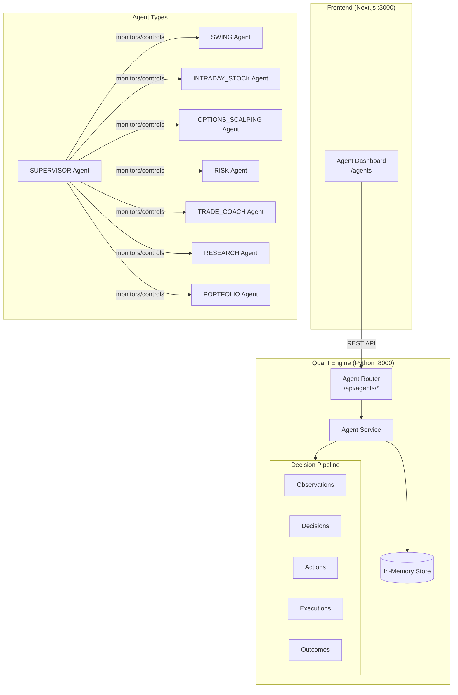
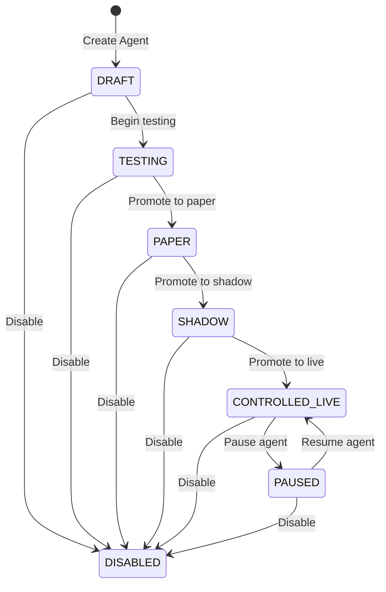
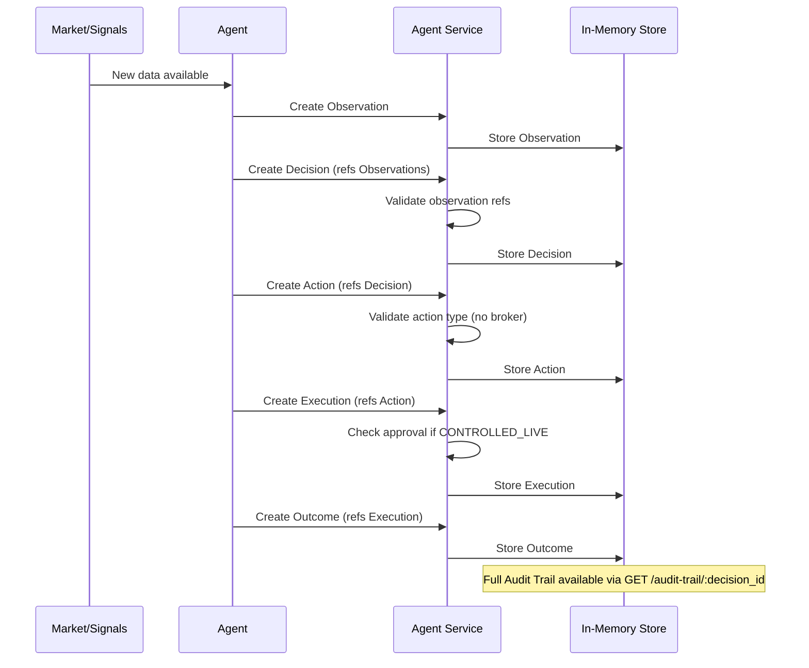
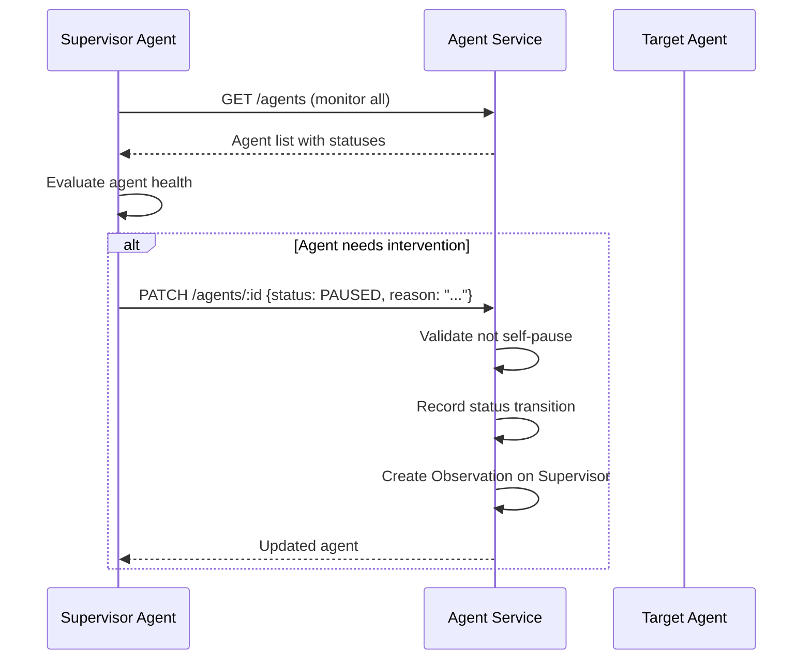

# Technical Design Document

## Overview

The AI Agent Architecture System establishes the foundational infrastructure for autonomous and semi-autonomous trading agents in the ProfitTerminal platform. It provides agent lifecycle management, a full decision audit pipeline (observation → decision → action → execution → outcome), policy enforcement, persistent memory, and supervisor oversight — all backed by the critical safety invariant that agents cannot directly execute broker orders.

### Key Design Decisions

1. **Python FastAPI module**: The agent system lives in `apps/quant/agents/` as a new module following existing patterns (similar to `paper_trading/`, `trade_coach/`). Python is chosen for consistency with the quant engine and future ML/AI integration.
2. **In-memory storage**: Following the project's existing patterns, all entities are stored in-memory using Python dictionaries. No database migration required.
3. **Separate router registration**: The agents router is registered in `main.py` following the same pattern as other modules (trade_coach, paper_trading, etc.).
4. **Pydantic v2 models**: All data models use Pydantic v2 BaseModel for validation, serialization, and API schema generation.
5. **Audit trail as linked records**: The observation → decision → action → execution → outcome chain uses foreign key references (IDs) between records, allowing full trail reconstruction via a single query endpoint.
6. **Safety by design**: The Agent_Action model restricts action_type to a closed enum that excludes broker execution. The service layer enforces approval requirements for CONTROLLED_LIVE agents.

### Technology Stack

- **Backend**: Python FastAPI (existing quant engine) — new `agents/` module
- **Frontend**: Next.js App Router (existing) — new `/agents` route
- **Storage**: In-memory Python dictionaries (consistent with existing modules)
- **Validation**: Pydantic v2 models with strict enum enforcement
- **Testing**: Hypothesis (Python PBT), pytest (unit tests)

## Architecture

### High-Level Architecture Diagram



### Agent Lifecycle State Machine



### Decision Audit Pipeline



### Supervisor Oversight Flow



## Components and Interfaces

### 1. Agent Router (FastAPI)

**Location:** `apps/quant/agents/router.py`

| Endpoint | Method | Description |
|----------|--------|-------------|
| `/api/agents` | POST | Create a new agent |
| `/api/agents` | GET | List agents (filter by type, status) |
| `/api/agents/{agent_id}` | GET | Get agent by ID |
| `/api/agents/{agent_id}` | PATCH | Update agent (config, status) |
| `/api/agents/{agent_id}` | DELETE | Delete agent and associated data |
| `/api/agents/{agent_id}/tasks` | POST | Create task for agent |
| `/api/agents/{agent_id}/tasks` | GET | List tasks for agent |
| `/api/agents/{agent_id}/tasks/{task_id}` | PATCH | Update task status |
| `/api/agents/{agent_id}/policies` | POST | Create policy for agent |
| `/api/agents/{agent_id}/policies` | GET | List policies for agent |
| `/api/agents/{agent_id}/policies/{policy_id}` | PATCH | Enable/disable policy |
| `/api/agents/{agent_id}/observations` | POST | Record observation |
| `/api/agents/{agent_id}/observations` | GET | List observations |
| `/api/agents/{agent_id}/decisions` | POST | Record decision |
| `/api/agents/{agent_id}/decisions` | GET | List decisions |
| `/api/agents/{agent_id}/decisions/{decision_id}/audit-trail` | GET | Full audit trail |
| `/api/agents/{agent_id}/actions` | POST | Record action |
| `/api/agents/{agent_id}/executions` | POST | Record execution |
| `/api/agents/{agent_id}/outcomes` | POST | Record outcome |
| `/api/agents/{agent_id}/memory` | POST | Create memory entry |
| `/api/agents/{agent_id}/memory` | GET | List memory entries |
| `/api/agents/{agent_id}/memory/{memory_id}` | DELETE | Delete memory entry |

### 2. Agent Service

**Location:** `apps/quant/agents/service.py`

```python
class AgentService:
    """Core service managing agent CRUD, lifecycle, and decision pipeline."""
    
    def __init__(self):
        self.agents: Dict[str, Agent] = {}
        self.tasks: Dict[str, AgentTask] = {}
        self.policies: Dict[str, AgentPolicy] = {}
        self.observations: Dict[str, AgentObservation] = {}
        self.decisions: Dict[str, AgentDecision] = {}
        self.actions: Dict[str, AgentAction] = {}
        self.executions: Dict[str, AgentExecution] = {}
        self.outcomes: Dict[str, AgentOutcome] = {}
        self.memory: Dict[str, AgentMemory] = {}
        self.status_transitions: List[StatusTransition] = []
    
    # Agent CRUD
    def create_agent(self, request: CreateAgentRequest) -> Agent: ...
    def get_agent(self, agent_id: str) -> Agent: ...
    def list_agents(self, agent_type: Optional[AgentType], status: Optional[AgentStatus]) -> List[Agent]: ...
    def update_agent(self, agent_id: str, request: UpdateAgentRequest) -> Agent: ...
    def delete_agent(self, agent_id: str) -> None: ...
    
    # Lifecycle
    def transition_status(self, agent_id: str, new_status: AgentStatus, reason: str) -> Agent: ...
    def validate_transition(self, current: AgentStatus, target: AgentStatus) -> bool: ...
    
    # Tasks
    def create_task(self, agent_id: str, request: CreateTaskRequest) -> AgentTask: ...
    def list_tasks(self, agent_id: str, status: Optional[TaskStatus]) -> List[AgentTask]: ...
    def update_task(self, task_id: str, request: UpdateTaskRequest) -> AgentTask: ...
    def get_active_task_count(self, agent_id: str) -> int: ...
    
    # Policies
    def create_policy(self, agent_id: str, request: CreatePolicyRequest) -> AgentPolicy: ...
    def list_policies(self, agent_id: str) -> List[AgentPolicy]: ...
    def toggle_policy(self, policy_id: str, enabled: bool) -> AgentPolicy: ...
    def has_risk_limit_policy(self, agent_id: str) -> bool: ...
    
    # Decision pipeline
    def create_observation(self, agent_id: str, request: CreateObservationRequest) -> AgentObservation: ...
    def create_decision(self, agent_id: str, request: CreateDecisionRequest) -> AgentDecision: ...
    def create_action(self, agent_id: str, request: CreateActionRequest) -> AgentAction: ...
    def create_execution(self, agent_id: str, request: CreateExecutionRequest) -> AgentExecution: ...
    def create_outcome(self, agent_id: str, request: CreateOutcomeRequest) -> AgentOutcome: ...
    def get_audit_trail(self, decision_id: str) -> AuditTrail: ...
    
    # Memory
    def create_memory(self, agent_id: str, request: CreateMemoryRequest) -> AgentMemory: ...
    def list_memory(self, agent_id: str, memory_type: Optional[MemoryType]) -> List[AgentMemory]: ...
    def delete_memory(self, memory_id: str) -> None: ...
    def enforce_memory_limit(self, agent_id: str) -> None: ...
    
    # Supervisor
    def supervisor_pause_agent(self, supervisor_id: str, target_id: str, reason: str) -> Agent: ...
    def supervisor_disable_agent(self, supervisor_id: str, target_id: str, reason: str) -> Agent: ...
```

### 3. Agent Dashboard (Next.js)

**Location:** `apps/web/app/agents/page.tsx`

**Components:**
- `AgentListView` — Table of all agents with type, status, task count, last activity
- `AgentDetailView` — Configuration, policies, recent pipeline activity
- `AgentCreateForm` — Form to create new agents
- `LifecycleControls` — Status transition buttons (only valid next states)
- `AuditTrailTimeline` — Visual timeline of observation → decision → action → execution → outcome
- `StatusBadge` — Color-coded status indicator

## Data Models

### Core Enums

```python
class AgentType(str, Enum):
    SWING = "SWING"
    INTRADAY_STOCK = "INTRADAY_STOCK"
    OPTIONS_SCALPING = "OPTIONS_SCALPING"
    RISK = "RISK"
    TRADE_COACH = "TRADE_COACH"
    RESEARCH = "RESEARCH"
    PORTFOLIO = "PORTFOLIO"
    SUPERVISOR = "SUPERVISOR"

class AgentStatus(str, Enum):
    DRAFT = "DRAFT"
    TESTING = "TESTING"
    PAPER = "PAPER"
    SHADOW = "SHADOW"
    CONTROLLED_LIVE = "CONTROLLED_LIVE"
    PAUSED = "PAUSED"
    DISABLED = "DISABLED"

class TaskStatus(str, Enum):
    PENDING = "PENDING"
    IN_PROGRESS = "IN_PROGRESS"
    COMPLETED = "COMPLETED"
    FAILED = "FAILED"

class PolicyType(str, Enum):
    RISK_LIMIT = "RISK_LIMIT"
    POSITION_LIMIT = "POSITION_LIMIT"
    TRADING_HOURS = "TRADING_HOURS"
    INSTRUMENT_RESTRICTION = "INSTRUMENT_RESTRICTION"
    APPROVAL_REQUIRED = "APPROVAL_REQUIRED"

class ObservationType(str, Enum):
    MARKET_DATA = "MARKET_DATA"
    PORTFOLIO_STATE = "PORTFOLIO_STATE"
    SIGNAL = "SIGNAL"
    NEWS = "NEWS"
    USER_INPUT = "USER_INPUT"

class DecisionType(str, Enum):
    TRADE_RECOMMENDATION = "TRADE_RECOMMENDATION"
    RISK_ALERT = "RISK_ALERT"
    PORTFOLIO_ADJUSTMENT = "PORTFOLIO_ADJUSTMENT"
    COACHING_INSIGHT = "COACHING_INSIGHT"
    RESEARCH_FINDING = "RESEARCH_FINDING"

class ActionType(str, Enum):
    PAPER_TRADE = "PAPER_TRADE"
    RECOMMEND = "RECOMMEND"
    ALERT = "ALERT"
    REBALANCE = "REBALANCE"
    COACH = "COACH"
    RESEARCH_REPORT = "RESEARCH_REPORT"

class ExecutionStatus(str, Enum):
    PENDING = "PENDING"
    EXECUTING = "EXECUTING"
    COMPLETED = "COMPLETED"
    FAILED = "FAILED"
    REJECTED = "REJECTED"

class OutcomeStatus(str, Enum):
    SUCCESS = "SUCCESS"
    PARTIAL_SUCCESS = "PARTIAL_SUCCESS"
    FAILURE = "FAILURE"

class MemoryType(str, Enum):
    TRADE_HISTORY = "TRADE_HISTORY"
    PATTERN = "PATTERN"
    PREFERENCE = "PREFERENCE"
    CONTEXT = "CONTEXT"
    LESSON_LEARNED = "LESSON_LEARNED"
```

### Entity Models

```python
class Agent(BaseModel):
    id: str = Field(default_factory=lambda: str(uuid4()))
    name: str = Field(..., min_length=1, max_length=100)
    agent_type: AgentType
    status: AgentStatus = AgentStatus.DRAFT
    config: Dict[str, Any] = Field(default_factory=dict)
    created_at: datetime = Field(default_factory=datetime.utcnow)
    updated_at: datetime = Field(default_factory=datetime.utcnow)

class AgentTask(BaseModel):
    id: str = Field(default_factory=lambda: str(uuid4()))
    agent_id: str
    description: str = Field(..., min_length=1)
    priority: int = Field(..., ge=1, le=5)
    status: TaskStatus = TaskStatus.PENDING
    metadata: Dict[str, Any] = Field(default_factory=dict)
    created_at: datetime = Field(default_factory=datetime.utcnow)
    completed_at: Optional[datetime] = None

class AgentPolicy(BaseModel):
    id: str = Field(default_factory=lambda: str(uuid4()))
    agent_id: str
    name: str = Field(..., min_length=1)
    policy_type: PolicyType
    rules: Dict[str, Any] = Field(default_factory=dict)
    enabled: bool = True
    created_at: datetime = Field(default_factory=datetime.utcnow)

class AgentObservation(BaseModel):
    id: str = Field(default_factory=lambda: str(uuid4()))
    agent_id: str
    observation_type: ObservationType
    data: Dict[str, Any] = Field(default_factory=dict)
    source: str = Field(..., min_length=1)
    data_version: str = Field(default="1.0")
    timestamp: datetime = Field(default_factory=datetime.utcnow)

class AgentDecision(BaseModel):
    id: str = Field(default_factory=lambda: str(uuid4()))
    agent_id: str
    observation_ids: List[str] = Field(default_factory=list)
    decision_type: DecisionType
    reasoning: str = Field(..., min_length=1)
    confidence: float = Field(..., ge=0.0, le=1.0)
    timestamp: datetime = Field(default_factory=datetime.utcnow)

class AgentAction(BaseModel):
    id: str = Field(default_factory=lambda: str(uuid4()))
    decision_id: str
    agent_id: str
    action_type: ActionType
    parameters: Dict[str, Any] = Field(default_factory=dict)
    timestamp: datetime = Field(default_factory=datetime.utcnow)

class AgentExecution(BaseModel):
    id: str = Field(default_factory=lambda: str(uuid4()))
    action_id: str
    agent_id: str
    status: ExecutionStatus = ExecutionStatus.PENDING
    context: Dict[str, Any] = Field(default_factory=dict)
    requires_approval: bool = False
    approved_by: Optional[str] = None
    started_at: Optional[datetime] = None
    completed_at: Optional[datetime] = None

class AgentOutcome(BaseModel):
    id: str = Field(default_factory=lambda: str(uuid4()))
    execution_id: str
    agent_id: str
    outcome_status: OutcomeStatus
    result_data: Dict[str, Any] = Field(default_factory=dict)
    timestamp: datetime = Field(default_factory=datetime.utcnow)

class AgentMemory(BaseModel):
    id: str = Field(default_factory=lambda: str(uuid4()))
    agent_id: str
    memory_type: MemoryType
    content: Dict[str, Any] = Field(default_factory=dict)
    timestamp: datetime = Field(default_factory=datetime.utcnow)

class StatusTransition(BaseModel):
    agent_id: str
    previous_status: AgentStatus
    new_status: AgentStatus
    reason: str
    timestamp: datetime = Field(default_factory=datetime.utcnow)

class AuditTrail(BaseModel):
    decision: AgentDecision
    observations: List[AgentObservation]
    actions: List[AgentAction]
    executions: List[AgentExecution]
    outcomes: List[AgentOutcome]
```

### Valid Lifecycle Transitions Map

```python
VALID_TRANSITIONS: Dict[AgentStatus, List[AgentStatus]] = {
    AgentStatus.DRAFT: [AgentStatus.TESTING, AgentStatus.DISABLED],
    AgentStatus.TESTING: [AgentStatus.PAPER, AgentStatus.DISABLED],
    AgentStatus.PAPER: [AgentStatus.SHADOW, AgentStatus.DISABLED],
    AgentStatus.SHADOW: [AgentStatus.CONTROLLED_LIVE, AgentStatus.DISABLED],
    AgentStatus.CONTROLLED_LIVE: [AgentStatus.PAUSED, AgentStatus.DISABLED],
    AgentStatus.PAUSED: [AgentStatus.CONTROLLED_LIVE, AgentStatus.DISABLED],
    AgentStatus.DISABLED: [],  # Terminal state
}
```

### API Request/Response Models

**Create Agent Request:**
```python
class CreateAgentRequest(BaseModel):
    name: str = Field(..., min_length=1, max_length=100)
    agent_type: AgentType
    config: Dict[str, Any] = Field(default_factory=dict)
```

**Update Agent Request:**
```python
class UpdateAgentRequest(BaseModel):
    name: Optional[str] = Field(None, min_length=1, max_length=100)
    config: Optional[Dict[str, Any]] = None
    status: Optional[AgentStatus] = None
    status_reason: Optional[str] = None
```

**Create Task Request:**
```python
class CreateTaskRequest(BaseModel):
    description: str = Field(..., min_length=1)
    priority: int = Field(..., ge=1, le=5)
```

**Create Policy Request:**
```python
class CreatePolicyRequest(BaseModel):
    name: str = Field(..., min_length=1)
    policy_type: PolicyType
    rules: Dict[str, Any] = Field(default_factory=dict)
```

**Create Observation Request:**
```python
class CreateObservationRequest(BaseModel):
    observation_type: ObservationType
    data: Dict[str, Any] = Field(default_factory=dict)
    source: str = Field(..., min_length=1)
    data_version: str = Field(default="1.0")
```

**Create Decision Request:**
```python
class CreateDecisionRequest(BaseModel):
    observation_ids: List[str] = Field(..., min_length=1)
    decision_type: DecisionType
    reasoning: str = Field(..., min_length=1)
    confidence: float = Field(..., ge=0.0, le=1.0)
```

**Create Action Request:**
```python
class CreateActionRequest(BaseModel):
    decision_id: str
    action_type: ActionType
    parameters: Dict[str, Any] = Field(default_factory=dict)
```

**Create Execution Request:**
```python
class CreateExecutionRequest(BaseModel):
    action_id: str
    context: Dict[str, Any] = Field(default_factory=dict)
```

**Create Outcome Request:**
```python
class CreateOutcomeRequest(BaseModel):
    execution_id: str
    outcome_status: OutcomeStatus
    result_data: Dict[str, Any] = Field(default_factory=dict)
```

**Create Memory Request:**
```python
class CreateMemoryRequest(BaseModel):
    memory_type: MemoryType
    content: Dict[str, Any] = Field(default_factory=dict)
```

## Correctness Properties

### Property 1: Agent creation round-trip preserves all fields

*For any* valid agent creation input (name, type, config), creating the agent and then retrieving it by ID SHALL produce a record where name, agent_type, and config match the original values exactly, and status is DRAFT.

**Validates: Requirements 1.1, 1.2, 1.3, 1.4**

### Property 2: Lifecycle transition validity

*For any* agent with a given status, and *for any* requested target status, the transition SHALL succeed if and only if the target status is in the VALID_TRANSITIONS map for the current status. All other transitions SHALL be rejected.

**Validates: Requirements 2.1, 2.2**

### Property 3: Lifecycle transition recording

*For any* successful status transition, the system SHALL record a StatusTransition with the correct previous status, new status, reason, and a timestamp no earlier than the agent's creation time.

**Validates: Requirements 2.3**

### Property 4: Disabled agent cannot receive tasks

*For any* agent with Agent_Status DISABLED, attempting to create a task for that agent SHALL be rejected. Agents in any other status SHALL accept task creation.

**Validates: Requirements 2.4, 3.4**

### Property 5: Paused agent blocks decisions but retains tasks

*For any* agent with Agent_Status PAUSED, creating a new decision SHALL be rejected, but existing tasks SHALL remain unchanged and accessible.

**Validates: Requirements 2.5**

### Property 6: Decision observation reference integrity

*For any* Agent_Decision creation request, all referenced observation_ids SHALL exist in the store and SHALL belong to the same agent. If any observation_id is invalid or belongs to a different agent, the creation SHALL be rejected.

**Validates: Requirements 6.2**

### Property 7: Action type safety — no broker execution

*For any* Agent_Action, the action_type SHALL be one of: PAPER_TRADE, RECOMMEND, ALERT, REBALANCE, COACH, RESEARCH_REPORT. No other action types SHALL be accepted by the system.

**Validates: Requirements 8.1, 8.2**

### Property 8: Audit trail completeness

*For any* Agent_Decision with associated actions, executions, and outcomes, querying the audit trail SHALL return the decision, all its observations (by observation_ids), all actions referencing that decision, all executions referencing those actions, and all outcomes referencing those executions. No records SHALL be missing.

**Validates: Requirements 7.5**

### Property 9: Memory limit enforcement

*For any* agent, the total number of memory entries SHALL never exceed 1000. When a new memory entry would exceed the limit, the oldest entry (by timestamp) SHALL be removed before the new entry is stored.

**Validates: Requirements 9.4**

### Property 10: Supervisor cannot self-pause

*For any* Supervisor agent attempting to pause or disable itself, the operation SHALL be rejected. The Supervisor SHALL be able to pause or disable any other agent.

**Validates: Requirements 10.5**

### Property 11: Risk policy requirement for trading agents

*For any* agent with Agent_Type SWING, INTRADAY_STOCK, or OPTIONS_SCALPING, transitioning to PAPER status (or beyond) SHALL be rejected unless the agent has at least one enabled policy with PolicyType RISK_LIMIT.

**Validates: Requirements 4.5**

### Property 12: Agent deletion cascades to all associated records

*For any* agent that is deleted, all associated tasks, policies, observations, decisions, actions, executions, outcomes, and memory entries SHALL also be removed from the store. No orphaned records SHALL remain.

**Validates: Requirements 1.7**

## Error Handling

### API Error Responses

| Error Scenario | HTTP Status | Response |
|---|---|---|
| Agent not found | 404 | `{"detail": "Agent not found", "agent_id": "..."}` |
| Invalid lifecycle transition | 409 | `{"detail": "Invalid transition", "current_status": "...", "requested_status": "...", "allowed_transitions": [...]}` |
| Agent disabled (task creation) | 409 | `{"detail": "Cannot assign task to disabled agent"}` |
| Agent paused (decision creation) | 409 | `{"detail": "Cannot create decision for paused agent"}` |
| Invalid observation reference | 422 | `{"detail": "Observation not found or belongs to different agent", "invalid_ids": [...]}` |
| Broker execution rejected | 403 | `{"detail": "Direct broker execution is prohibited", "agent_id": "...", "attempted_action": "..."}` |
| Missing risk policy for promotion | 409 | `{"detail": "Agent requires at least one RISK_LIMIT policy before transitioning to PAPER", "agent_id": "..."}` |
| Supervisor self-pause | 403 | `{"detail": "Supervisor cannot pause or disable itself"}` |
| Invalid request data | 422 | `{"detail": "Validation error", "errors": [...]}` |
| Memory limit exceeded | N/A | Oldest entry auto-removed (not an error) |

### Service-Level Error Handling

| Scenario | Handling |
|---|---|
| Concurrent modification | Last-write-wins (in-memory store, single-process) |
| Memory eviction | Log info-level message when oldest entry removed |
| Supervisor action on non-existent target | Return 404 |
| Deletion of agent with active pipeline records | Cascade delete all associated records |

## Testing Strategy

### Property-Based Testing (PBT)

**Library:** Hypothesis (Python)

**Configuration:** Minimum 100 iterations per property test.

**Property tests to implement:**

1. **Agent CRUD properties:**
   - Property 1: Creation round-trip — Tag: `Feature: agent-architecture, Property 1: Agent creation round-trip`
   - Property 12: Deletion cascade — Tag: `Feature: agent-architecture, Property 12: Agent deletion cascades`

2. **Lifecycle properties:**
   - Property 2: Transition validity — Tag: `Feature: agent-architecture, Property 2: Lifecycle transition validity`
   - Property 3: Transition recording — Tag: `Feature: agent-architecture, Property 3: Lifecycle transition recording`
   - Property 4: Disabled blocks tasks — Tag: `Feature: agent-architecture, Property 4: Disabled agent cannot receive tasks`
   - Property 5: Paused blocks decisions — Tag: `Feature: agent-architecture, Property 5: Paused agent blocks decisions`
   - Property 11: Risk policy requirement — Tag: `Feature: agent-architecture, Property 11: Risk policy requirement`

3. **Decision pipeline properties:**
   - Property 6: Observation reference integrity — Tag: `Feature: agent-architecture, Property 6: Decision observation reference integrity`
   - Property 7: Action type safety — Tag: `Feature: agent-architecture, Property 7: Action type safety`
   - Property 8: Audit trail completeness — Tag: `Feature: agent-architecture, Property 8: Audit trail completeness`

4. **Safety and limits:**
   - Property 9: Memory limit — Tag: `Feature: agent-architecture, Property 9: Memory limit enforcement`
   - Property 10: Supervisor self-pause — Tag: `Feature: agent-architecture, Property 10: Supervisor cannot self-pause`

### Unit Tests (Example-Based)

- Create agent for each type verifies correct defaults
- Valid and invalid lifecycle transitions (specific examples)
- Task assignment to disabled agent returns error
- Decision creation with invalid observation IDs
- Audit trail query with multiple actions per decision
- Supervisor pauses target agent successfully
- Supervisor attempts self-pause returns error
- Memory eviction when over 1000 entries
- Delete agent removes all associated records

### Integration Tests

- Full decision pipeline: create observation → create decision → create action → create execution → create outcome → query audit trail
- Lifecycle progression from DRAFT to CONTROLLED_LIVE
- Dashboard API calls for list, detail, and create flows
- Supervisor workflow: monitor agents, pause one, verify state
