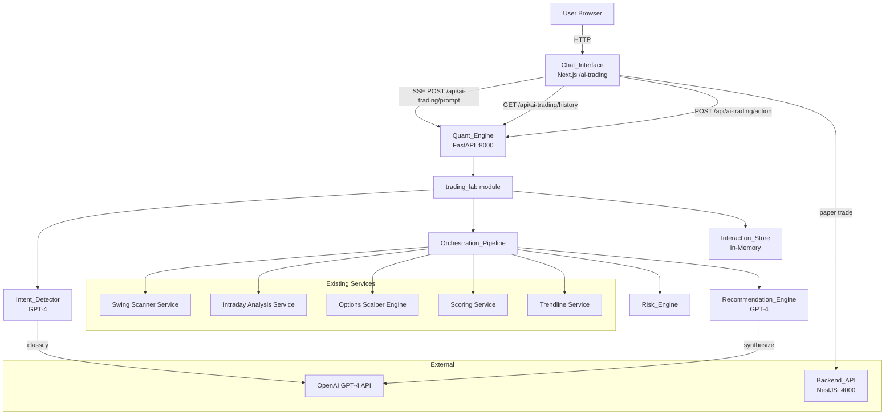
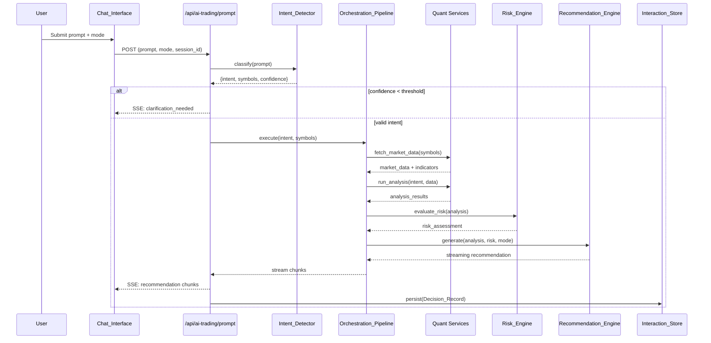

# Technical Design Document

## Overview

The AI Trading Lab is a conversational trading assistant that lives at `/ai-trading`. It accepts natural-language prompts, classifies trading intent, orchestrates data fetching and quantitative analysis from the existing Quant Engine, applies risk management, and uses GPT-4 to produce structured, actionable trading recommendations — all streamed in real-time via Server-Sent Events.

The system is built as a new module (`trading_lab/`) inside the existing Python/FastAPI Quant Engine at `apps/quant`. The frontend is a Next.js page at `apps/web/app/ai-trading/page.tsx` providing a chat-style interface with conversation history, response mode selection, and action buttons for paper trading.

### Key Design Decisions

1. **Backend in the Quant Engine (Python/FastAPI)**: The trading lab backend lives in the quant engine because it needs direct access to all analysis services (swing, intraday, options scalper) without HTTP overhead.
2. **Server-Sent Events for streaming**: SSE provides a simpler streaming model than WebSockets for this request-response pattern, and works well with FastAPI's `StreamingResponse`.
3. **In-process orchestration**: The pipeline calls existing services directly (in-process) rather than making HTTP calls back to itself, reducing latency.
4. **GPT-4 for both intent detection and recommendation generation**: Leverages structured JSON output for reliable parsing.
5. **In-memory session store (initial version)**: Decision records are stored in-memory per session, following the same pattern as the existing scalper module. Can be migrated to PostgreSQL later.

### Technology Stack

- **Backend**: Python 3.11+, FastAPI, OpenAI Python SDK, Pydantic v2
- **Frontend**: Next.js 14 (App Router), TypeScript, React, Tailwind CSS
- **AI Model**: OpenAI GPT-4 (via `openai` Python package)
- **Streaming**: Server-Sent Events (SSE) via FastAPI `StreamingResponse`
- **State**: In-memory session store (dictionary keyed by session ID)

## Architecture

### High-Level Architecture Diagram



### Data Flow



### Module Structure

```
apps/quant/trading_lab/
├── __init__.py
├── router.py              # FastAPI router with SSE endpoints
├── models.py              # Pydantic models (request/response/domain)
├── intent_detector.py     # GPT-4 intent classification
├── orchestrator.py        # Pipeline orchestration
├── recommendation_engine.py  # GPT-4 recommendation synthesis
├── risk_engine.py         # Risk evaluation and position sizing
├── interaction_store.py   # In-memory decision record storage
├── response_formatter.py  # Mode-specific output formatting
└── exceptions.py          # Custom exceptions
```

## Components and Interfaces

### 1. Intent Detector (`intent_detector.py`)

Classifies natural-language prompts into structured trading intents using GPT-4.

```python
class TradingIntent(str, Enum):
    SWING_STOCK = "SWING_STOCK"
    INTRADAY_STOCK = "INTRADAY_STOCK"
    OPTIONS_SCALPING = "OPTIONS_SCALPING"
    TRADE_ANALYSIS = "TRADE_ANALYSIS"
    PORTFOLIO_ANALYSIS = "PORTFOLIO_ANALYSIS"
    MARKET_ANALYSIS = "MARKET_ANALYSIS"
    STRATEGY_ANALYSIS = "STRATEGY_ANALYSIS"
    PAPER_TRADE = "PAPER_TRADE"

class IntentClassification(BaseModel):
    intent: TradingIntent
    symbols: List[str]
    confidence: float  # 0.0 to 1.0
    needs_clarification: bool

class IntentDetector:
    CONFIDENCE_THRESHOLD: float = 0.6

    async def classify(self, prompt: str) -> IntentClassification:
        """Classify prompt using GPT-4 structured JSON output."""
        ...
```

**Design Rationale**: GPT-4 is used here (instead of regex/keyword matching) because natural language intent is ambiguous — "should I buy RELIANCE calls?" could be OPTIONS_SCALPING or TRADE_ANALYSIS depending on context.

### 2. Orchestration Pipeline (`orchestrator.py`)

Coordinates the full analysis flow based on detected intent.

```python
class PipelineStep(str, Enum):
    MARKET_SELECTION = "market_selection"
    STRATEGY_SELECTION = "strategy_selection"
    DATA_FETCH = "data_fetch"
    QUANT_ANALYSIS = "quant_analysis"
    TRENDLINE_ANALYSIS = "trendline_analysis"
    RISK_EVALUATION = "risk_evaluation"
    AI_REASONING = "ai_reasoning"
    RECOMMENDATION = "recommendation"

class PipelineContext(BaseModel):
    intent: TradingIntent
    symbols: List[str]
    market_data: Optional[Dict[str, Any]] = None
    market_data_timestamp: Optional[datetime] = None
    quant_analysis: Optional[Dict[str, Any]] = None
    trendline_analysis: Optional[Dict[str, Any]] = None
    risk_assessment: Optional[Dict[str, Any]] = None
    recommendation: Optional[Dict[str, Any]] = None

class Orchestrator:
    STALE_DATA_THRESHOLD_SECONDS: int = 300  # 5 minutes

    async def execute(
        self, 
        intent: IntentClassification, 
        response_mode: ResponseMode,
        session_id: str,
    ) -> AsyncGenerator[str, None]:
        """Execute pipeline steps and yield SSE chunks."""
        ...

    def _is_market_hours(self) -> bool:
        """Check if current time is within NSE market hours (9:15-15:30 IST)."""
        ...

    def _is_data_stale(self, timestamp: datetime) -> bool:
        """Check if market data is older than 5 minutes."""
        ...
```

**Intent-to-Service Routing:**

| Intent | Service Invoked |
|--------|----------------|
| SWING_STOCK | `SwingScannerService` + `SwingScoringService` |
| INTRADAY_STOCK | `IntradayAnalysisService` + `IntradayScoringService` |
| OPTIONS_SCALPING | `AIAnalysisEngine` (from scalper module) |
| TRADE_ANALYSIS | `QuantService.analyze()` (full technical analysis) |
| PORTFOLIO_ANALYSIS | NestJS Paper Trading API (GET positions) |
| MARKET_ANALYSIS | `ScoringService` + `TrendlineService` |
| STRATEGY_ANALYSIS | Combined quant analysis with strategy framing |
| PAPER_TRADE | NestJS Paper Trading API (POST trade) |

### 3. Recommendation Engine (`recommendation_engine.py`)

Synthesizes quantitative analysis into structured recommendations using GPT-4.

```python
class ResponseMode(str, Enum):
    QUICK = "QUICK"
    DETAILED = "DETAILED"
    TRADER = "TRADER"
    QUANT = "QUANT"
    COACH = "COACH"

class SignalDirection(str, Enum):
    BUY = "BUY"
    SELL = "SELL"
    HOLD = "HOLD"

class Recommendation(BaseModel):
    signal: SignalDirection
    probability: float  # 0-100
    risk_reward_ratio: float
    entry_price: Optional[float]
    stop_loss: Optional[float]
    target_price: Optional[float]
    position_size: Optional[int]
    rationale: str
    is_low_confidence: bool = False
    is_high_risk: bool = False
    warnings: List[str] = []
    market_data_timestamp: datetime

class RecommendationEngine:
    LOW_CONFIDENCE_THRESHOLD: float = 60.0
    HIGH_RISK_RR_THRESHOLD: float = 1.5
    MAX_RISK_PERCENT: float = 0.02  # 2% max risk per trade

    async def generate(
        self,
        analysis: Dict[str, Any],
        risk_assessment: Dict[str, Any],
        mode: ResponseMode,
        portfolio_value: float = 1000000.0,
    ) -> AsyncGenerator[str, None]:
        """Generate streaming recommendation based on mode."""
        ...

    def _calculate_position_size(
        self,
        entry_price: float,
        stop_loss: float,
        portfolio_value: float,
    ) -> int:
        """Calculate position size for max 2% portfolio risk."""
        risk_per_share = abs(entry_price - stop_loss)
        max_risk_amount = portfolio_value * self.MAX_RISK_PERCENT
        return int(max_risk_amount / risk_per_share) if risk_per_share > 0 else 0
```

### 4. Risk Engine (`risk_engine.py`)

Evaluates risk parameters for every recommendation.

```python
class RiskAssessment(BaseModel):
    risk_reward_ratio: float
    max_loss_amount: float
    position_size_suggested: int
    is_high_risk: bool
    warnings: List[str]
    passed: bool

class RiskEngine:
    def evaluate(
        self,
        entry_price: float,
        stop_loss: float,
        target_price: float,
        portfolio_value: float = 1000000.0,
    ) -> RiskAssessment:
        """Evaluate risk for a proposed trade."""
        ...
```

### 5. Interaction Store (`interaction_store.py`)

Persists all prompt-response interactions with metadata.

```python
class DecisionRecord(BaseModel):
    decision_id: str  # UUID
    agent_id: str     # AI Trading Lab instance ID
    session_id: str
    prompt: str
    response: str
    prompt_version: str
    market_data_timestamp: Optional[datetime]
    signal: Optional[SignalDirection]
    probability: Optional[float]
    risk_reward_ratio: Optional[float]
    created_at: datetime

class InteractionStore:
    def __init__(self):
        self._records: Dict[str, List[DecisionRecord]] = {}  # session_id -> records
        self._agent_id: str = f"ai-trading-lab-{uuid4().hex[:8]}"

    def persist(self, session_id: str, record: DecisionRecord) -> None:
        """Store a decision record."""
        ...

    def get_history(
        self, session_id: str, page: int = 1, page_size: int = 20
    ) -> Tuple[List[DecisionRecord], int]:
        """Get paginated history ordered by created_at descending."""
        ...
```

### 6. Response Formatter (`response_formatter.py`)

Formats recommendations according to the selected response mode.

```python
class ResponseFormatter:
    def format(self, recommendation: Recommendation, mode: ResponseMode) -> str:
        """Format recommendation based on response mode."""
        if mode == ResponseMode.QUICK:
            return self._format_quick(recommendation)
        elif mode == ResponseMode.DETAILED:
            return self._format_detailed(recommendation)
        elif mode == ResponseMode.TRADER:
            return self._format_trader(recommendation)
        elif mode == ResponseMode.QUANT:
            return self._format_quant(recommendation)
        elif mode == ResponseMode.COACH:
            return self._format_coach(recommendation)
```

### 7. Router (`router.py`)

FastAPI router exposing the three API endpoints with SSE streaming.

```python
router = APIRouter(prefix="/api/ai-trading", tags=["ai-trading-lab"])

@router.post("/prompt")
async def submit_prompt(request: PromptRequest) -> StreamingResponse:
    """
    Accept a user prompt and return a streaming recommendation via SSE.
    
    SSE event format:
    - event: status (pipeline progress updates)
    - event: chunk (recommendation text chunks)
    - event: recommendation (final structured recommendation JSON)
    - event: error (error messages)
    - event: done (stream complete)
    """
    ...

@router.get("/history")
async def get_history(
    session_id: str = Query(...),
    page: int = Query(1, ge=1),
    page_size: int = Query(20, ge=1, le=100),
) -> HistoryResponse:
    """Return paginated conversation history."""
    ...

@router.post("/action")
async def execute_action(request: ActionRequest) -> ActionResponse:
    """Execute an action button command."""
    ...
```

### 8. Frontend Chat Interface (`apps/web/app/ai-trading/page.tsx`)

React component providing the conversational UI.

```typescript
// Key state
interface ChatState {
  messages: ChatMessage[];
  isLoading: boolean;
  responseMode: ResponseMode;
  sessionId: string;
  abortController: AbortController | null;
}

// SSE consumption
function useSSEStream(url: string, body: object) {
  // Uses fetch with ReadableStream to consume SSE events
  // Updates messages incrementally as chunks arrive
}

// Action handlers
function handleAction(action: ActionType, decisionId: string) {
  // ANALYZE_MARKET: submits follow-up prompt
  // BUY_ON_PAPER: calls NestJS paper trading endpoint
  // IGNORE: marks decision as ignored
  // STOP: aborts current AbortController
}
```

## Data Models

### Backend Models (Pydantic)

```python
# Request Models
class PromptRequest(BaseModel):
    prompt: str = Field(..., min_length=1, max_length=1000)
    response_mode: ResponseMode = ResponseMode.QUICK
    session_id: str = Field(default_factory=lambda: str(uuid4()))

class ActionRequest(BaseModel):
    action: Literal["ANALYZE_MARKET", "BUY_ON_PAPER", "IGNORE", "STOP"]
    decision_id: str
    session_id: str

# Response Models
class HistoryResponse(BaseModel):
    success: bool = True
    data: List[DecisionRecord]
    page: int
    page_size: int
    total_records: int

class ActionResponse(BaseModel):
    success: bool
    message: str
    data: Optional[Dict[str, Any]] = None

# SSE Event Models
class SSEEvent(BaseModel):
    event: Literal["status", "chunk", "recommendation", "error", "done"]
    data: str  # JSON-encoded payload

class StatusEvent(BaseModel):
    step: str
    message: str

class RecommendationEvent(BaseModel):
    decision_id: str
    signal: SignalDirection
    probability: float
    risk_reward_ratio: float
    entry_price: Optional[float]
    stop_loss: Optional[float]
    target_price: Optional[float]
    position_size: Optional[int]
    rationale: str
    is_low_confidence: bool
    is_high_risk: bool
    warnings: List[str]
    market_data_timestamp: str
    formatted_response: str
```

### Frontend Types (TypeScript)

```typescript
type ResponseMode = "QUICK" | "DETAILED" | "TRADER" | "QUANT" | "COACH";
type SignalDirection = "BUY" | "SELL" | "HOLD";
type ActionType = "ANALYZE_MARKET" | "BUY_ON_PAPER" | "IGNORE" | "STOP";

interface ChatMessage {
  id: string;
  role: "user" | "assistant" | "system";
  content: string;
  timestamp: Date;
  recommendation?: RecommendationData;
  isStreaming?: boolean;
}

interface RecommendationData {
  decisionId: string;
  signal: SignalDirection;
  probability: number;
  riskRewardRatio: number;
  entryPrice?: number;
  stopLoss?: number;
  targetPrice?: number;
  positionSize?: number;
  isLowConfidence: boolean;
  isHighRisk: boolean;
  warnings: string[];
  marketDataTimestamp: string;
}

interface PromptRequestBody {
  prompt: string;
  response_mode: ResponseMode;
  session_id: string;
}

interface ActionRequestBody {
  action: ActionType;
  decision_id: string;
  session_id: string;
}

interface HistoryResponseBody {
  success: boolean;
  data: DecisionRecord[];
  page: number;
  page_size: number;
  total_records: number;
}
```

## Correctness Properties

*A property is a characteristic or behavior that should hold true across all valid executions of a system — essentially, a formal statement about what the system should do. Properties serve as the bridge between human-readable specifications and machine-verifiable correctness guarantees.*

### Property 1: Intent classification always returns a valid structured result

*For any* non-empty string prompt, the Intent Detector SHALL return a result containing exactly one intent from the defined enum, a list of symbols (possibly empty), and a confidence score between 0.0 and 1.0 inclusive.

**Validates: Requirements 1.1, 1.4**

### Property 2: Low-confidence prompts trigger clarification

*For any* prompt where the Intent Detector computes a confidence score below the threshold (0.6), the system SHALL return a clarification request rather than proceeding with analysis.

**Validates: Requirements 1.2**

### Property 3: Symbol extraction from prompts

*For any* prompt containing one or more valid NSE stock symbols (from a known universe), the Intent Detector's classification result SHALL include those symbols in the extracted symbols list.

**Validates: Requirements 1.3**

### Property 4: Pipeline step ordering

*For any* valid intent classification, the Orchestration Pipeline SHALL execute steps in the invariant order: market_selection → strategy_selection → data_fetch → quant_analysis → trendline_analysis → risk_evaluation → ai_reasoning → recommendation.

**Validates: Requirements 2.1**

### Property 5: Stale data triggers re-fetch

*For any* market data timestamp older than 5 minutes when the current time is within NSE market hours (9:15-15:30 IST), the Orchestration Pipeline SHALL trigger a fresh data fetch before generating a recommendation.

**Validates: Requirements 3.2**

### Property 6: Recommendation structural completeness with threshold-based flagging

*For any* generated recommendation: (a) the output SHALL contain signal direction, probability, risk/reward ratio, entry price, stop loss, and target price; (b) if probability < 60%, it SHALL be labeled low-confidence with a warning; (c) if risk/reward < 1.5, it SHALL be flagged as high-risk.

**Validates: Requirements 4.1, 4.2, 7.2, 7.3**

### Property 7: Response mode content differentiation

*For any* recommendation and any response mode, the formatted output SHALL contain mode-appropriate content: QUICK contains only signal/probability/R:R/levels; DETAILED includes full indicator breakdown; TRADER includes entry/SL/targets/position sizing; QUANT emphasizes numerical metrics; COACH includes educational explanations.

**Validates: Requirements 4.4, 4.5, 4.6, 4.7, 4.8**

### Property 8: Decision Record integrity

*For any* persisted Decision Record: (a) it SHALL contain all required fields (prompt, response, prompt_version, market_data_timestamp, signal, probability, risk_reward_ratio, agent_id, decision_id); (b) the decision_id SHALL be a valid UUID unique across all records in the session.

**Validates: Requirements 5.1, 5.2, 5.3**

### Property 9: History ordering

*For any* set of Decision Records returned by the history endpoint, the records SHALL be ordered by creation timestamp in strictly descending order.

**Validates: Requirements 5.4**

### Property 10: Risk evaluation invariant

*For any* recommendation produced by the pipeline, the risk engine evaluation step SHALL have been executed (risk_assessment is non-null) before the recommendation is returned to the user.

**Validates: Requirements 7.1**

### Property 11: Position sizing respects 2% max risk

*For any* trade recommendation with entry_price and stop_loss, the suggested position_size multiplied by the per-share risk (|entry - stop_loss|) SHALL be less than or equal to 2% of the portfolio value.

**Validates: Requirements 7.4**

## Error Handling

### Error Categories and Responses

| Error Source | HTTP Status | SSE Event | User-Facing Message |
|---|---|---|---|
| Intent detection failure | 200 (SSE) | `error` | "I couldn't understand your request. Try rephrasing with a specific stock or trading intent." |
| Quant Engine unreachable | 200 (SSE) | `error` | "Market data service is currently unavailable. Cannot generate recommendation." |
| Quant Engine partial data | 200 (SSE) | `chunk` + `error` | Partial analysis with disclaimer about missing data |
| GPT-4 timeout/failure | 200 (SSE) | `error` | "AI analysis temporarily unavailable. Retrying..." (after 2 retries: final error) |
| Paper trade failure | 200 | JSON error | Display failure reason with retry button |
| Invalid prompt (empty) | 400 | N/A | "Please enter a trading prompt." |
| Session not found | 404 | N/A | "Session expired. Please refresh the page." |

### Retry Strategy

```python
class RetryConfig:
    max_retries: int = 2
    base_delay: float = 1.0  # seconds
    backoff_multiplier: float = 2.0  # exponential backoff

    def get_delay(self, attempt: int) -> float:
        return self.base_delay * (self.backoff_multiplier ** attempt)
```

GPT-4 calls are retried with exponential backoff (1s, 2s) before returning an error. Quant Engine calls are not retried — if data is unavailable, the user is informed immediately.

### Graceful Degradation

- If trendline analysis fails but other analysis succeeds → generate recommendation without trendline data, note omission
- If risk engine fails → still generate recommendation but with a warning that risk assessment is unavailable
- If streaming connection drops → frontend shows last received content with "connection lost" indicator

## Testing Strategy

### Property-Based Testing

Property-based testing is appropriate for this feature because the core logic involves:
- Input classification across a wide range of natural language strings
- Structural invariants that must hold for all outputs
- Threshold-based decision logic with continuous input ranges
- Data ordering guarantees

**Library**: `hypothesis` (Python)
**Configuration**: Minimum 100 iterations per property test
**Tag format**: `Feature: ai-trading-lab, Property {number}: {description}`

### Unit Tests (Example-Based)

- Intent routing: verify each intent type invokes the correct service (Requirements 2.3-2.7)
- Error handling: mock failures and verify correct error messages (Requirements 8.1-8.4)
- API endpoints: verify request/response schemas (Requirements 9.1-9.3)
- SSE streaming format: verify event types and data structure (Requirement 9.4)

### Integration Tests

- Full pipeline execution with mocked GPT-4 and real quant services
- SSE streaming end-to-end (prompt → incremental response)
- Paper trade action flow (button click → NestJS API call → response)
- History persistence and retrieval across multiple interactions

### Frontend Tests

- Component rendering: chat interface, mode selector, action buttons
- SSE consumption and incremental message display
- AbortController cancellation on STOP action
- Responsive layout and accessibility
