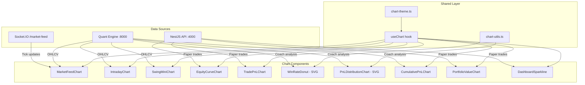

# Design Document: App-Wide Charts

## Overview

This design adds reusable charting capabilities across six pages of the ProfitTerminal app by extracting the core chart logic from the existing `ChartViewer.tsx` into a shared hook (`useChart`) and building specialized chart components on top of it. The implementation uses `lightweight-charts` v4.1.3 (already installed) for candlestick, line, and histogram charts, and simple SVG for chart types not natively supported (donut, distribution histogram).

All chart components share consistent styling, dark mode support, responsive resize behavior, and cleanup lifecycle management through the shared hook layer.

## Architecture



## Components and Interfaces

### Shared Hook: `useChart`

Location: `apps/web/lib/hooks/useChart.ts`

```typescript
interface UseChartOptions {
  height?: number;
  autoResize?: boolean;
  darkMode?: boolean; // auto-detected from theme if omitted
  showGrid?: boolean;
  showCrosshair?: boolean;
  showTimeScale?: boolean;
  showPriceScale?: boolean;
  fitContent?: boolean;
}

interface UseChartReturn {
  chartContainerRef: React.RefObject<HTMLDivElement>;
  chart: IChartApi | null;
  isReady: boolean;
}

function useChart(options?: UseChartOptions): UseChartReturn;
```

Responsibilities:
- Creates and mounts a `lightweight-charts` instance to a container ref
- Registers a `ResizeObserver` for responsive width adjustment (debounced to <100ms)
- Reads current theme (via `document.documentElement.classList` for Tailwind dark mode) and applies chart colors
- Removes chart and observer on unmount
- Exposes the raw `IChartApi` for consumers to add series and configure as needed

### Theme Configuration: `chart-theme.ts`

Location: `apps/web/lib/charts/chart-theme.ts`

```typescript
interface ChartTheme {
  background: string;
  textColor: string;
  gridColor: string;
  borderColor: string;
  crosshairColor: string;
  upColor: string;
  downColor: string;
  volumeUpColor: string;
  volumeDownColor: string;
}

function getChartTheme(isDark: boolean): ChartTheme;
```

### Utilities: `chart-utils.ts`

Location: `apps/web/lib/charts/chart-utils.ts`

```typescript
// Convert OHLCVData[] to lightweight-charts CandlestickData[]
function toCandlestickData(data: OHLCVData[]): CandlestickData[];

// Convert OHLCVData[] to volume HistogramData[]
function toVolumeData(data: OHLCVData[]): HistogramData[];

// Convert timestamped value pairs to LineData[]
function toLineData(points: { timestamp: string; value: number }[]): LineData[];

// Add a horizontal price level line to a chart
function addPriceLevel(
  chart: IChartApi,
  price: number,
  color: string,
  label: string
): ISeriesApi<'Line'>;

// Compute cumulative sum from an array of values
function cumulativeSum(values: number[]): number[];

// Bin numeric values into a histogram (returns bin edges and counts)
function binValues(
  values: number[],
  binCount: number
): { bins: { min: number; max: number; midpoint: number; count: number }[] };
```

### Component: `MarketFeedChart`

Location: `apps/web/components/charts/MarketFeedChart.tsx`

```typescript
interface MarketFeedChartProps {
  symbol: string;
  height?: number;
}
```

- Fetches OHLCV from quant engine on symbol change
- Subscribes to Socket.IO ticks via the existing market-feed connection on the page
- Updates the last candle's OHLC in real-time
- Shows a "disconnected" overlay when connection is lost
- Auto-scrolls to keep latest candle visible

### Component: `IntradayChart`

Location: `apps/web/components/charts/IntradayChart.tsx`

```typescript
interface IntradayChartProps {
  symbol: string;
  data: OHLCVData[];
  entry?: number;
  stopLoss?: number;
  target?: number;
  height?: number;
}
```

- Renders 5-minute candlestick chart with optional price level overlays
- Green line for entry, red for stop-loss, blue for target
- Includes a legend below the chart

### Component: `SwingMiniChart`

Location: `apps/web/components/charts/SwingMiniChart.tsx`

```typescript
interface SwingMiniChartProps {
  symbol: string;
  data: OHLCVData[];
  entry?: number;
  stopLoss?: number;
  target?: number;
  onClick?: () => void;
}
```

- Fixed height 120px, no volume, no time axis labels
- Compact candlestick with price level overlays
- Clickable (triggers parent selection)

### Component: `EquityCurveChart`

Location: `apps/web/components/charts/EquityCurveChart.tsx`

```typescript
interface EquityCurveChartProps {
  trades: { closedAt: string; realizedPnL: number }[];
  height?: number;
}
```

- Line chart with cumulative P&L
- Green line segments where cumulative > 0, red where < 0
- Uses lightweight-charts area series with color switching via baseline series

### Component: `TradePnLChart`

Location: `apps/web/components/charts/TradePnLChart.tsx`

```typescript
interface TradePnLChartProps {
  trades: { closedAt: string; realizedPnL: number }[];
  height?: number;
}
```

- Histogram series with green bars for profit, red for loss
- Ordered chronologically by close time

### Component: `WinRateDonut`

Location: `apps/web/components/charts/WinRateDonut.tsx`

```typescript
interface WinRateDonutProps {
  wins: number;
  losses: number;
  size?: number; // diameter in px, default 200
}
```

- Pure SVG donut chart
- Green segment for wins, red for losses
- Centered label with win rate percentage
- Legend below with counts

### Component: `PnLDistributionChart`

Location: `apps/web/components/charts/PnLDistributionChart.tsx`

```typescript
interface PnLDistributionChartProps {
  pnlValues: number[];
  binCount?: number; // default 10
  height?: number;
}
```

- SVG-based histogram
- Green bars for positive midpoint bins, red for negative
- X-axis shows P&L range, Y-axis shows trade count

### Component: `CumulativePnLChart`

Location: `apps/web/components/charts/CumulativePnLChart.tsx`

```typescript
interface CumulativePnLChartProps {
  trades: { date: string; pnl: number }[];
  height?: number;
}
```

- Line chart with area fill
- Green area above zero, red area below
- Horizontal zero reference line
- Uses lightweight-charts baseline series

### Component: `PortfolioValueChart`

Location: `apps/web/components/charts/PortfolioValueChart.tsx`

```typescript
interface PortfolioValueChartProps {
  data: { date: string; value: number }[];
  height?: number;
}
```

- Line chart for daily portfolio value
- Tooltip on hover showing date and exact value
- 30-day range

### Component: `DashboardSparkline`

Location: `apps/web/components/charts/DashboardSparkline.tsx`

```typescript
interface DashboardSparklineProps {
  data: number[]; // 7 data points
  width?: number; // default 120
  height?: number; // default 40
}
```

- Minimal line chart: no axes, no grid, no crosshair
- Green when last > first, red otherwise
- Uses lightweight-charts with all decorations disabled

## Data Models

### OHLCV Data (existing)

```typescript
// From apps/web/lib/api-client.ts
interface OHLCVData {
  timestamp: string;
  open: number;
  high: number;
  low: number;
  close: number;
  volume: number;
}
```

### Trade Data for Charts

```typescript
// Derived from PaperTrade for chart consumption
interface ChartTrade {
  closedAt: string;    // ISO timestamp
  realizedPnL: number; // positive or negative
  tradeType: TradeType;
}
```

### Portfolio History Data

```typescript
// New type for portfolio value chart
interface PortfolioHistoryPoint {
  date: string;  // YYYY-MM-DD
  value: number; // total portfolio value
}
```

### Coach Analysis Chart Data

```typescript
// Derived from CoachResponse for chart use
interface CoachChartData {
  winCount: number;
  lossCount: number;
  pnlValues: number[];           // individual trade P&L values
  cumulativePnL: { date: string; pnl: number }[];
}
```

### Tick Update (existing from market-feed page)

```typescript
interface TickData {
  instrumentToken: string;
  symbol: string;
  lastPrice: number;
  open: number;
  high: number;
  low: number;
  volume: number;
  timestamp: string;
}
```


## Correctness Properties

*A property is a characteristic or behavior that should hold true across all valid executions of a system — essentially, a formal statement about what the system should do. Properties serve as the bridge between human-readable specifications and machine-verifiable correctness guarantees.*

### Property 1: OHLCV to Candlestick Data Conversion

*For any* valid OHLCVData array, converting via `toCandlestickData` SHALL produce a CandlestickData array of the same length where each element's open, high, low, close matches the corresponding input, and each time value equals the input timestamp converted to Unix seconds.

**Validates: Requirements 1.1, 2.1**

### Property 2: Candle Update from Tick Preserves Invariants

*For any* current candle state (with open, high, low, close) and any new tick price, updating the candle SHALL produce a result where: high = max(previous high, tick price), low = min(previous low, tick price), close = tick price, and open remains unchanged.

**Validates: Requirements 1.2**

### Property 3: Price Level Color Mapping

*For any* signal with entry, stop-loss, and target price values, the price level overlay creation SHALL assign green to entry, red to stop-loss, and blue to target, and each line SHALL be positioned at exactly the specified price value.

**Validates: Requirements 2.2, 3.3**

### Property 4: Data Slicing to Last N Items

*For any* array of timestamped data points and any positive integer N, slicing to the last N items SHALL return min(array.length, N) items, and those items SHALL be the last min(array.length, N) elements of the original array in their original order.

**Validates: Requirements 3.2, 9.2, 10.2**

### Property 5: Cumulative Sum Correctness

*For any* array of numeric P&L values, the cumulative sum at position i SHALL equal the sum of all values from index 0 through i (inclusive), and the output array SHALL have the same length as the input.

**Validates: Requirements 4.1, 4.2, 8.1**

### Property 6: Sign-Based Color Assignment

*For any* numeric value, the color assignment function SHALL return green when the value is strictly positive, red when strictly negative, and a neutral color when zero.

**Validates: Requirements 4.3, 5.2, 7.3, 8.2**

### Property 7: Trade Type Filter Preserves Only Matching Trades

*For any* array of trades with mixed trade types and any selected type filter, filtering SHALL return only trades whose tradeType matches the filter, and all matching trades from the input SHALL be present in the output.

**Validates: Requirements 4.4, 5.4**

### Property 8: Chronological Sort Invariant

*For any* array of trades with close timestamps, after chronological sorting, each trade's closedAt timestamp SHALL be less than or equal to the next trade's closedAt timestamp.

**Validates: Requirements 5.3**

### Property 9: Histogram Binning Accounts for All Values

*For any* array of numeric values and any bin count >= 1, the `binValues` function SHALL produce bins where: the sum of all bin counts equals the input array length, every input value falls within at least one bin's [min, max] range, and the number of bins equals the requested bin count.

**Validates: Requirements 7.1, 7.2**

### Property 10: Donut Arc Proportions

*For any* win count and loss count where (wins + losses) > 0, the donut chart segments SHALL have arc angles proportional to their count divided by total, and the sum of all arc angles SHALL equal 360 degrees (within floating point tolerance).

**Validates: Requirements 6.1**

### Property 11: Win Rate Percentage Computation

*For any* win count and loss count where (wins + losses) > 0, the computed win rate percentage SHALL equal (wins / (wins + losses)) * 100, rounded to the nearest integer.

**Validates: Requirements 6.2, 6.3**

### Property 12: Trend Direction Color Assignment

*For any* array of at least 2 numeric data points, the sparkline color SHALL be green when the last element is strictly greater than the first element, and red otherwise.

**Validates: Requirements 10.4**

## Error Handling

| Scenario | Behavior |
|----------|----------|
| OHLCV fetch fails (network error, 4xx/5xx) | Chart shows "Failed to load data" message with a retry button. No crash. |
| OHLCV response is empty array | Chart shows "No data available" empty state. |
| WebSocket disconnects during streaming | MarketFeedChart overlays a "Feed disconnected" indicator (red dot + text). Data freezes at last known state. |
| WebSocket reconnects | Indicator clears, chart resumes updates from the latest tick. |
| Invalid tick data (NaN, null price) | Tick is silently dropped; candle is not updated. Console warning logged. |
| Trade coach API returns error | Charts show loading skeleton briefly, then an error message. |
| Paper trades API returns 0 trades | Equity and P&L charts show empty state message. |
| Chart resize fails (container removed) | ResizeObserver callback exits early if chart ref is null. No error thrown. |
| Dark mode toggle mid-session | Chart theme is reapplied on next render cycle via the `useChart` hook detecting class change. |
| Division by zero in win rate (0 wins + 0 losses) | Win rate displays "N/A" instead of computing. Donut renders empty ring. |

## Testing Strategy

### Unit Tests (Vitest + Testing Library)

- **Data transformation utilities** (`chart-utils.ts`): Test `toCandlestickData`, `toVolumeData`, `toLineData`, `cumulativeSum`, `binValues` with specific examples and edge cases (empty arrays, single element, large datasets).
- **Theme function** (`chart-theme.ts`): Verify light and dark theme objects have expected color values.
- **Component rendering**: Use `@testing-library/react` to verify:
  - Empty state messages appear when no data
  - Loading skeletons appear during fetch
  - Legends render correct labels and values
  - Click handlers fire on SwingMiniChart
  - SVG donut/histogram render correct structure

### Property-Based Tests (Vitest + fast-check)

Property-based testing is appropriate for this feature because the core chart utilities are pure functions with clear input/output behavior and large input spaces (arbitrary numeric arrays, timestamp sequences, price values).

**Library**: `fast-check` (JavaScript PBT library, compatible with Vitest)

**Configuration**:
- Minimum 100 iterations per property test
- Each property test references its design document property via tag comment

**Tag format**: `// Feature: app-wide-charts, Property {number}: {property_text}`

**Properties to implement**:
1. OHLCV conversion (Property 1)
2. Candle update from tick (Property 2)
3. Price level color mapping (Property 3)
4. Data slicing to last N (Property 4)
5. Cumulative sum (Property 5)
6. Sign-based color (Property 6)
7. Trade type filter (Property 7)
8. Chronological sort (Property 8)
9. Histogram binning (Property 9)
10. Donut arc proportions (Property 10)
11. Win rate computation (Property 11)
12. Trend direction color (Property 12)

### Integration Tests

- **MarketFeedChart + Socket.IO**: Verify that tick events update the chart (mock Socket.IO).
- **Paper Trading Charts + API**: Verify fetch → transform → render pipeline with MSW mocks.
- **Dashboard charts**: Verify data fetching and rendering lifecycle.

### Manual Testing Checklist

- Verify charts resize smoothly on window resize
- Verify dark mode toggle applies correct theme
- Verify real-time updates are smooth (no flicker/jank)
- Verify tooltips display on hover for PortfolioValueChart
- Verify SwingMiniChart click selects the candidate
