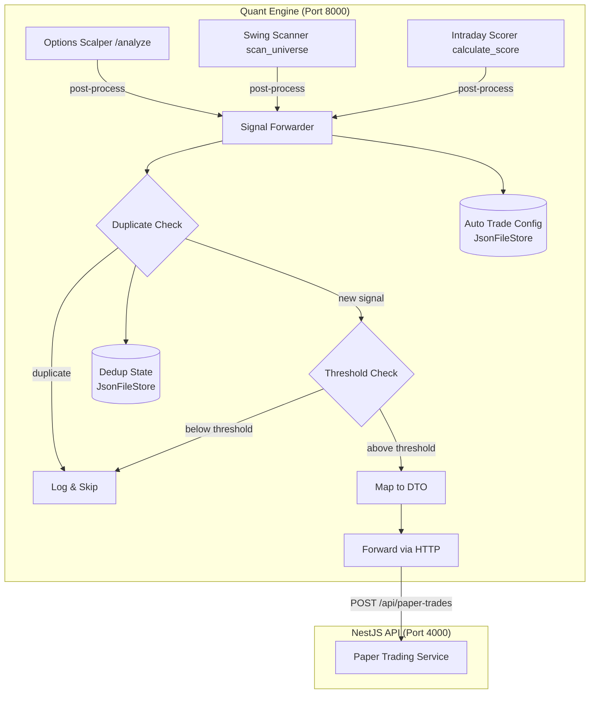

# Design Document: Auto Paper Trade Signals

## Overview

This design implements a Signal Forwarder module within the quant engine that intercepts analysis results from three existing signal sources (Options Scalper, Swing Scanner, Intraday Scorer), evaluates them against configurable thresholds, suppresses duplicates, and forwards qualifying signals to the NestJS Paper Trading API as paper trades.

The Signal Forwarder operates as a post-processing layer — it does not modify any analysis module. Instead, it is called after each analysis completes, receiving the result and deciding whether to create a paper trade.

**Key Design Decisions:**
- **Post-processing hook pattern**: The forwarder is invoked after analysis endpoints return, keeping analysis modules unchanged.
- **Per-user config via JsonFileStore**: Consistent with other quant modules (agents, prompt_library, trade_sync).
- **HTTP forwarding to NestJS API**: Same pattern as TradeMonitor — the quant engine calls the NestJS API over HTTP.
- **In-memory deduplication with persisted state**: Fast duplicate checks with persistence across restarts.

## Architecture



### Integration Points

The Signal Forwarder hooks into existing workflows without modifying analysis modules:

1. **Options Scalper**: After the `/api/options-scalper/analyze` endpoint handler returns `AnalyzeResponse`, a wrapper calls `signal_forwarder.forward_scalper_signal(result)`.
2. **Swing Scanner**: After `scan_universe()` returns candidates, the caller invokes `signal_forwarder.forward_swing_signals(candidates)`.
3. **Intraday Scorer**: After `calculate_score()` returns a result, the caller invokes `signal_forwarder.forward_intraday_signal(result, symbol, stop_loss, target)`.

## Components and Interfaces

### 1. SignalForwarder (Core Service)

**Location:** `apps/quant/signal_forwarder/forwarder.py`

Responsibilities:
- Receive analysis results from each signal source
- Load user config to check if source is enabled and get thresholds
- Check for duplicate signals
- Map signal data to CreatePaperTradeDto format
- Call Paper Trading API via HTTP
- Track forwarding statistics for health checks

```python
class SignalForwarder:
    def __init__(self, api_base_url: str = "http://localhost:4000", user_id: str = "default_user"):
        ...
    
    async def forward_scalper_signal(self, result: ScalperAnalysisResult) -> Optional[str]:
        """Forward Options Scalper signal. Returns trade_id or None."""
    
    async def forward_swing_signals(self, candidates: List[SwingScanResult]) -> List[str]:
        """Forward qualifying Swing Scanner candidates. Returns list of trade_ids."""
    
    async def forward_intraday_signal(
        self, result: IntradayScoreResult, symbol: str, 
        current_price: float, stop_loss: Optional[float], target: Optional[float]
    ) -> Optional[str]:
        """Forward Intraday Scorer signal. Returns trade_id or None."""
    
    def get_health(self) -> ForwarderHealth:
        """Return session statistics."""
```

### 2. DuplicateChecker

**Location:** `apps/quant/signal_forwarder/duplicate_checker.py`

Responsibilities:
- Track recently created trades by (symbol, direction, tradeType) key
- Check if an open trade already exists for a signal
- Check if a trade was created within the duplicate window
- Persist state via JsonFileStore for restart recovery

```python
class DuplicateChecker:
    def __init__(self, store: JsonFileStore):
        ...
    
    def is_duplicate(self, symbol: str, direction: str, trade_type: str, 
                     duplicate_window_minutes: int) -> Tuple[bool, Optional[str]]:
        """Check if signal is duplicate. Returns (is_dup, reason_msg)."""
    
    def record_trade(self, symbol: str, direction: str, trade_type: str, trade_id: str) -> None:
        """Record a trade creation for future dedup checks."""
    
    def mark_trade_closed(self, symbol: str, direction: str, trade_type: str) -> None:
        """Mark a trade as closed to allow new signals."""
```

### 3. SignalMapper

**Location:** `apps/quant/signal_forwarder/mapper.py`

Responsibilities:
- Convert Options Scalper result to CreatePaperTradeDto payload
- Convert Swing Scanner candidate to CreatePaperTradeDto payload
- Convert Intraday Scorer result to CreatePaperTradeDto payload
- Pure functions with no side effects

```python
class SignalMapper:
    @staticmethod
    def map_scalper_signal(result: ScalperAnalysisResult, user_id: str) -> dict:
        """Map scalper result to Paper Trading API payload."""
    
    @staticmethod
    def map_swing_signal(candidate: SwingScanResult, user_id: str, quantity: int) -> dict:
        """Map swing candidate to Paper Trading API payload."""
    
    @staticmethod
    def map_intraday_signal(
        result: IntradayScoreResult, symbol: str, current_price: float,
        stop_loss: float, target: float, user_id: str, quantity: int
    ) -> dict:
        """Map intraday result to Paper Trading API payload."""
```

### 4. AutoTradeConfig

**Location:** `apps/quant/signal_forwarder/config.py`

Responsibilities:
- Store and retrieve per-user auto-trade configuration
- Provide defaults when no config exists
- Validate configuration values

```python
@dataclass
class AutoTradeConfigData:
    options_scalper_enabled: bool = True
    swing_scanner_enabled: bool = True
    intraday_scorer_enabled: bool = True
    options_scalper_threshold: float = 70.0  # 50-95
    swing_scanner_threshold: float = 65.0   # 0-100
    intraday_scorer_threshold: float = 70.0 # 0-100
    default_swing_quantity: int = 1
    default_intraday_quantity: int = 1
    duplicate_window_minutes: int = 60      # 1-1440

class AutoTradeConfigService:
    def __init__(self, store: JsonFileStore):
        ...
    
    def get_config(self, user_id: str) -> AutoTradeConfigData:
        """Get config for user, returning defaults if none exists."""
    
    def update_config(self, user_id: str, updates: dict) -> AutoTradeConfigData:
        """Update config fields, validating ranges."""
```

### 5. API Endpoints (NestJS side)

**Location:** `apps/api/src/trading/auto-trade-config.controller.ts`

- `GET /api/auto-trade-config` — Retrieve current config
- `PUT /api/auto-trade-config` — Update config

These endpoints read/write to the Postgres database via Prisma, mirroring the JsonFileStore config as the source of truth on the quant side.

## Data Models

### AutoTradeConfig (persisted in JsonFileStore)

```json
{
  "default_user": {
    "options_scalper_enabled": true,
    "swing_scanner_enabled": true,
    "intraday_scorer_enabled": true,
    "options_scalper_threshold": 70.0,
    "swing_scanner_threshold": 65.0,
    "intraday_scorer_threshold": 70.0,
    "default_swing_quantity": 1,
    "default_intraday_quantity": 1,
    "duplicate_window_minutes": 60
  }
}
```

### Deduplication State (persisted in JsonFileStore)

```json
{
  "NIFTY|LONG|OPTIONS_SCALPING": {
    "trade_id": "abc-123",
    "created_at": "2024-01-15T10:30:00Z",
    "status": "OPEN"
  },
  "RELIANCE|LONG|SWING": {
    "trade_id": "def-456",
    "created_at": "2024-01-15T09:15:00Z",
    "status": "OPEN"
  }
}
```

### Signal Mapper Output (CreatePaperTradeDto payload)

**Options Scalper → Paper Trade:**
```json
{
  "userId": "default_user",
  "symbol": "NIFTY24DEC21500CE",
  "direction": "LONG",
  "tradeType": "OPTIONS_SCALPING",
  "entryPrice": 150.0,
  "stopLoss": 120.0,
  "target": 200.0,
  "quantity": 50,
  "agentId": "options_scalper",
  "probability": 78.5,
  "riskRewardRatio": 2.5,
  "strikePrice": 21500,
  "optionType": "CE",
  "expiryDate": "2024-12-19",
  "underlying": "NIFTY",
  "indicators": {
    "spot_price": 21450,
    "trend": "Bullish",
    "rsi": 62.5,
    "pcr": 1.2
  }
}
```

**Swing Scanner → Paper Trade:**
```json
{
  "userId": "default_user",
  "symbol": "RELIANCE",
  "direction": "LONG",
  "tradeType": "SWING",
  "entryPrice": 2500.0,
  "stopLoss": 2425.0,
  "target": 2650.0,
  "quantity": 1,
  "agentId": "swing_scanner",
  "probability": 72.5,
  "indicators": {
    "total_score": 72.5,
    "rsi": 55.0,
    "adx": 28.0
  }
}
```

**Intraday Scorer → Paper Trade:**
```json
{
  "userId": "default_user",
  "symbol": "TATAMOTORS",
  "direction": "LONG",
  "tradeType": "INTRADAY",
  "entryPrice": 850.0,
  "stopLoss": 840.0,
  "target": 870.0,
  "quantity": 1,
  "agentId": "intraday_scorer",
  "probability": 75.0,
  "indicators": {
    "trend_score": 92.0,
    "momentum_score": 80.0,
    "volume_score": 68.0,
    "vwap_score": 75.0
  }
}
```

### ForwarderHealth (in-memory stats)

```python
@dataclass
class ForwarderHealth:
    signals_forwarded: int = 0
    signals_skipped: int = 0
    errors: int = 0
    last_forward_time: Optional[datetime] = None
    last_error_time: Optional[datetime] = None
    last_error_message: Optional[str] = None
```


## Correctness Properties

*A property is a characteristic or behavior that should hold true across all valid executions of a system — essentially, a formal statement about what the system should do. Properties serve as the bridge between human-readable specifications and machine-verifiable correctness guarantees.*

### Property 1: Scalper signal gating

*For any* ScalperAnalysisResult, the Signal Forwarder SHALL create a paper trade if and only if signal_type is BUY_CE or BUY_PE AND probability is above the configured options_scalper_threshold. HOLD signals or signals below threshold shall never produce a trade.

**Validates: Requirements 1.1, 1.2**

### Property 2: Scalper signal mapping correctness

*For any* valid ScalperAnalysisResult with signal_type BUY_CE or BUY_PE, the mapped CreatePaperTradeDto payload SHALL have: direction=LONG, tradeType=OPTIONS_SCALPING, optionType matching signal_type (CE for BUY_CE, PE for BUY_PE), quantity=lot_size, entryPrice=entry_price, stopLoss=stop_loss, target=target_price, strikePrice=strike_price, expiryDate=expiry_date, underlying=underlying, probability=probability, riskRewardRatio=risk_reward_ratio, and agentId="options_scalper".

**Validates: Requirements 1.3, 1.4, 1.5, 1.6, 1.7, 6.6**

### Property 3: Swing signal gating

*For any* SwingScanResult, the Signal Forwarder SHALL create a paper trade if and only if the candidate's score is above the configured swing_scanner_threshold AND the candidate includes valid entry_price, stop_loss, and target values. Candidates below threshold or missing price data shall not produce a trade.

**Validates: Requirements 2.1, 2.6**

### Property 4: Swing signal mapping correctness

*For any* qualifying SwingScanResult candidate, the mapped payload SHALL have: tradeType=SWING, direction derived from analysis trend (LONG for bullish, SHORT for bearish), quantity=default_swing_quantity from config, probability=total_score, agentId="swing_scanner", and entry_price/stop_loss/target derived from the candidate's analysis.

**Validates: Requirements 2.2, 2.3, 2.4, 2.5, 6.6**

### Property 5: Intraday signal gating

*For any* IntradayScoreResult, the Signal Forwarder SHALL create a paper trade if and only if strength equals STRONG AND total_score is above the configured intraday_scorer_threshold. Results with MODERATE or WEAK strength shall never produce a trade regardless of score.

**Validates: Requirements 3.1, 3.5**

### Property 6: Intraday signal mapping correctness

*For any* qualifying IntradayScoreResult, the mapped payload SHALL have: tradeType=INTRADAY, direction determined by EMA alignment (LONG when bullish, SHORT when bearish), quantity=default_intraday_quantity from config, stop_loss and target passed through from scoring inputs, agentId="intraday_scorer", and indicators containing trend_score, momentum_score, volume_score, and vwap_score.

**Validates: Requirements 3.2, 3.3, 3.4, 3.6, 6.6**

### Property 7: Duplicate signal suppression

*For any* signal with a (symbol, direction, tradeType) key, the Signal Forwarder SHALL suppress the signal if either: (a) the deduplication state has an OPEN trade for that key, or (b) the last trade for that key was created within the configured duplicate_window_minutes. Signals outside the window with no open trade shall not be suppressed.

**Validates: Requirements 4.1, 4.2**

### Property 8: Config round-trip and defaults

*For any* valid AutoTradeConfigData (all fields within valid ranges), serializing to JSON and deserializing SHALL produce an equivalent config. When no config exists for a user, the returned config SHALL have all sources enabled, options_scalper_threshold=70, swing_scanner_threshold=65, intraday_scorer_threshold=70, default_swing_quantity=1, default_intraday_quantity=1, duplicate_window_minutes=60.

**Validates: Requirements 5.1, 5.4**

### Property 9: Disabled source skipping

*For any* signal from a source that is disabled in the AutoTradeConfig, the Signal Forwarder SHALL skip the signal without creating a trade and without logging at ERROR level.

**Validates: Requirements 5.2**

### Property 10: Health counter accuracy

*For any* sequence of signal forwarding operations (successful forwards, skips, and errors), the ForwarderHealth counters SHALL exactly equal the count of each operation type performed in that sequence.

**Validates: Requirements 7.4**

## Error Handling

### HTTP Communication Errors

| Scenario | Behavior |
|----------|----------|
| API unreachable (connection refused/timeout) | Retry once after 2-second delay. If retry fails, log ERROR with full payload, increment error counter, return None. |
| API returns 4xx error | Log ERROR with status code, response body, and request payload. Do not retry. Increment error counter. |
| API returns 5xx error | Retry once after 2-second delay. If retry fails, log ERROR. Increment error counter. |

### Signal Validation Errors

| Scenario | Behavior |
|----------|----------|
| Scalper result missing required trade fields (entry_price, stop_loss, etc.) for BUY signals | Skip signal, log WARNING. This should not happen with valid analysis but guards against partial data. |
| Swing candidate with no analysis or missing price levels | Skip candidate, log WARNING with symbol. Continue processing remaining candidates. |
| Intraday signal missing stop_loss or target from caller | Skip signal, log WARNING. Cannot create trade without risk levels. |

### Configuration Errors

| Scenario | Behavior |
|----------|----------|
| JsonFileStore file corrupted | JsonFileStore handles gracefully (starts fresh). Config returns defaults. |
| Config values out of valid range on update | Reject update, return validation error. Keep existing config. |

### Graceful Degradation

- Signal forwarding failures do NOT affect the original analysis response. The analysis endpoint always returns its result normally.
- If the Signal Forwarder itself throws an unexpected exception, it is caught at the integration point and logged. The analysis continues unaffected.

## Testing Strategy

### Property-Based Tests (Hypothesis)

The feature's core logic (threshold gating, signal mapping, duplicate detection, config validation) is implemented as pure functions and deterministic services — ideal for property-based testing.

- **Library**: `hypothesis` (already in use in the project, evidenced by `.hypothesis/` directory)
- **Minimum iterations**: 100 per property test
- **Tag format**: `# Feature: auto-paper-trade-signals, Property {N}: {title}`

Each correctness property (1-10) will be implemented as a single Hypothesis test:
1. Scalper signal gating
2. Scalper signal mapping correctness
3. Swing signal gating
4. Swing signal mapping correctness
5. Intraday signal gating
6. Intraday signal mapping correctness
7. Duplicate signal suppression
8. Config round-trip and defaults
9. Disabled source skipping
10. Health counter accuracy

### Unit Tests (pytest)

Example-based tests for specific scenarios:
- API error handling and retry behavior (mock httpx)
- Logging output verification (specific log messages)
- Default config values verification
- Duplicate suppression log message content
- Integration point wiring (forwarder called after analysis)

### Integration Tests

- End-to-end: Scalper analyze → Signal Forwarder → Paper Trading API (with real HTTP to test NestJS API)
- GET/PUT /api/auto-trade-config endpoints
- Full flow with multiple signals and dedup verification

### Test File Structure

```
apps/quant/tests/signal_forwarder/
├── test_mapper_properties.py        # Properties 2, 4, 6 (mapping correctness)
├── test_gating_properties.py        # Properties 1, 3, 5 (threshold gating)
├── test_duplicate_properties.py     # Property 7 (dedup)
├── test_config_properties.py        # Properties 8, 9 (config)
├── test_health_properties.py        # Property 10 (counters)
├── test_forwarder_unit.py           # Example-based unit tests
└── test_forwarder_integration.py    # Integration tests
```
