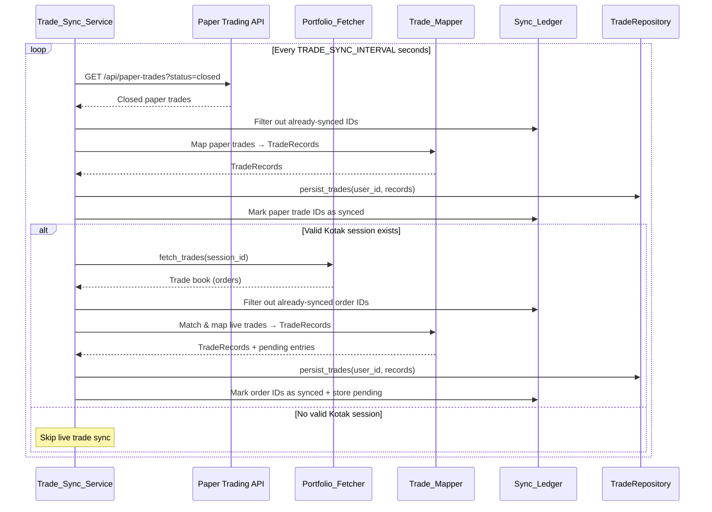

# Design Document: Auto Trade Logging

## Overview

Auto Trade Logging is a background synchronization service (`Trade_Sync_Service`) in the quant engine that automatically captures completed trades from all trading sources—paper trading (via NestJS API), live stock trades, and live options trades (via Kotak Neo BFF)—and persists them as `TradeRecord` entries in the Trade Analysis module.

The service follows the same architectural pattern as the existing `TradeMonitor` (polling loop with configurable interval) and reuses the `PortfolioFetcher` for Kotak BFF communication. A `Sync_Ledger` backed by `JsonFileStore` prevents duplicate logging across restarts. A `Trade_Mapper` component handles the transformation from source-specific formats into the unified `TradeRecord` schema.

### Design Goals

- **Zero manual entry**: All trading activity flows into Trade Analysis automatically
- **Idempotent syncing**: Every sync cycle is safe to repeat—duplicates are never created
- **Graceful degradation**: Network failures, session expiry, or malformed data never crash the service
- **Source traceability**: Every auto-logged trade carries its origin (paper/live_stock/live_options)
- **Restart-safe**: Sync state persists across quant engine restarts via JSON ledger

## Architecture

```mermaid
graph TD
    subgraph Quant Engine (port 8000)
        TSS[Trade_Sync_Service<br/>Background Loop]
        TM[Trade_Mapper]
        SL[Sync_Ledger<br/>JsonFileStore]
        TR[Trade_Analysis_Repository]
    end

    subgraph NestJS API (port 4000)
        PT[Paper Trading API<br/>Postgres/Prisma]
        BFF[Kotak Neo BFF<br/>Proxy Controller]
    end

    subgraph External
        KN[Kotak Neo Broker API]
    end

    TSS -->|1. Fetch closed paper trades| PT
    TSS -->|2. Fetch trade book| BFF
    BFF --> KN
    TSS --> TM
    TM -->|3. Map to TradeRecord| TR
    TSS -->|4. Record synced IDs| SL
```

### Sync Cycle Flow



## Components and Interfaces

### 1. Trade_Sync_Service

**Location**: `apps/quant/trade_sync/service.py`

The orchestrator background service. Follows the same pattern as `TradeMonitor`.

```python
class TradeSyncService:
    def __init__(
        self,
        api_base_url: str = "http://localhost:4000",
        bff_base_url: str = "http://localhost:4000/api/kotak-neo",
        interval: int = 60,
        user_id: str = "default",
    ):
        ...

    async def start(self) -> None: ...
    async def stop(self) -> None: ...
    async def run_sync_cycle(self) -> SyncCycleResult: ...
    def get_status(self) -> SyncStatus: ...
```

**Responsibilities**:
- Manage the polling loop lifecycle (start/stop)
- Orchestrate paper trade sync and live trade sync each cycle
- Detect Kotak session validity before live trade fetching
- Report status (last sync time, counts, errors)

### 2. Trade_Mapper

**Location**: `apps/quant/trade_sync/mapper.py`

Pure transformation functions (no I/O). Converts source-specific trade data into `TradeRecord` format.

```python
class TradeMapper:
    def map_paper_trade(self, paper_trade: dict) -> TradeRecord: ...
    def map_live_stock_trade(self, buy_order: dict, sell_order: dict) -> TradeRecord: ...
    def map_live_options_trade(self, buy_order: dict, sell_order: dict) -> TradeRecord: ...
    def match_orders(self, orders: List[dict], instrument_type: str) -> MatchResult: ...
```

**Key mapping rules**:
- Paper trades: `strategy="paper_trade"`, `setup=tradeType`
- Live stocks: `strategy="live_stock"`, direction inferred from buy/sell order sequence
- Live options: `strategy="live_options"`, `setup=f"{option_type} {strike} {expiry}"`

### 3. Sync_Ledger

**Location**: `apps/quant/trade_sync/ledger.py`

Persistent deduplication layer using `JsonFileStore`.

```python
class SyncLedger:
    def __init__(self):
        self._store = JsonFileStore("trade_sync_ledger")

    def is_synced(self, source: str, source_id: str) -> bool: ...
    def mark_synced(self, source: str, source_id: str, trade_analysis_id: str) -> None: ...
    def add_pending(self, entry: PendingEntry) -> None: ...
    def get_pending(self, source: str, symbol: str) -> List[PendingEntry]: ...
    def remove_pending(self, source: str, source_id: str) -> None: ...
    def get_all_synced(self) -> List[SyncedEntry]: ...
```

**Storage structure** in `data/trade_sync_ledger.json`:
```json
{
  "synced": {
    "paper_trade:abc123": {"trade_analysis_id": "ta_xyz", "sync_timestamp": "..."},
    "live_stock:order456": {"trade_analysis_id": "ta_abc", "sync_timestamp": "..."}
  },
  "pending": [
    {"source": "live_stock", "source_id": "order789", "symbol": "RELIANCE", "direction": "BUY", "price": 2500.0, "quantity": 10, "timestamp": "..."}
  ]
}
```

### 4. Integration Points

| Component | Method | Purpose |
|-----------|--------|---------|
| Paper Trading API | `GET /api/paper-trades?status=TARGET_HIT,STOP_HIT,MANUAL_EXIT,EXPIRED` | Fetch closed paper trades |
| PortfolioFetcher | `fetch_trades(session_id)` | Fetch Kotak trade book |
| KotakNeoAuthController | `GET /api/kotak-neo/status` | Check session validity |
| TradeRepository | `persist_trades(user_id, trades)` | Write TradeRecords |
| TradeRepository | `get_trades(user_id)` | Read existing trades (for verification) |
| JsonFileStore | `trade_sync_ledger` module | Ledger persistence |

## Data Models

### SyncCycleResult

```python
@dataclass
class SyncCycleResult:
    timestamp: datetime
    paper_trades_synced: int = 0
    live_stock_trades_synced: int = 0
    live_options_trades_synced: int = 0
    errors: List[str] = field(default_factory=list)
    kotak_session_valid: bool = False
```

### SyncStatus

```python
@dataclass
class SyncStatus:
    running: bool
    last_sync_timestamp: Optional[datetime]
    last_cycle_result: Optional[SyncCycleResult]
    total_synced_count: int
    pending_count: int
```

### SyncedEntry

```python
@dataclass
class SyncedEntry:
    source: str            # "paper_trade" | "live_stock" | "live_options"
    source_id: str         # Paper trade ID or Kotak order ID
    trade_analysis_id: str # ID in TradeRepository
    sync_timestamp: datetime
```

### PendingEntry

```python
@dataclass
class PendingEntry:
    source: str            # "live_stock" | "live_options"
    source_id: str         # Kotak order ID
    symbol: str
    direction: str         # "BUY" | "SELL"
    price: float
    quantity: int
    timestamp: datetime
    # Options-specific
    strike_price: Optional[float] = None
    expiry: Optional[str] = None
    option_type: Optional[str] = None  # "CE" | "PE"
```

### MatchResult

```python
@dataclass
class MatchResult:
    matched_pairs: List[Tuple[dict, dict]]  # (buy_order, sell_order)
    unmatched_orders: List[dict]
```

### Trade_Mapper Field Mappings

#### Paper Trade → TradeRecord

| Paper Trade Field | TradeRecord Field | Notes |
|-------------------|-------------------|-------|
| id | (used for ledger key) | Not stored in TradeRecord |
| symbol | symbol | Direct copy |
| direction | direction | "LONG"/"SHORT" → TradeDirection enum |
| entryPrice | entry_price | Direct copy |
| exitPrice | exit_price | Direct copy |
| quantity | quantity | Direct copy |
| realizedPnL | realized_pnl | Direct copy |
| enteredAt | entry_date | Parse ISO datetime |
| exitedAt | exit_date | Parse ISO datetime |
| — | strategy | Always "paper_trade" |
| tradeType | setup | e.g., "SWING", "OPTIONS_SCALPING" |
| — | holding_period_days | Computed: (exit_date - entry_date).days |
| — | id | Generated UUID |
| — | user_id | From service config |
| — | created_at | Set to entry_date (actual execution time) |

#### Live Stock Order Pair → TradeRecord

| Source Fields | TradeRecord Field | Notes |
|---------------|-------------------|-------|
| buy.symbol | symbol | Direct copy |
| buy/sell sequence | direction | BUY first = LONG, SELL first = SHORT |
| entry_order.price | entry_price | Executed price of entry order |
| exit_order.price | exit_price | Executed price of exit order |
| order.quantity | quantity | Direct copy |
| — | realized_pnl | (exit - entry) × qty × direction_sign |
| entry_order.timestamp | entry_date | Trade execution time |
| exit_order.timestamp | exit_date | Trade execution time |
| — | strategy | Always "live_stock" |
| — | holding_period_days | Computed |
| — | created_at | Set to entry_date |

#### Live Options Order Pair → TradeRecord

| Source Fields | TradeRecord Field | Notes |
|---------------|-------------------|-------|
| contract symbol | symbol | Full contract name |
| buy/sell sequence | direction | Entry side determines direction |
| entry.price | entry_price | Entry premium |
| exit.price | exit_price | Exit premium |
| order.quantity × lot_size | quantity | Net quantity |
| — | realized_pnl | (exit−entry) × qty × lot_size × dir |
| — | strategy | Always "live_options" |
| option_type + strike + expiry | setup | e.g., "CE 20000 2024-01-25" |
| — | holding_period_days | Computed |
| — | created_at | Set to entry_date |

## Correctness Properties

*A property is a characteristic or behavior that should hold true across all valid executions of a system—essentially, a formal statement about what the system should do. Properties serve as the bridge between human-readable specifications and machine-verifiable correctness guarantees.*

### Property 1: Paper trade mapping preserves all fields

*For any* valid closed paper trade with non-empty symbol, valid direction, positive prices and quantity, and valid datetime strings, mapping it through `TradeMapper.map_paper_trade` SHALL produce a `TradeRecord` where: `symbol` equals the source symbol, `direction` matches the source direction, `entry_price` equals entryPrice, `exit_price` equals exitPrice, `quantity` equals source quantity, `realized_pnl` equals realizedPnL, `entry_date` equals the parsed enteredAt, `exit_date` equals the parsed exitedAt, `strategy` equals "paper_trade", `setup` equals the source tradeType, and `created_at` equals `entry_date`.

**Validates: Requirements 1.2, 1.3, 6.1, 6.3**

### Property 2: Sync idempotency — duplicate trades are never created

*For any* set of trades that have already been recorded in the Sync_Ledger, running a subsequent sync cycle with those same trades SHALL produce zero new TradeRecords in the repository and the repository state SHALL remain unchanged.

**Validates: Requirements 1.5, 2.7, 3.7**

### Property 3: Ledger records all successfully synced trades

*For any* trade (from any source) that is successfully persisted to the TradeRepository, the Sync_Ledger SHALL contain an entry with the corresponding source and source_id immediately after the sync operation completes.

**Validates: Requirements 1.4, 2.6, 3.6**

### Property 4: Trade book filtering correctly partitions by instrument type

*For any* trade book response containing a mix of completed orders with varying instrument types and statuses, the equity filter SHALL return only orders where status is "complete" AND instrument type is equity, and the options filter SHALL return only orders where status is "complete" AND instrument type contains "OPT" or "FUT". The union of filtered results plus non-complete orders SHALL equal the original set (no orders lost or duplicated).

**Validates: Requirements 2.2, 3.1**

### Property 5: Stock order matching pairs correctly and computes P&L

*For any* set of completed equity orders containing matching BUY/SELL pairs for the same symbol, `TradeMapper.match_orders` SHALL pair each BUY with a SELL of the same symbol, and the resulting TradeRecord's `realized_pnl` SHALL equal `(exit_price - entry_price) × quantity` for LONG trades and `(entry_price - exit_price) × quantity` for SHORT trades.

**Validates: Requirements 2.3**

### Property 6: Options order matching pairs by contract and computes P&L correctly

*For any* set of completed options orders containing matching BUY/SELL pairs for the same contract (same symbol, strike, expiry, option_type), `TradeMapper.match_orders` SHALL pair them correctly, and the resulting TradeRecord's `realized_pnl` SHALL equal `(exit_premium - entry_premium) × quantity × lot_size` for long positions and `(entry_premium - exit_premium) × quantity × lot_size` for short positions.

**Validates: Requirements 3.2, 3.4**

### Property 7: Unmatched orders are stored as pending entries

*For any* set of orders where some have no matching counterpart (e.g., a BUY with no corresponding SELL for the same symbol/contract), those unmatched orders SHALL appear in the Sync_Ledger's pending entries with all required fields preserved (source, source_id, symbol, direction, price, quantity, timestamp).

**Validates: Requirements 2.4, 3.5**

### Property 8: Sync Ledger persistence round-trip

*For any* valid ledger state containing synced entries (with source, source_id, trade_analysis_id, sync_timestamp) and pending entries (with source, source_id, symbol, direction, price, quantity, timestamp, and optional options fields), persisting to JSON and reloading SHALL produce a state equivalent to the original.

**Validates: Requirements 5.1, 5.2, 5.3, 5.4**

### Property 9: Repository filtering by strategy returns correct subset

*For any* set of TradeRecords with mixed strategy values ("paper_trade", "live_stock", "live_options"), filtering by a given strategy value SHALL return exactly the trades with that strategy and no others.

**Validates: Requirements 6.2**

### Property 10: Partial mapping failures do not prevent valid trade syncing

*For any* batch of trades where some have missing required fields (causing mapping failures), the Trade_Sync_Service SHALL still successfully sync all valid trades in the batch, and only the invalid trades SHALL be reported as errors.

**Validates: Requirements 7.4**

## Error Handling

### Error Categories and Responses

| Error Condition | Response | Recovery |
|----------------|----------|----------|
| Paper Trading API unreachable | Log warning, skip paper sync | Retry next cycle |
| Kotak BFF returns 401/403 | Mark session invalid, skip live sync | Wait for new session |
| Kotak BFF returns 5xx | Log error, skip live sync | Retry next cycle |
| Individual trade mapping fails | Log error with trade details | Continue processing remaining trades |
| TradeRepository write fails | Log error, don't mark as synced | Retry next cycle (trade re-fetched) |
| Ledger file corrupted/missing | Initialize empty state, log warning | Start fresh (may re-sync some trades, deduped by repo) |
| Unexpected exception in cycle | Log error, continue loop | Next cycle runs normally |

### Session Management

The service tracks Kotak session validity:
- Checks `GET /api/kotak-neo/status` at start of each live sync
- On 401/403 from PortfolioFetcher, marks session as invalid
- Re-checks session status each cycle (session may be re-established externally)
- Paper trade sync is independent of Kotak session state

### Failure Isolation

Each trade is processed independently within a cycle:
```python
for trade in closed_paper_trades:
    try:
        record = mapper.map_paper_trade(trade)
        repository.persist_trades(user_id, [record])
        ledger.mark_synced("paper_trade", trade["id"], record.id)
    except MappingError as e:
        logger.warning(f"Failed to map paper trade {trade.get('id')}: {e}")
        errors.append(str(e))
    except Exception as e:
        logger.error(f"Failed to sync paper trade {trade.get('id')}: {e}")
        errors.append(str(e))
```

## Testing Strategy

### Property-Based Tests (using Hypothesis)

The project already uses Hypothesis (`.hypothesis/` directory exists). Each correctness property will be implemented as a property-based test with minimum 100 iterations.

**Test file**: `apps/quant/tests/test_trade_sync_properties.py`

| Property | Test Focus | Generators |
|----------|-----------|------------|
| 1: Paper trade mapping | TradeMapper.map_paper_trade | Random paper trade dicts with valid fields |
| 2: Sync idempotency | Full sync cycle with pre-populated ledger | Random trade sets + ledger states |
| 3: Ledger records synced | Sync cycle end state | Random trade batches |
| 4: Trade book filtering | Filter functions | Random order lists with mixed types |
| 5: Stock order matching | TradeMapper.match_orders (equity) | Random buy/sell order pairs |
| 6: Options order matching | TradeMapper.match_orders (options) | Random options order pairs with contract details |
| 7: Unmatched → pending | Sync with incomplete order sets | Random order sets with missing counterparts |
| 8: Ledger round-trip | SyncLedger serialize/deserialize | Random ledger states |
| 9: Repository filtering | TradeRepository.get_trades + filter | Random TradeRecord sets with mixed strategies |
| 10: Partial failure resilience | Sync with mixed valid/invalid trades | Random batches with some invalid entries |

**Configuration**: Each test runs with `@settings(max_examples=100)`.

**Tag format**: Each test includes a docstring comment:
```python
# Feature: auto-trade-logging, Property 1: Paper trade mapping preserves all fields
```

### Unit Tests (example-based)

**Test file**: `apps/quant/tests/test_trade_sync_unit.py`

- Service starts/stops correctly
- Service respects TRADE_SYNC_ENABLED=false
- Service uses TRADE_SYNC_INTERVAL value
- Sync cycle calls both paper and live sync when session valid
- Sync cycle calls only paper sync when session invalid
- Status endpoint returns correct fields after a cycle
- Paper Trading API unreachable → warning logged, no crash
- Kotak BFF 401 → session marked invalid
- Kotak BFF 500 → error logged, retry next cycle
- Corrupted ledger file → empty state, warning logged

### Integration Tests

**Test file**: `apps/quant/tests/test_trade_sync_integration.py`

- End-to-end paper trade sync with real TradeRepository (file-based)
- End-to-end live trade sync with mocked PortfolioFetcher
- Multi-cycle sync with accumulating ledger state
- Restart scenario: verify ledger loads correctly and prevents re-sync

