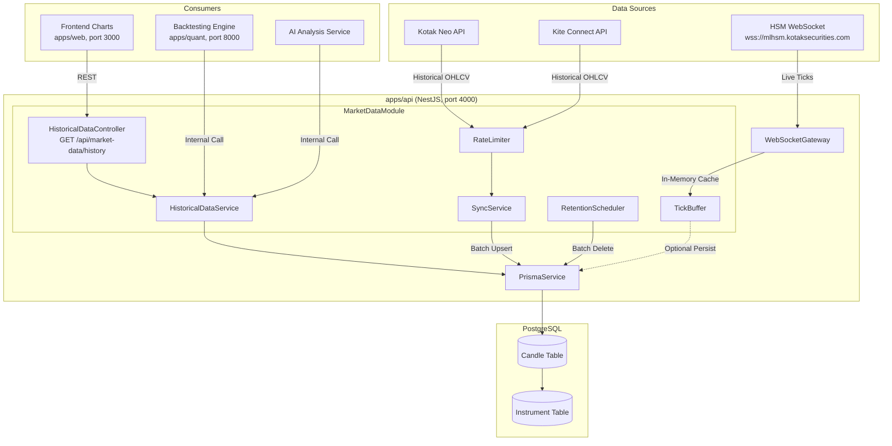
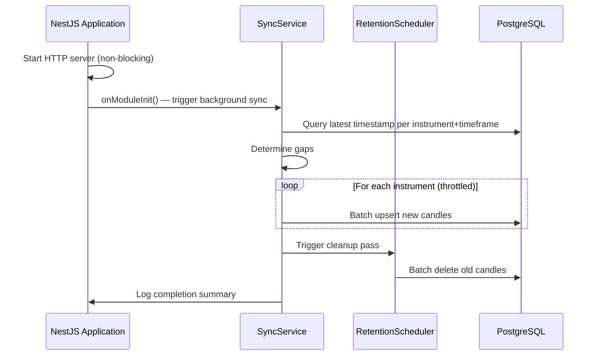

# Design Document: Historical Market Data

## Overview

This design describes the architecture for a historical market data storage and retrieval system within ProfitTerminal. The system provides a 2-year rolling window of OHLCV candle data in PostgreSQL, integrating with the existing Kite Connect and Kotak Neo broker APIs.

The system is decomposed into four core concerns:
1. **Data Ingestion** — Incremental sync from broker APIs with rate limiting and retry logic
2. **Data Storage** — Idempotent upsert into the existing `Candle` table with proper indexing
3. **Data Query** — Efficient retrieval with date clamping, pagination, and ascending ordering
4. **Data Lifecycle** — Automated 2-year retention cleanup via scheduled batch deletion

The design preserves separation between live tick data (in-memory/WebSocket) and historical candle data (PostgreSQL), and integrates cleanly with the existing `MarketDataModule` in NestJS.

## Architecture

### High-Level Data Flow



### Startup Sequence



## Components and Interfaces

### 1. HistoricalDataService

The central query service for historical candle data. Integrates into the existing `MarketDataModule`.

```typescript
@Injectable()
export class HistoricalDataService {
  constructor(
    private readonly prisma: PrismaService,
    private readonly configService: ConfigService,
  ) {}

  /**
   * Query historical candles with automatic date clamping.
   * Returns candles ordered by timestamp ascending.
   */
  async getHistoricalCandles(params: {
    instrumentId: string;
    timeframe: Timeframe;
    fromDate: Date;
    toDate: Date;
  }): Promise<HistoricalCandlesResult> { ... }

  /**
   * Batch upsert candles (idempotent).
   * Uses ON CONFLICT DO UPDATE on the unique constraint.
   */
  async upsertCandles(candles: CandleInput[]): Promise<number> { ... }

  /**
   * Get the latest stored timestamp for an instrument+timeframe.
   * Used by SyncService to determine sync starting point.
   */
  async getLatestTimestamp(
    instrumentId: string,
    timeframe: Timeframe,
  ): Promise<Date | null> { ... }

  /**
   * Delete candles older than the retention boundary.
   * Operates in batches to avoid long-running transactions.
   */
  async deleteOlderThan(
    boundary: Date,
    batchSize: number,
  ): Promise<number> { ... }
}
```

### 2. SyncService

Handles incremental data fetching from broker APIs.

```typescript
@Injectable()
export class SyncService implements OnModuleInit {
  constructor(
    private readonly historicalDataService: HistoricalDataService,
    private readonly kiteConnectProvider: KiteConnectProvider,
    private readonly rateLimiter: RateLimiter,
    private readonly configService: ConfigService,
    private readonly retentionScheduler: RetentionScheduler,
  ) {}

  /**
   * Called on app start. Initiates non-blocking background sync.
   */
  async onModuleInit(): Promise<void> { ... }

  /**
   * Sync historical data for a single instrument+timeframe.
   * Determines the latest stored timestamp and fetches only new data.
   */
  async syncHistoricalData(
    instrumentId: string,
    timeframe: Timeframe,
  ): Promise<SyncResult> { ... }

  /**
   * Sync all active instruments. Runs in background.
   */
  private async syncAllInstruments(): Promise<void> { ... }

  /**
   * Chunk a date range into broker-API-sized segments.
   * Kotak limits: ~2000 candles per request for day timeframe.
   */
  private chunkDateRange(
    from: Date,
    to: Date,
    timeframe: Timeframe,
  ): DateRange[] { ... }
}
```

### 3. RetentionScheduler

Daily cleanup job using NestJS `@Cron` decorator.

```typescript
@Injectable()
export class RetentionScheduler {
  constructor(
    private readonly historicalDataService: HistoricalDataService,
    private readonly configService: ConfigService,
  ) {}

  /**
   * Runs daily at configured time. Deletes expired candles in batches.
   */
  @Cron(CronExpression.EVERY_DAY_AT_2AM)
  async handleRetentionCleanup(): Promise<void> { ... }

  /**
   * Manual trigger (called by SyncService on startup).
   */
  async runCleanup(): Promise<RetentionResult> { ... }
}
```

### 4. RateLimiter

Token-bucket rate limiter for broker API requests.

```typescript
@Injectable()
export class RateLimiter {
  private tokens: number = 10;
  private lastRefill: number = Date.now();
  private readonly maxTokens = 10; // 10 req/sec

  /**
   * Acquire a token. Blocks (awaits) if no tokens available.
   */
  async acquire(): Promise<void> { ... }
}
```

### 5. TickBuffer

Optional in-memory buffer for live tick persistence.

```typescript
@Injectable()
export class TickBuffer {
  private buffer: TickData[] = [];
  private flushTimer: NodeJS.Timeout | null = null;

  constructor(
    private readonly prisma: PrismaService,
    private readonly configService: ConfigService,
  ) {}

  /**
   * Add a tick to the buffer. Flushes when batch size or interval reached.
   */
  push(tick: TickData): void { ... }

  /**
   * Non-blocking flush to database.
   */
  private async flush(): Promise<void> { ... }
}
```

### 6. HistoricalDataController

REST endpoint for historical data queries.

```typescript
@Controller('market-data')
export class HistoricalDataController {
  @Get('history')
  async getHistory(
    @Query() query: HistoricalDataQueryDto,
  ): Promise<HistoricalDataResponseDto> { ... }
}
```

### Module Registration

The new services integrate into the existing `MarketDataModule`:

```typescript
@Module({
  imports: [ConfigModule, DatabaseModule, AuditModule, ScheduleModule.forRoot()],
  controllers: [MarketDataController, KiteAuthController, HistoricalDataController],
  providers: [
    MarketDataService,
    KiteConnectProvider,
    HistoricalDataService,
    SyncService,
    RetentionScheduler,
    RateLimiter,
    TickBuffer,
  ],
  exports: [MarketDataService, HistoricalDataService],
})
export class MarketDataModule {}
```

## Data Models

### Existing Candle Model (No Schema Changes Required)

The existing `Candle` model in `prisma/schema.prisma` already satisfies all data model requirements:

```prisma
model Candle {
  id           String     @id @default(uuid())
  instrumentId String
  timeframe    Timeframe
  timestamp    DateTime
  open         Float
  high         Float
  low          Float
  close        Float
  volume       BigInt
  createdAt    DateTime   @default(now())
  Instrument   Instrument @relation(fields: [instrumentId], references: [id], onDelete: Cascade)

  @@unique([instrumentId, timeframe, timestamp])
  @@index([instrumentId, timeframe, timestamp])
  @@index([timestamp])
}
```

**Existing indexes already satisfy Requirement 13:**
- `@@unique([instrumentId, timeframe, timestamp])` — enforces uniqueness and serves as composite index
- `@@index([instrumentId, timeframe, timestamp])` — composite index for range queries
- `@@index([timestamp])` — timestamp index for retention cleanup

**Existing Timeframe enum already includes all required values:**
```prisma
enum Timeframe {
  TICK
  ONE_MIN
  FIVE_MIN
  FIFTEEN_MIN
  THIRTY_MIN
  ONE_HOUR
  FOUR_HOUR
  ONE_DAY
  ONE_WEEK
  ONE_MONTH
}
```

### DTOs and Interfaces

```typescript
// Input for batch upsert
interface CandleInput {
  instrumentId: string;
  timeframe: Timeframe;
  timestamp: Date;
  open: number;
  high: number;
  low: number;
  close: number;
  volume: bigint;
}

// Query parameters DTO
class HistoricalDataQueryDto {
  @IsUUID()
  instrumentId: string;

  @IsEnum(Timeframe)
  timeframe: Timeframe;

  @IsISO8601()
  from: string; // ISO 8601 date

  @IsISO8601()
  @IsOptional()
  to?: string; // defaults to now
}

// Response DTO
interface HistoricalDataResponseDto {
  instrumentId: string;
  timeframe: Timeframe;
  from: string; // ISO 8601 (may be clamped)
  to: string;   // ISO 8601 (may be clamped)
  count: number;
  candles: CandleOutput[];
}

interface CandleOutput {
  timestamp: string; // ISO 8601
  open: number;
  high: number;
  low: number;
  close: number;
  volume: string; // BigInt serialized as string
}

// Sync result
interface SyncResult {
  instrumentId: string;
  timeframe: Timeframe;
  candlesSynced: number;
  fromDate: Date;
  toDate: Date;
  durationMs: number;
}

// Retention result
interface RetentionResult {
  deletedCount: number;
  durationMs: number;
  batchesProcessed: number;
}
```

### Configuration Schema

| Environment Variable | Type | Default | Description |
|---------------------|------|---------|-------------|
| `MARKET_DATA_RETENTION_YEARS` | number | `2` | Rolling retention window in years |
| `STORE_TICKS` | boolean | `false` | Enable tick-level storage |
| `TICK_BATCH_SIZE` | number | `1000` | Ticks before flush |
| `TICK_BATCH_INTERVAL_MS` | number | `5000` | Max ms between flushes |
| `SYNC_ON_STARTUP` | boolean | `true` | Enable startup background sync |
| `RETENTION_CRON` | string | `0 2 * * *` | Cron expression for daily cleanup |
| `BROKER_RATE_LIMIT_RPS` | number | `10` | Max broker API requests per second |

## Correctness Properties

*A property is a characteristic or behavior that should hold true across all valid executions of a system—essentially, a formal statement about what the system should do. Properties serve as the bridge between human-readable specifications and machine-verifiable correctness guarantees.*

### Property 1: Candle Upsert Idempotence

*For any* valid candle data (instrumentId, timeframe, timestamp, OHLCV), upserting it N times (where N >= 1) and then querying by the composite key SHALL return exactly one record, and that record's OHLCV values SHALL match the last upserted values.

**Validates: Requirements 1.3, 2.1, 2.3**

### Property 2: Date Clamping at Retention Boundary

*For any* query where fromDate is earlier than (current date minus MARKET_DATA_RETENTION_YEARS), the effective fromDate used in the database query SHALL be clamped to (current date minus MARKET_DATA_RETENTION_YEARS), and no candles with timestamps before this boundary SHALL appear in the result.

**Validates: Requirements 3.2, 6.2, 9.2**

### Property 3: Future Date Clamping

*For any* query where toDate is in the future (later than the current timestamp), the effective toDate SHALL be clamped to the current timestamp at the time of query execution.

**Validates: Requirements 3.3**

### Property 4: Query Results Ascending Order

*For any* valid query returning two or more candles, every candle[i].timestamp SHALL be less than or equal to candle[i+1].timestamp (strict ascending order by timestamp).

**Validates: Requirements 3.4**

### Property 5: Incremental Sync Gap Detection

*For any* instrument+timeframe combination that already has stored candles, the sync operation SHALL request data from the broker API starting only after the latest stored timestamp, and the resulting stored dataset SHALL have no gaps between the previously-latest timestamp and the newly-fetched data.

**Validates: Requirements 4.2**

### Property 6: Date Range Chunking Validity

*For any* date range [from, to] and timeframe, the chunking function SHALL produce sub-ranges that: (a) are contiguous and non-overlapping, (b) collectively cover the entire [from, to] range, and (c) each sub-range contains at most the broker API's maximum allowed candle count.

**Validates: Requirements 4.4**

### Property 7: Retention Cleanup Correctness

*For any* set of candles in the database, after the retention scheduler executes: (a) no Candle record with timestamp older than the retention boundary SHALL remain, (b) all Candle records with timestamp within the retention window SHALL be preserved, and (c) all non-Candle tables (Instrument, Signal, Trade, etc.) SHALL be completely unaffected.

**Validates: Requirements 5.2, 5.5**

### Property 8: API Response Shape Completeness

*For any* valid GET /api/market-data/history request, the JSON response SHALL contain all required fields: instrumentId (string), timeframe (string), from (ISO 8601), to (ISO 8601), count (integer equal to candles array length), and candles (array).

**Validates: Requirements 6.5**

### Property 9: Range Selector Date Calculation

*For any* range selector value in {1D, 1W, 1M, 3M, 6M, 1Y, 2Y}, the computed fromDate SHALL be exactly the corresponding duration before the current date, and toDate SHALL be the current date.

**Validates: Requirements 7.3**

### Property 10: Backtest Date Validation

*For any* backtest request where the start date is before the retention boundary, the system SHALL return a validation error that includes the earliest available date, and SHALL NOT execute the backtest.

**Validates: Requirements 8.2**

### Property 11: Only Completed Bars Persisted

*For any* write to the Candle table from the live data pipeline, the persisted candle SHALL represent a completed (closed) timeframe bar—meaning its timestamp corresponds to a bar whose time period has fully elapsed.

**Validates: Requirements 11.2**

### Property 12: Tick Buffer Dual-Threshold Flush

*For any* sequence of ticks arriving while STORE_TICKS=true, the buffer SHALL flush when EITHER the buffer size reaches TICK_BATCH_SIZE OR TICK_BATCH_INTERVAL_MS milliseconds have elapsed since the last flush, whichever condition is met first.

**Validates: Requirements 12.2**

### Property 13: Configuration Invalid Value Fallback

*For any* environment variable (MARKET_DATA_RETENTION_YEARS, STORE_TICKS, TICK_BATCH_SIZE, TICK_BATCH_INTERVAL_MS) with an invalid value (non-numeric for numbers, non-boolean for booleans), the system SHALL log a warning and use the documented default value.

**Validates: Requirements 14.5**

## Error Handling

### Broker API Errors

| Error Scenario | Handling Strategy |
|---|---|
| HTTP 429 (Rate Limited) | RateLimiter prevents this proactively; if received, back off exponentially |
| HTTP 401 (Auth Expired) | Log error, skip instrument, alert for re-authentication |
| HTTP 500 (Server Error) | Retry with exponential backoff (1s, 2s, 4s), max 3 attempts |
| Network Timeout | Retry with same backoff strategy; configurable timeout (30s default) |
| Partial Data Response | Accept partial data, store what's available, log warning, retry gap on next sync |

### Database Errors

| Error Scenario | Handling Strategy |
|---|---|
| Unique constraint violation | Expected during upsert — handled by ON CONFLICT DO UPDATE |
| Connection pool exhausted | Queue requests, log warning, fail gracefully with 503 |
| Transaction timeout (retention) | Break into smaller batches, continue with next batch |
| Foreign key violation | Skip candle with invalid instrumentId, log warning |

### API Endpoint Errors

| HTTP Code | Condition | Response Body |
|---|---|---|
| 400 | Missing required params | `{ error: "VALIDATION_ERROR", message: "..." }` |
| 404 | instrumentId not found | `{ error: "NOT_FOUND", message: "Instrument not found" }` |
| 500 | Internal error | `{ error: "INTERNAL_ERROR", message: "..." }` |

### Resilience Patterns

- **Circuit Breaker**: Wraps broker API calls. Opens after 5 consecutive failures, half-opens after 60s.
- **Non-blocking Startup**: `onModuleInit` launches sync via `setImmediate()` / `Promise` without awaiting, so the HTTP server accepts requests immediately.
- **Graceful Degradation**: If sync fails for some instruments, others continue independently.

## Testing Strategy

### Property-Based Testing (PBT)

**Library**: [fast-check](https://github.com/dubzzz/fast-check) (TypeScript)

PBT is appropriate for this feature because:
- The core logic involves pure functions (date clamping, chunking, upsert idempotence)
- Universal properties hold across wide input spaces (any instrumentId, any timestamp, any OHLCV values)
- Input variation reveals edge cases (leap years, DST, midnight boundaries, BigInt overflow)

**Configuration**:
- Minimum 100 iterations per property test
- Each test tagged with: `Feature: historical-market-data, Property {N}: {title}`
- Properties 1-13 from the Correctness Properties section implemented as fast-check property tests

### Unit Tests (Example-Based)

| Area | Tests |
|---|---|
| HistoricalDataService.getHistoricalCandles | Valid queries, empty results, boundary dates |
| SyncService.syncHistoricalData | First sync (empty), incremental sync, error scenarios |
| RetentionScheduler | Batch deletion, error resilience, logging |
| RateLimiter | Token acquisition, refill timing |
| TickBuffer | Flush on size, flush on interval, disabled mode |
| HistoricalDataController | Validation (400), not found (404), success response shape |
| ConfigService extensions | Default values, invalid value warnings |

### Integration Tests

| Area | Tests |
|---|---|
| Full sync flow | Mock broker API → SyncService → PostgreSQL → Query |
| Retention end-to-end | Insert old data → Run scheduler → Verify deletion |
| API endpoint | HTTP request → Controller → Service → DB → Response |
| Startup sequence | App boot → Sync triggered → API responsive |

### Test Coverage Targets

- **Service layer**: 90%+ coverage via property + unit tests
- **Controller layer**: 80%+ coverage via integration tests
- **Utility functions** (clamping, chunking, rate limiting): 95%+ via property tests
