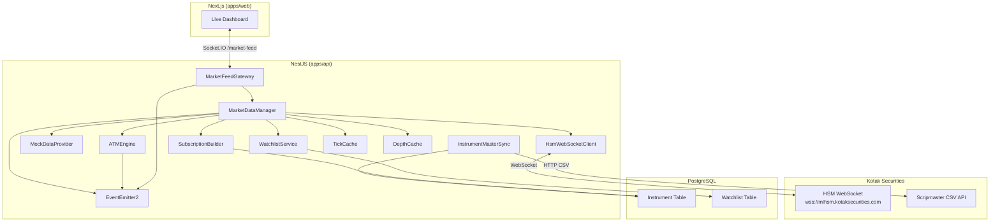
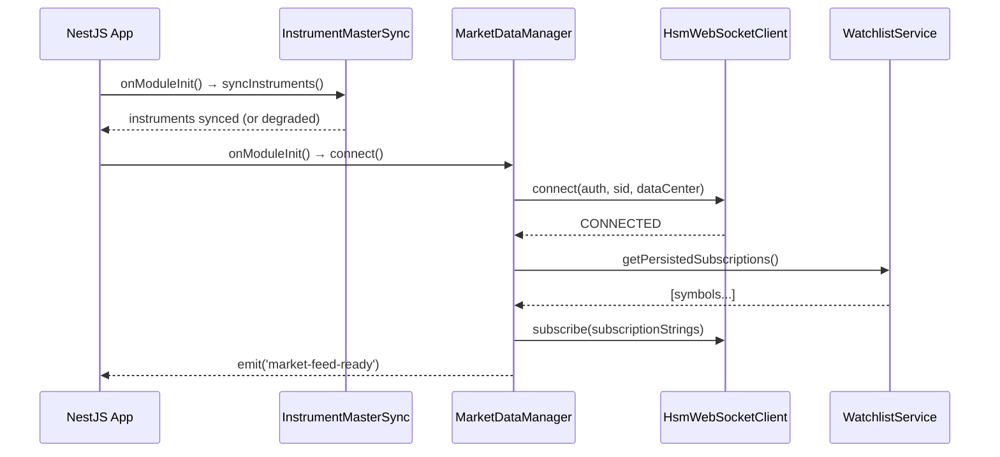

# Design Document: HSM Market Feed

## Overview

The HSM Market Feed system provides real-time market data streaming to ProfitTerminal by integrating with Kotak Securities' HSM (High-Speed Market) WebSocket service. It delivers live price ticks, options chain monitoring, and market depth for NSE equities and derivatives.

The architecture follows a layered approach:
1. **Transport Layer** — HSM WebSocket client managing the raw connection to `wss://mlhsm.kotaksecurities.com`
2. **Data Layer** — Normalization, caching, and event broadcasting of ticks
3. **Domain Layer** — ATM engine, watchlist management, subscription orchestration
4. **Presentation Layer** — WebSocket gateway to frontend and Live Dashboard UI

Key design decisions:
- **HSM client as a NestJS injectable service** wrapping the `ws` package with reconnection logic
- **In-memory Maps** for tick and depth caches (latestTicks, latestDepths) — no persistence needed for ephemeral live data
- **NestJS EventEmitter2** for decoupled tick broadcasting to internal consumers (ATM Engine, portfolio service)
- **Strategy pattern** with a shared `IMarketDataProvider` interface enabling transparent swap between real HSM and mock provider
- **Dedicated WebSocket gateway** (Socket.IO namespace `/market-feed`) for frontend tick delivery
- **Instrument Master Sync** as a scheduled + on-demand service using Kotak scripmaster CSV endpoint

## Architecture



### Startup Sequence



## Components and Interfaces

### IMarketDataProvider (Interface)

The contract shared between `HsmWebSocketClient` and `MockDataProvider`:

```typescript
type ConnectionStatus = 'DISCONNECTED' | 'CONNECTING' | 'CONNECTED' | 'RECONNECTING';

interface IMarketDataProvider {
  connect(auth: string, sid: string, dataCenter: string): Promise<void>;
  disconnect(): Promise<void>;
  subscribe(subscriptionStrings: string[]): void;
  unsubscribe(subscriptionStrings: string[]): void;
  getConnectionStatus(): ConnectionStatus;
  getActiveSubscriptions(): string[];
  onTick(handler: (rawTick: RawHsmTick) => void): void;
  onDepth(handler: (rawDepth: RawHsmDepth) => void): void;
  onStatusChange(handler: (status: ConnectionStatus) => void): void;
}
```

### HsmWebSocketClient

NestJS injectable service implementing `IMarketDataProvider`:

```typescript
@Injectable()
export class HsmWebSocketClient implements IMarketDataProvider {
  private ws: WebSocket | null = null;
  private status: ConnectionStatus = 'DISCONNECTED';
  private activeSubscriptions: Set<string> = new Set();
  private reconnectAttempts: number = 0;
  private maxBackoff: number = 60_000; // 60s cap
  private heartbeatTimer: NodeJS.Timeout | null = null;
  
  // Reconnection metrics
  private metrics = {
    totalReconnectAttempts: 0,
    successfulReconnections: 0,
    disconnectedSince: null as Date | null,
  };
}
```

**Reconnection strategy**: Exponential backoff starting at 1s, doubling each attempt, capped at 60s. On success, all previously active subscriptions are restored within 2s. After 5 consecutive minutes of failure, emits `connection-critical` event.

### MockDataProvider

```typescript
@Injectable()
export class MockDataProvider implements IMarketDataProvider {
  private intervalHandle: NodeJS.Timeout | null = null;
  private tickInterval: number; // default 1000ms from config
  private basePrices: Map<string, number> = new Map();
  // Simulates ±2% random walk around base price
}
```

### MarketDataManager

Central orchestration service:

```typescript
@Injectable()
export class MarketDataManager {
  constructor(
    private readonly provider: IMarketDataProvider,
    private readonly instrumentSync: InstrumentMasterSync,
    private readonly subscriptionBuilder: SubscriptionBuilder,
    private readonly tickCache: TickCache,
    private readonly depthCache: DepthCache,
    private readonly eventEmitter: EventEmitter2,
    private readonly sessionStore: KotakSessionStore,
    private readonly prisma: PrismaService,
  ) {}

  // Public API
  async connect(): Promise<void>;
  async subscribeStock(symbol: string): Promise<void>;
  async subscribeIndex(symbol: string): Promise<void>;
  async subscribeOption(params: { underlying: string; expiry: Date; strike: number; optionType: 'CALL' | 'PUT' }): Promise<void>;
  async subscribeDepth(token: string): Promise<void>;
  unsubscribe(token: string): void;
  getLatestTick(token: string): NormalizedTick | null;
  getLatestDepth(token: string): NormalizedDepth | null;
  getActiveSubscriptions(): string[];
  getConnectionStatus(): ConnectionStatus;
}
```

### SubscriptionBuilder

```typescript
@Injectable()
export class SubscriptionBuilder {
  private static readonly MAX_SCRIPS = 200;
  private static readonly MAX_CHANNELS = 16;
  
  buildStockSubscription(instrument: Instrument): string;
  buildIndexSubscription(instrument: Instrument): string;
  buildBatch(instruments: Instrument[]): string[];
  validate(instrument: Instrument): void; // throws on missing fields
  deduplicate(subscriptions: string[]): string[];
  checkLimits(current: number, adding: number): void; // throws if exceeds 200/16
}
```

### TickCache

```typescript
@Injectable()
export class TickCache {
  private latestTicks: Map<string, NormalizedTick> = new Map();
  
  set(token: string, tick: NormalizedTick): void;
  get(token: string): NormalizedTick | null;
  remove(token: string): void;
  getAll(): Map<string, NormalizedTick>;
  clear(): void;
}
```

### DepthCache

```typescript
@Injectable()
export class DepthCache {
  private latestDepths: Map<string, NormalizedDepth> = new Map();

  set(token: string, depth: NormalizedDepth): void;
  get(token: string): NormalizedDepth | null;
  remove(token: string): void;
}
```

### ATMEngine

```typescript
@Injectable()
export class ATMEngine {
  private currentATM: Map<string, number> = new Map(); // underlying → strike
  private strikeRange: number; // from ATM_STRIKE_RANGE env, default 5
  
  onSpotTick(underlying: string, spotPrice: number): void;
  getATMStrike(underlying: string): number | null;
  private calculateATM(spotPrice: number, availableStrikes: number[]): number;
  private rebalanceSubscriptions(underlying: string, newATM: number, oldATM: number): void;
}
```

### InstrumentMasterSync

```typescript
@Injectable()
export class InstrumentMasterSync {
  async syncAll(): Promise<SyncResult>;
  private fetchFilePaths(): Promise<string[]>;
  private downloadAndParseCsv(url: string): Promise<RawInstrumentRow[]>;
  private upsertInstruments(rows: RawInstrumentRow[]): Promise<number>;
  private deactivateExpired(): Promise<number>;
}
```

### WatchlistService

```typescript
@Injectable()
export class WatchlistService {
  async addSymbol(userId: string, watchlistId: string, symbol: string): Promise<void>;
  async removeSymbol(userId: string, watchlistId: string, symbol: string): Promise<void>;
  async getWatchlist(userId: string, watchlistId: string): Promise<WatchlistItem[]>;
  async getPersistedSubscriptions(): Promise<string[]>;
  // Max 50 symbols per watchlist
}
```

### MarketFeedGateway (Socket.IO)

```typescript
@WebSocketGateway({ namespace: '/market-feed', cors: { origin: 'http://localhost:3000', credentials: true } })
export class MarketFeedGateway implements OnGatewayConnection, OnGatewayDisconnect {
  // Listens to EventEmitter2 'tick.*' events
  // Broadcasts to subscribed frontend clients
  // Handles: subscribe, unsubscribe, getStatus messages from clients
}
```

## Data Models

### NormalizedTick

```typescript
interface NormalizedTick {
  instrumentToken: string;
  exchange: string;
  symbol: string;
  lastPrice: number;
  open: number;
  high: number;
  low: number;
  previousClose: number;
  volume: number;
  oi: number;
  bid: number;
  ask: number;
  timestamp: string; // ISO-8601
}
```

### NormalizedDepth

```typescript
interface DepthLevel {
  price: number;
  quantity: number;
  orders: number;
}

interface NormalizedDepth {
  instrumentToken: string;
  bids: DepthLevel[]; // sorted descending by price, max 5
  asks: DepthLevel[]; // sorted ascending by price, max 5
  bestBid: number;
  bestAsk: number;
  spread: number; // bestAsk - bestBid, >= 0
  timestamp: string; // ISO-8601
}
```

### Watchlist (Prisma model addition)

```prisma
model Watchlist {
  id        String          @id @default(uuid())
  userId    String
  name      String
  symbols   String[]        // max 50 per watchlist
  createdAt DateTime        @default(now())
  updatedAt DateTime        @updatedAt
  User      User            @relation(fields: [userId], references: [id], onDelete: Cascade)

  @@unique([userId, name])
  @@index([userId])
}
```

### Instrument Table Extension

The existing `Instrument` model needs an `instrumentToken` field for HSM subscription mapping:

```prisma
model Instrument {
  // ... existing fields ...
  instrumentToken  String?   // Kotak HSM token for subscription
  exchangeSegment  String?   // e.g., "nse_cm", "nse_fo"
  lotSize          Int?      // For derivatives
  tickSize         Float?    // Minimum price movement

  @@index([instrumentToken])
  @@index([underlying, expiry, optionType])
}
```

### RawHsmTick (internal, broker-specific)

```typescript
interface RawHsmTick {
  tk: string;       // token
  lp: string;       // last price
  op: string;       // open
  hp: string;       // high
  lop: string;      // low
  pc: string;       // previous close
  v: string;        // volume
  oi?: string;      // open interest
  bp1?: string;     // best bid price
  sp1?: string;     // best ask price
  ts?: string;      // timestamp
  e: string;        // exchange
  // ... additional HSM fields
}
```

## Correctness Properties

*A property is a characteristic or behavior that should hold true across all valid executions of a system — essentially, a formal statement about what the system should do. Properties serve as the bridge between human-readable specifications and machine-verifiable correctness guarantees.*

### Property 1: Exponential backoff calculation

*For any* reconnection attempt number N (where N ≥ 1), the computed backoff delay SHALL equal min(1000 × 2^(N-1), 60000) milliseconds.

**Validates: Requirements 1.3**

### Property 2: Subscription preservation through reconnection

*For any* set of active subscriptions and any disconnect/reconnect cycle, the set of active subscriptions after reconnection SHALL be equal to the set before disconnection.

**Validates: Requirements 1.4, 11.2**

### Property 3: Connection status state validity

*For any* sequence of connection lifecycle events (connect, disconnect, error, reconnect-attempt, reconnect-success), the connection status SHALL always be one of: DISCONNECTED, CONNECTING, CONNECTED, or RECONNECTING.

**Validates: Requirements 1.6**

### Property 4: Instrument sync idempotency

*For any* valid set of CSV instrument rows, running the sync operation twice with the same input SHALL produce identical database state after both executions.

**Validates: Requirements 2.4**

### Property 5: Instrument CSV parse round-trip

*For any* valid CSV instrument row that is parsed and upserted, querying the Instrument table by exchange and instrumentToken SHALL return a record with equivalent field values.

**Validates: Requirements 2.6**

### Property 6: Expiry-based deactivation

*For any* instrument record, if its expiry date is in the past relative to the sync time, the sync operation SHALL set isActive to false; if the expiry is in the future or null, isActive SHALL remain true.

**Validates: Requirements 2.3**

### Property 7: Subscription string format correctness

*For any* valid Instrument record with exchange segment and instrument token, the Subscription_Builder SHALL produce a string matching the pattern `{exchangeSegment}|{token}&1` for stocks and `{exchangeSegment}|{indexName}&1` for indices.

**Validates: Requirements 3.1, 3.2**

### Property 8: Subscription deduplication

*For any* list of subscription strings (possibly containing duplicates), the deduplicate function SHALL return a list where every element is unique and every element appears in the original input.

**Validates: Requirements 3.3**

### Property 9: HSM protocol limit enforcement

*For any* current subscription count C and requested addition count A, if C + A exceeds 200 scrips or the channel count exceeds 16, the Subscription_Builder SHALL reject the request with an error.

**Validates: Requirements 3.5**

### Property 10: Tick parsing structural validity

*For any* valid RawHsmTick message, the parsed NormalizedTick SHALL have: all numeric fields (lastPrice, open, high, low, previousClose, volume, oi, bid, ask) as JavaScript numbers, lastPrice as a positive number, and timestamp as a valid ISO-8601 date string.

**Validates: Requirements 4.3, 5.2, 5.4**

### Property 11: Tick cache consistency

*For any* instrument token, if a NormalizedTick has been stored in the TickCache for that token, getLatestTick(token) SHALL return that exact tick. If no tick has been stored, getLatestTick(token) SHALL return null.

**Validates: Requirements 4.4**

### Property 12: Unsubscribe cleanup

*For any* active subscription token, calling unsubscribe(token) SHALL result in the token being absent from both the active subscriptions set and the TickCache.

**Validates: Requirements 4.5**

### Property 13: Depth normalization structure

*For any* raw depth snapshot, the normalized output SHALL contain at most 5 bid levels and at most 5 ask levels, with bestBid, bestAsk, and spread fields computed.

**Validates: Requirements 6.1, 6.2**

### Property 14: Depth sort invariant

*For any* normalized depth snapshot, bids SHALL be sorted in strictly descending price order and asks SHALL be sorted in strictly ascending price order.

**Validates: Requirements 6.4**

### Property 15: Depth spread non-negativity

*For any* normalized depth snapshot with at least one bid and one ask, spread SHALL equal bestAsk minus bestBid, and spread SHALL be greater than or equal to zero.

**Validates: Requirements 6.5**

### Property 16: ATM strike nearest to spot

*For any* spot price and non-empty set of available strike prices, the ATM_Engine SHALL select the strike price that minimizes |strikePrice - spotPrice|.

**Validates: Requirements 7.1**

### Property 17: ATM subscription range completeness

*For any* ATM strike and configured range N, the ATM_Engine SHALL subscribe to exactly 2N strikes (N above ATM + N below ATM) for both CALL and PUT types, totaling 4N option subscriptions.

**Validates: Requirements 7.2**

### Property 18: ATM rebalance correctness

*For any* ATM shift from oldATM to newATM with range N, the set of newly subscribed strikes SHALL equal (newRange \ oldRange) and the set of unsubscribed strikes SHALL equal (oldRange \ newRange), where range is ±N strikes around the respective ATM.

**Validates: Requirements 7.3**

### Property 19: Mock price within bounds

*For any* mock tick generated from a base price P, the simulated lastPrice SHALL be within the range [P × 0.98, P × 1.02].

**Validates: Requirements 8.2**

### Property 20: Mock depth structure

*For any* mock depth snapshot generated, it SHALL contain exactly 5 bid levels and exactly 5 ask levels with prices distributed around the simulated last price.

**Validates: Requirements 8.5**

### Property 21: Watchlist reference-counted unsubscribe

*For any* symbol present in multiple watchlists, removing it from one watchlist SHALL NOT trigger unsubscription if at least one other watchlist still references it. Unsubscription SHALL only occur when the last reference is removed.

**Validates: Requirements 10.2**

### Property 22: Watchlist size limit enforcement

*For any* watchlist containing 50 symbols, attempting to add an additional symbol SHALL be rejected with an error, and the watchlist size SHALL remain at 50.

**Validates: Requirements 10.5**

### Property 23: Reconnection metrics accuracy

*For any* sequence of N reconnection attempts with S successes and total disconnected time T, the metrics SHALL report totalReconnectAttempts = N, successfulReconnections = S, and timeDisconnected = T (±tolerance).

**Validates: Requirements 11.4**

## Error Handling

### Connection Errors

| Error Scenario | Handling Strategy |
|---|---|
| WebSocket connection refused | Exponential backoff reconnection (1s → 60s cap) |
| Invalid session credentials | Emit `session-expired` event, cease reconnection, notify frontend |
| Heartbeat timeout (>5s) | Treat as disconnection, begin reconnection |
| 5 minutes continuous failure | Emit `connection-critical` event for monitoring/alerting |

### Data Errors

| Error Scenario | Handling Strategy |
|---|---|
| Malformed raw tick message | Discard message, log warning with raw payload |
| Missing required tick fields | Discard message, log warning |
| Invalid numeric values (NaN, negative price) | Discard tick, log warning |
| Depth data with invalid levels | Discard depth snapshot, retain last valid |

### Subscription Errors

| Error Scenario | Handling Strategy |
|---|---|
| Symbol not found in Instrument table | Return descriptive error to caller |
| HSM limit exceeded (200 scrips) | Reject subscription with limit error |
| Channel limit exceeded (16 channels) | Reject subscription with limit error |
| Instrument missing exchange/token | Throw validation error with field details |

### Sync Errors

| Error Scenario | Handling Strategy |
|---|---|
| CSV download failure | Retry 3× at 5s intervals, then report failure |
| CSV parse error (malformed row) | Skip row, log warning, continue processing |
| Database upsert failure | Log error, continue with remaining rows |
| Startup sync failure | Log error, proceed with stale data, emit `startup-degraded` |

### Watchlist Errors

| Error Scenario | Handling Strategy |
|---|---|
| Symbol not in Instrument table | Return error: "Symbol not found" |
| Watchlist at 50-symbol limit | Return error: "Watchlist limit reached (max 50)" |
| Database persistence failure | Return error, do not update in-memory state |

## Testing Strategy

### Property-Based Testing (fast-check)

The project already has `fast-check` and `@fast-check/jest` installed. Each correctness property maps to one property-based test with minimum 100 iterations.

**Library**: `fast-check` (already in devDependencies)
**Configuration**: Minimum 100 iterations per property test
**Tag format**: `Feature: hsm-market-feed, Property {N}: {title}`

**Key test files:**
- `src/market-feed/subscription-builder.spec.ts` — Properties 7, 8, 9
- `src/market-feed/tick-parser.spec.ts` — Property 10
- `src/market-feed/tick-cache.spec.ts` — Properties 11, 12
- `src/market-feed/depth-cache.spec.ts` — Properties 13, 14, 15
- `src/market-feed/atm-engine.spec.ts` — Properties 16, 17, 18
- `src/market-feed/mock-provider.spec.ts` — Properties 19, 20
- `src/market-feed/hsm-client.spec.ts` — Properties 1, 2, 3, 23
- `src/market-feed/instrument-sync.spec.ts` — Properties 4, 5, 6
- `src/market-feed/watchlist.spec.ts` — Properties 21, 22

### Unit Tests (Jest)

Example-based tests for:
- Session-expired event emission on auth failure (Req 1.5)
- MarketDataManager startup sequence (Req 9.1–9.4)
- Watchlist auto-subscribe on add (Req 10.1)
- Connection status transitions (Req 11.1)
- Connection-critical event after 5-min failure (Req 11.5)

### Integration Tests

- HSM WebSocket connection with real/mocked HSM server
- Instrument sync with mocked CSV endpoint
- Subscription restoration timing (<2s, Req 11.3)
- End-to-end: tick from HSM → NormalizedTick → EventEmitter → WebSocket Gateway → frontend

### Frontend Component Tests

- Live Dashboard renders connection status for each state
- Active subscriptions table renders with correct columns
- Options monitor panel renders CE/PE data
- Market depth panel renders 5 bid/ask levels
- Update latency verification (<100ms from receipt)

### Test Generators (fast-check arbitraries)

Key generators to build:
- `arbInstrument()` — valid Instrument records with exchange, token, symbol
- `arbRawHsmTick()` — valid RawHsmTick with realistic field values
- `arbRawHsmDepth()` — valid depth data with random levels
- `arbSubscriptionSet()` — sets of valid subscription strings
- `arbStrikeSet(spot)` — sets of strike prices around a given spot
- `arbWatchlistState()` — watchlist configurations with shared symbols
- `arbCsvRow()` — valid CSV instrument rows

