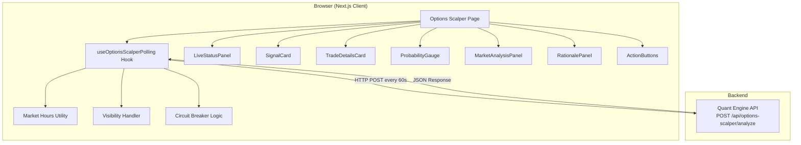

# Design Document: Options Scalper Page

## Overview

The Options Scalper Page is a real-time trading signal dashboard rendered at `/options-scalper` in the ProfitTerminal Next.js application. It communicates with the quant engine (`http://localhost:8000/api/options-scalper/analyze`) via HTTP POST requests to fetch NIFTY50 options scalping signals and displays them in a structured, responsive card layout.

The page implements an auto-refresh mechanism that polls the quant engine every 60 seconds during Indian market hours (9:15 AM – 3:30 PM IST, Monday–Friday), with intelligent handling for page visibility, consecutive failures (circuit breaker), and manual user controls (pause/resume/refresh).

### Key Design Decisions

1. **Client-side polling over WebSocket-only**: The existing page already has WebSocket support as a bonus channel, but the primary mechanism is HTTP polling. This ensures reliability when the WebSocket connection drops.
2. **Custom hook extraction**: The auto-refresh, market-hours checking, and visibility handling logic will be extracted into a dedicated `useOptionsScalperPolling` hook for testability and separation of concerns.
3. **Pure formatting utilities**: All display formatting (currency, R:R, probability, countdown) will be pure functions, making them trivially testable with property-based testing.
4. **Circuit breaker pattern**: After 3 consecutive API failures, auto-refresh pauses to avoid hammering an unresponsive service. A manual refresh or resume resets the circuit.

## Architecture



### Data Flow

1. Page mounts → `useOptionsScalperPolling` checks if current time is within market hours
2. If within market hours, an initial fetch is triggered immediately
3. On success: signal data propagates to UI components, countdown resets to 60s, failure counter resets
4. On failure: last successful data retained, failure counter increments, error shown in status panel
5. After 3 consecutive failures: auto-refresh pauses (circuit breaker trips)
6. Timer ticks every second, decrementing countdown
7. When countdown reaches 0, next fetch fires (if not already in-flight)
8. On tab hide: pause polling. On tab visible + market hours: resume immediately

## Components and Interfaces

### Page Component

**`app/options-scalper/page.tsx`** — Already exists. The page orchestrates sub-components and delegates polling logic to the custom hook.

### Custom Hook: `useOptionsScalperPolling`

```typescript
interface UseOptionsScalperPollingOptions {
  underlying: string;
  refreshIntervalSeconds: number;
  apiUrl: string;
  requestTimeoutMs: number;
}

interface UseOptionsScalperPollingResult {
  data: AnalysisResult | null;
  status: 'active' | 'paused' | 'error' | 'initializing' | 'market-closed';
  secondsUntilRefresh: number;
  isRefreshing: boolean;
  errorMessage: string | undefined;
  consecutiveFailures: number;
  refreshNow: () => void;
  togglePause: (paused: boolean) => void;
}
```

### Utility Functions

**`lib/options-scalper/formatters.ts`**:
- `formatPrice(value: number | null): string` — Returns `₹X.XX` or `"N/A"`
- `formatRiskReward(value: number | null): string` — Returns `"1:X.X"` or `"N/A"`
- `formatProbability(value: number | null): string` — Returns `"X.X%"` or `"N/A"`
- `formatCountdown(seconds: number): string` — Returns `"M:SS"`

**`lib/options-scalper/market-hours.ts`**:
- `isMarketHours(date: Date): boolean` — Checks if timestamp is Mon–Fri 9:15–15:30 IST

### Existing Components (already implemented)

| Component | Purpose |
|-----------|---------|
| `LiveStatusPanel` | Status dot, countdown, refresh/pause controls |
| `SignalCard` | Signal type, strike, entry, target, SL, R:R, probability |
| `TradeDetailsCard` | Structured trade parameters |
| `ProbabilityGauge` | Visual probability indicator |
| `MarketAnalysisPanel` | Technical indicators and OI data |
| `RationalePanel` | Text explanation of signal |
| `ActionButtons` | Paper trade execution |

### Sidebar Navigation

The sidebar in `app/layout.tsx` already contains the "Options Scalper" link. Active state styling needs to be added using `usePathname()` from `next/navigation` to conditionally apply `bg-accent text-accent-foreground` and `aria-current="page"`.

## Data Models

### AnalysisResult (API Response)

```typescript
interface AnalysisResult {
  timestamp: string;
  underlying: string;
  signal_type: 'BUY CE' | 'BUY PE' | 'HOLD';
  probability: number;           // 0-100
  risk_reward_ratio: number;     // positive float
  strike_price: number | null;
  expiry_date: string | null;
  entry_price: number | null;
  target_price: number | null;
  stop_loss: number | null;
  lot_size: number | null;
  spot_price: number;
  trend: string;
  oi_interpretation: string;
  pcr: number;
  trendline_status: string;
  support_level: number | null;
  resistance_level: number | null;
  rsi: number;
  macd: number;
  macd_signal: number;
  vwap: number;
  ema_5: number;
  ema_15: number;
  atr: number;
  volume_ratio: number;
  call_oi: number;
  put_oi: number;
  call_oi_change: number;
  put_oi_change: number;
  atm_iv: number | null;
  rationale: string;
  hold_reason: string | null;
}
```

### Polling State

```typescript
interface PollingState {
  isPaused: boolean;
  isInFlight: boolean;
  consecutiveFailures: number;   // 0-3, trips circuit at 3
  lastSuccessfulData: AnalysisResult | null;
  secondsRemaining: number;      // countdown 60 → 0
  status: 'active' | 'paused' | 'error' | 'initializing' | 'market-closed';
}
```

### Request Payload

```typescript
interface AnalyzeRequest {
  underlying: 'NIFTY' | 'BANKNIFTY';
}
```

## Correctness Properties

*A property is a characteristic or behavior that should hold true across all valid executions of a system — essentially, a formal statement about what the system should do. Properties serve as the bridge between human-readable specifications and machine-verifiable correctness guarantees.*

### Property 1: Formatting functions produce correctly structured output

*For any* valid numeric input (finite positive number), `formatPrice` SHALL produce a string matching the pattern `₹<digits>.<2 digits>`, `formatRiskReward` SHALL produce a string matching `1:<digits>.<1 digit>`, and `formatProbability` (for inputs in [0, 100]) SHALL produce a string matching `<digits>.<1 digit>%`.

**Validates: Requirements 1.2, 1.3, 1.4**

### Property 2: Null inputs produce "N/A" display

*For any* formatting function (`formatPrice`, `formatRiskReward`, `formatProbability`) when called with `null` as input, the output SHALL be the string `"N/A"`.

**Validates: Requirements 1.7**

### Property 3: Market hours classification is correct for any timestamp

*For any* `Date` object, `isMarketHours(date)` SHALL return `true` if and only if the date falls on Monday–Friday AND the IST time is between 09:15:00 (inclusive) and 15:30:00 (inclusive). For all other timestamps (weekends, before 9:15, after 15:30), it SHALL return `false`.

**Validates: Requirements 2.1, 2.2, 2.5**

### Property 4: Countdown timer formatting is correct

*For any* non-negative integer `seconds`, `formatCountdown(seconds)` SHALL produce a string in the format `M:SS` where M is `Math.floor(seconds / 60)` and SS is `(seconds % 60).toString().padStart(2, '0')`.

**Validates: Requirements 2.4**

### Property 5: Circuit breaker trips after exactly 3 consecutive failures

*For any* sequence of API call results (success or failure), the circuit breaker SHALL trip (pause auto-refresh) if and only if the last 3 results are all failures. Any success in the sequence SHALL reset the consecutive failure counter to zero.

**Validates: Requirements 3.5**

## Error Handling

| Scenario | Behavior |
|----------|----------|
| API returns HTTP 4xx/5xx | Retain last successful data, show error in status panel, increment failure counter |
| Network timeout (10s) | Same as HTTP error — retain data, show connection error, increment counter |
| 3 consecutive failures | Trip circuit breaker: pause auto-refresh, show persistent error notification |
| Malformed JSON response | Treat as failure, retain last data, show parse error |
| Tab hidden during in-flight request | Let request complete but don't trigger new refresh cycle |
| Resume outside market hours | Remain paused, show "Market Closed" message |
| Invalid probability (< 0 or > 100) | Display "Error" indicator with alert icon |
| WebSocket disconnect | Fall back to HTTP polling (no user-visible error unless polling also fails) |

## Testing Strategy

### Unit Tests (Example-based)

Unit tests cover specific scenarios, edge cases, and component rendering:

- **SignalCard rendering**: Verify correct display for BUY CE, BUY PE, and HOLD signals
- **HOLD state**: Verify hold reason displays and trade fields are hidden
- **Error/loading states**: Verify "Waiting for analysis..." when data is null
- **LiveStatusPanel**: Verify status dot colors, PAUSED indicator, button states
- **Sidebar active state**: Verify `aria-current="page"` applied on correct route
- **Visibility handling**: Verify pause on hide, resume on visible during market hours
- **Manual controls**: Verify refresh button triggers fetch, pause stops timer
- **Responsive breakpoints**: Verify grid class changes at 768px and 1024px
- **Touch targets**: Verify 44x44px minimum on interactive elements

### Property-Based Tests

Property tests verify universal invariants across generated inputs using `fast-check`:

- **Formatter properties** (Properties 1, 2): Generate random numbers/null values, verify format patterns
- **Market hours property** (Property 3): Generate random Date objects across all days/times, verify classification
- **Countdown formatting** (Property 4): Generate random non-negative integers, verify M:SS format
- **Circuit breaker property** (Property 5): Generate random sequences of success/failure, verify trip/reset behavior

**Configuration:**
- Library: `fast-check` (already available in the monorepo's API package; add to web devDependencies)
- Minimum 100 iterations per property test
- Each test tagged with: `Feature: options-scalper-page, Property {N}: {description}`

### Integration Tests

- Verify full page mount triggers initial API call
- Verify 60-second polling cycle with mocked timers
- Verify circuit breaker resets on manual refresh success
