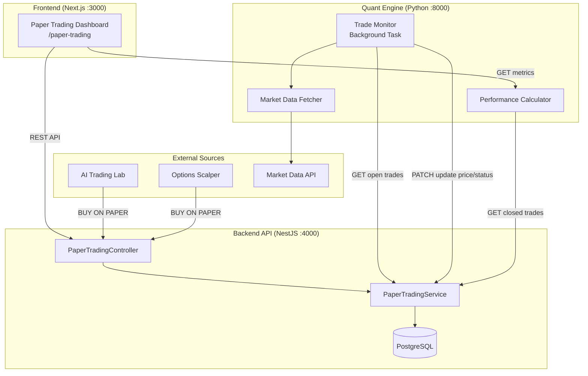
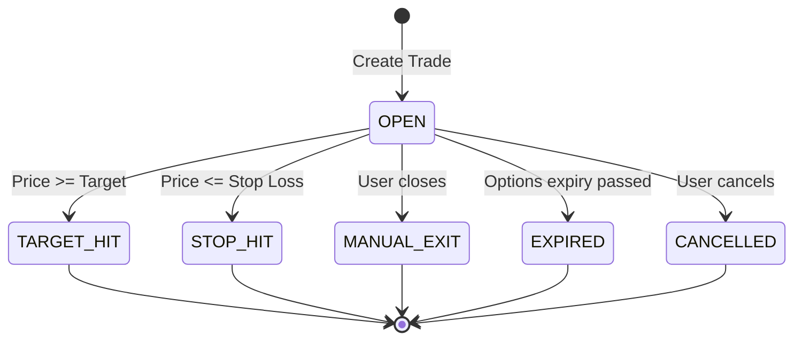
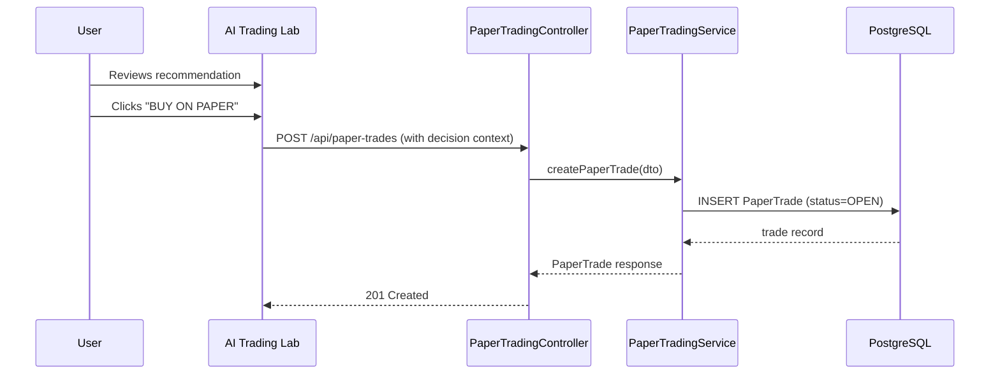
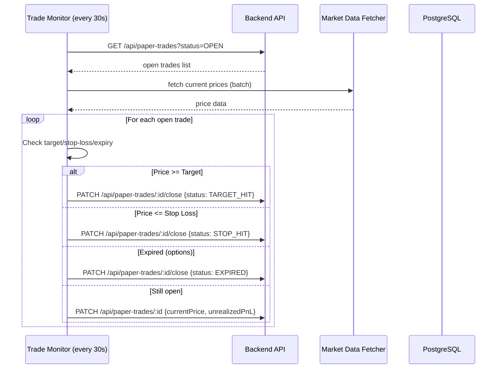

# Technical Design Document

## Overview

The Paper Trading System provides a full-lifecycle simulated trading environment that captures AI-generated trade recommendations, monitors them against live market prices, and computes aggregate performance metrics. It integrates with the existing AI Trading Lab and Options Scalper via "BUY ON PAPER" actions, persists complete decision context, and surfaces results through a dedicated `/paper-trading` dashboard.

### Key Design Decisions

1. **Enhanced existing service**: The `PaperTradingService` in `apps/api/src/trading/` is extended (not rewritten) to support the new trade types, AI metadata storage, and lifecycle transitions.
2. **Trade Monitor in Quant Engine**: The price-monitoring background loop runs in the Python Quant Engine (`apps/quant`) because it already has market data access and polling infrastructure (similar to the scalper's auto-refresh orchestrator).
3. **Performance Calculator in Quant Engine**: Metric calculations (win rate, profit factor, drawdown, etc.) are pure numerical computations well-suited to Python/NumPy, co-located with the trade monitor.
4. **Schema evolution over replacement**: The existing `PaperTrade` Prisma model is extended with new fields (trade type, AI context JSON, exit metadata) rather than creating a parallel table.
5. **REST-first dashboard**: The frontend dashboard uses standard REST polling (30s interval) rather than WebSocket for simplicity; the backend exposes all necessary endpoints.

### Technology Stack (additions)

- **Backend API**: NestJS (existing) — new `PaperTradingController`, extended `PaperTradingService`
- **Quant Engine**: Python FastAPI (existing) — new `trade_monitor` module, `performance_calculator` module
- **Frontend**: Next.js App Router (existing) — new `/paper-trading` route with three panels
- **Database**: PostgreSQL via Prisma (existing) — schema migration for extended `PaperTrade` model

## Architecture

### High-Level Architecture Diagram



### Low-Level Architecture — Trade Lifecycle



### Data Flow — Trade Creation



### Data Flow — Trade Monitoring



## Components and Interfaces

### 1. PaperTradingController (NestJS)

**Location:** `apps/api/src/trading/paper-trading.controller.ts`

| Endpoint | Method | Description |
|----------|--------|-------------|
| `/api/paper-trades` | POST | Create paper trade from AI decision or scalper signal |
| `/api/paper-trades` | GET | List trades with pagination, status/type filters |
| `/api/paper-trades/:id` | PATCH | Update current price/unrealizedPnL (monitor) |
| `/api/paper-trades/:id/close` | PATCH | Close trade (manual exit or monitor-triggered) |
| `/api/paper-trades/:id/cancel` | PATCH | Cancel an open trade |
| `/api/paper-trades/metrics` | GET | Get performance metrics (delegates to quant) |

### 2. PaperTradingService (NestJS) — Enhanced

**Location:** `apps/api/src/trading/paper-trading.service.ts`

```typescript
interface CreatePaperTradeDto {
  userId: string;
  symbol: string;
  direction: 'LONG' | 'SHORT';
  tradeType: 'SWING' | 'INTRADAY' | 'OPTIONS_SCALPING';
  entryPrice: number;
  stopLoss: number;
  target: number;
  quantity: number;
  // AI context
  decisionId?: string;
  agentId?: string;
  originalPrompt?: string;
  aiResponse?: string;
  probability?: number;
  riskRewardRatio?: number;
  marketDataSnapshot?: Record<string, any>;
  indicators?: Record<string, any>;
  trendlineAnalysis?: Record<string, any>;
  promptVersion?: string;
  // Options-specific
  strikePrice?: number;
  optionType?: 'CE' | 'PE';
  expiryDate?: Date;
  underlying?: string;
}

interface ClosePaperTradeDto {
  exitPrice: number;
  exitReason: 'TARGET_HIT' | 'STOP_HIT' | 'MANUAL_EXIT' | 'EXPIRED';
}

interface PaperTradeFilters {
  status?: TradeStatus[];
  tradeType?: TradeType;
  page?: number;
  pageSize?: number;
}
```

**Methods:**
- `createPaperTrade(dto: CreatePaperTradeDto): Promise<PaperTrade>`
- `closePaperTrade(tradeId: string, dto: ClosePaperTradeDto): Promise<PaperTrade>`
- `cancelPaperTrade(tradeId: string): Promise<PaperTrade>`
- `updateTradePrice(tradeId: string, currentPrice: number): Promise<void>`
- `getTradesForUser(userId: string, filters: PaperTradeFilters): Promise<PaginatedResult<PaperTrade>>`
- `getOpenTrades(userId: string): Promise<PaperTrade[]>`

### 3. Trade Monitor (Python Background Service)

**Location:** `apps/quant/paper_trading/trade_monitor.py`

```python
class TradeMonitor:
    """Background service that polls open paper trades every 30s."""
    
    def __init__(self, api_base_url: str, market_data_fetcher: MarketDataFetcher, interval: int = 30):
        ...
    
    async def start(self) -> None:
        """Start the monitoring loop."""
    
    async def stop(self) -> None:
        """Gracefully stop the monitoring loop."""
    
    async def check_trades(self) -> MonitorCycleResult:
        """Single check cycle: fetch open trades, get prices, evaluate conditions."""
    
    async def evaluate_trade(self, trade: PaperTradeData, current_price: float) -> TradeAction:
        """Determine action for a single trade based on current price."""
```

### 4. Performance Calculator (Python)

**Location:** `apps/quant/paper_trading/performance_calculator.py`

```python
@dataclass
class PerformanceMetrics:
    win_rate: float           # % of profitable trades
    profit_factor: float      # gross profits / gross losses
    total_pnl: float          # sum of realized P&L
    expectancy: float         # average P&L per trade
    average_r: float          # mean R-multiple
    max_drawdown: float       # largest peak-to-trough decline
    total_trades: int
    winning_trades: int
    losing_trades: int

class PerformanceCalculator:
    """Computes aggregate trading metrics from closed trade records."""
    
    def calculate_metrics(self, closed_trades: List[ClosedTradeData], trade_type: Optional[str] = None) -> PerformanceMetrics:
        """Calculate all performance metrics from closed trades."""
    
    def calculate_win_rate(self, trades: List[ClosedTradeData]) -> float:
        """Win Rate = winning_trades / total_trades * 100"""
    
    def calculate_profit_factor(self, trades: List[ClosedTradeData]) -> float:
        """Profit Factor = sum(profits) / abs(sum(losses))"""
    
    def calculate_expectancy(self, trades: List[ClosedTradeData]) -> float:
        """Expectancy = total_pnl / total_trades"""
    
    def calculate_average_r(self, trades: List[ClosedTradeData]) -> float:
        """Average R = mean(realized_pnl / initial_risk) for each trade"""
    
    def calculate_max_drawdown(self, trades: List[ClosedTradeData]) -> float:
        """Max Drawdown = largest peak-to-trough decline in cumulative P&L curve"""
```

### 5. Performance Calculator Router (Python FastAPI)

**Location:** `apps/quant/paper_trading/router.py`

| Endpoint | Method | Description |
|----------|--------|-------------|
| `/api/paper-trading/metrics` | GET | Calculate and return performance metrics |
| `/api/paper-trading/monitor/status` | GET | Get trade monitor status |

### 6. Paper Trading Dashboard (Next.js)

**Location:** `apps/web/app/paper-trading/page.tsx`

**Components:**
- `OpenTradesTable` — Displays all OPEN trades with live P&L, Close/Cancel buttons
- `ClosedTradesTable` — Displays terminal trades with sorting, expandable AI context
- `PerformanceMetricsPanel` — Summary cards with color-coded metrics
- `TradeTypeFilter` — Dropdown filter for All/Swing/Intraday/Options Scalping

## Data Models

### Extended PaperTrade Schema (Prisma Migration)

```prisma
enum PaperTradeStatus {
  OPEN
  TARGET_HIT
  STOP_HIT
  MANUAL_EXIT
  EXPIRED
  CANCELLED
}

enum PaperTradeType {
  SWING
  INTRADAY
  OPTIONS_SCALPING
}

model PaperTrade {
  id                String            @id @default(uuid())
  userId            String
  symbol            String
  direction         SignalDirection
  tradeType         PaperTradeType    @default(SWING)
  quantity          Int
  entryPrice        Float
  stopLoss          Float
  target            Float
  status            PaperTradeStatus  @default(OPEN)
  
  // Live tracking
  currentPrice      Float?
  unrealizedPnL     Float?
  
  // Exit data
  exitPrice         Float?
  realizedPnL       Float?
  exitedAt          DateTime?
  
  // AI context (stored as JSON)
  decisionId        String?
  agentId           String?
  aiContext         Json?             // {prompt, response, indicators, trendlineAnalysis, marketDataSnapshot, promptVersion}
  probability       Float?
  riskRewardRatio   Float?
  
  // Options-specific
  strikePrice       Float?
  optionType        String?           // "CE" or "PE"
  expiryDate        DateTime?
  underlying        String?
  
  // Metadata
  simulatedSlippage Float             @default(0)
  enteredAt         DateTime          @default(now())
  updatedAt         DateTime          @updatedAt
  
  // Relations
  signalId          String?
  Signal            Signal?           @relation(fields: [signalId], references: [id])
  User              User              @relation(fields: [userId], references: [id], onDelete: Cascade)
  
  @@index([userId, status])
  @@index([userId, tradeType])
  @@index([symbol])
  @@index([status])
}
```

### API Request/Response Models

**Create Paper Trade Request:**
```typescript
{
  symbol: string;
  direction: "LONG" | "SHORT";
  tradeType: "SWING" | "INTRADAY" | "OPTIONS_SCALPING";
  entryPrice: number;
  stopLoss: number;
  target: number;
  quantity: number;
  decisionId?: string;
  agentId?: string;
  originalPrompt?: string;
  aiResponse?: string;
  probability?: number;
  riskRewardRatio?: number;
  marketDataSnapshot?: object;
  indicators?: object;
  trendlineAnalysis?: object;
  promptVersion?: string;
  strikePrice?: number;
  optionType?: "CE" | "PE";
  expiryDate?: string; // ISO date
  underlying?: string;
}
```

**Paper Trade Response:**
```typescript
{
  id: string;
  symbol: string;
  direction: "LONG" | "SHORT";
  tradeType: "SWING" | "INTRADAY" | "OPTIONS_SCALPING";
  entryPrice: number;
  currentPrice: number | null;
  stopLoss: number;
  target: number;
  quantity: number;
  status: "OPEN" | "TARGET_HIT" | "STOP_HIT" | "MANUAL_EXIT" | "EXPIRED" | "CANCELLED";
  unrealizedPnL: number | null;
  realizedPnL: number | null;
  exitPrice: number | null;
  exitedAt: string | null;
  enteredAt: string;
  probability: number | null;
  riskRewardRatio: number | null;
  // Options fields (when tradeType = OPTIONS_SCALPING)
  strikePrice?: number;
  optionType?: "CE" | "PE";
  expiryDate?: string;
  underlying?: string;
}
```

**Performance Metrics Response:**
```typescript
{
  winRate: number;        // percentage (0-100)
  profitFactor: number;   // ratio
  totalPnL: number;       // absolute currency
  expectancy: number;     // average per trade
  averageR: number;       // mean R-multiple
  maxDrawdown: number;    // absolute currency (negative)
  totalTrades: number;
  winningTrades: number;
  losingTrades: number;
}
```

### Trade Monitor Internal Models (Python)

```python
@dataclass
class PaperTradeData:
    id: str
    symbol: str
    direction: str
    trade_type: str
    entry_price: float
    stop_loss: float
    target: float
    quantity: int
    status: str
    current_price: Optional[float]
    strike_price: Optional[float]
    option_type: Optional[str]
    expiry_date: Optional[date]
    underlying: Optional[str]

@dataclass
class TradeAction:
    trade_id: str
    action: str  # "CLOSE" | "UPDATE" | "NONE"
    new_status: Optional[str]  # "TARGET_HIT" | "STOP_HIT" | "EXPIRED"
    exit_price: Optional[float]
    current_price: float
    unrealized_pnl: float

@dataclass
class MonitorCycleResult:
    timestamp: datetime
    trades_checked: int
    trades_closed: int
    trades_updated: int
    errors: List[str]
```

## Correctness Properties

*A property is a characteristic or behavior that should hold true across all valid executions of a system — essentially, a formal statement about what the system should do. Properties serve as the bridge between human-readable specifications and machine-verifiable correctness guarantees.*

### Property 1: Trade creation round-trip preserves all fields

*For any* valid paper trade creation input (including AI context, options fields, and metadata), creating the trade and then reading it back SHALL produce a record where all input fields match the original values exactly.

**Validates: Requirements 1.1, 1.2, 1.3, 2.4, 3.1, 3.4**

### Property 2: Trade evaluation determines correct status transition

*For any* open paper trade with defined entry price, stop-loss, and target, and *for any* current market price:
- If price >= target (for LONG) or price <= target (for SHORT), status SHALL become TARGET_HIT
- If price <= stop-loss (for LONG) or price >= stop-loss (for SHORT), status SHALL become STOP_HIT
- If trade is OPTIONS_SCALPING and current date > expiry date, status SHALL become EXPIRED
- Otherwise, the trade SHALL remain OPEN with updated current price

**Validates: Requirements 4.2, 4.3, 4.5**

### Property 3: Unrealized P&L calculation correctness

*For any* open paper trade with entry price E, current price C, quantity Q, and direction D:
- If D is LONG: unrealizedPnL SHALL equal (C - E) × Q
- If D is SHORT: unrealizedPnL SHALL equal (E - C) × Q

**Validates: Requirements 4.4**

### Property 4: Terminal state immutability

*For any* paper trade in a terminal status (TARGET_HIT, STOP_HIT, MANUAL_EXIT, EXPIRED, or CANCELLED), attempting to close or cancel SHALL return an error and the trade's status SHALL remain unchanged.

**Validates: Requirements 5.3**

### Property 5: Win Rate calculation

*For any* non-empty set of closed trades with realized P&L values, Win Rate SHALL equal (count of trades where realizedPnL > 0) / (total count of closed trades) × 100.

**Validates: Requirements 6.1**

### Property 6: Profit Factor calculation

*For any* set of closed trades containing at least one winning and one losing trade, Profit Factor SHALL equal the sum of all positive realizedPnL values divided by the absolute value of the sum of all negative realizedPnL values.

**Validates: Requirements 6.2**

### Property 7: Total P&L calculation

*For any* set of closed trades, Total P&L SHALL equal the sum of all realizedPnL values across all trades in the set.

**Validates: Requirements 6.3**

### Property 8: Expectancy calculation

*For any* non-empty set of closed trades, Expectancy SHALL equal Total P&L divided by the count of closed trades.

**Validates: Requirements 6.4**

### Property 9: Average R calculation

*For any* set of closed trades where each trade has entry price, stop-loss, and realized P&L, Average R SHALL equal the mean of (realizedPnL / initialRisk) across all trades, where initialRisk = |entryPrice - stopLoss| × quantity.

**Validates: Requirements 6.5**

### Property 10: Max Drawdown calculation

*For any* ordered sequence of closed trades (by exit time), the Maximum Drawdown SHALL equal the largest peak-to-trough decline when computing the cumulative P&L curve. Formally: max over all pairs (i, j) where i < j of (cumulativePnL[i] - cumulativePnL[j]), where cumulativePnL[k] = sum of realizedPnL for trades 0..k.

**Validates: Requirements 6.6**

### Property 11: Trade type filtering correctness

*For any* set of paper trades with mixed trade types, and *for any* selected trade type filter, the filtered result SHALL contain only trades whose tradeType matches the filter, and SHALL contain ALL trades matching that filter from the original set.

**Validates: Requirements 2.5, 6.8, 9.3**

### Property 12: Pagination completeness and correctness

*For any* list of N paper trades and *for any* valid page size P, iterating through all pages SHALL yield exactly N unique trades with no duplicates and no missing entries, where each page (except possibly the last) contains exactly P items.

**Validates: Requirements 10.6**

## Error Handling

### Backend API (NestJS)

| Error Scenario | HTTP Status | Response |
|---|---|---|
| Trade not found | 404 | `{ error: "Paper trade not found", tradeId: "..." }` |
| Trade not in OPEN status (close/cancel) | 409 | `{ error: "Trade is already closed", status: "..." }` |
| Invalid trade type | 400 | `{ error: "Invalid trade type", allowed: [...] }` |
| Missing required fields | 400 | `{ error: "Validation failed", details: [...] }` |
| Options trade missing options fields | 400 | `{ error: "Options fields required for OPTIONS_SCALPING" }` |
| Database error | 500 | `{ error: "Internal server error" }` |
| Invalid pagination params | 400 | `{ error: "Invalid page or pageSize" }` |

### Trade Monitor (Python)

| Error Scenario | Handling |
|---|---|
| API unreachable | Log error, retry next cycle, increment error counter |
| Market data unavailable for symbol | Skip trade, log warning, continue with other trades |
| Individual trade update fails | Log error, continue with remaining trades |
| Monitor crash | Auto-restart via FastAPI lifespan, log critical error |

### Performance Calculator (Python)

| Error Scenario | Handling |
|---|---|
| Zero closed trades | Return all metrics as 0 (Requirement 6.7) |
| Division by zero (profit factor with no losses) | Return `Infinity` for profit factor |
| Division by zero (no initial risk) | Skip trade in Average R calculation |
| Invalid trade data | Skip malformed records, log warning |

## Testing Strategy

### Property-Based Testing (PBT)

**Library:** Hypothesis (Python) for quant engine; fast-check (TypeScript) for NestJS backend

**Configuration:** Minimum 100 iterations per property test.

**Property tests to implement:**

1. **Performance Calculator properties (Python/Hypothesis):**
   - Property 5: Win Rate — Tag: `Feature: paper-trading-system, Property 5: Win Rate calculation`
   - Property 6: Profit Factor — Tag: `Feature: paper-trading-system, Property 6: Profit Factor calculation`
   - Property 7: Total P&L — Tag: `Feature: paper-trading-system, Property 7: Total P&L calculation`
   - Property 8: Expectancy — Tag: `Feature: paper-trading-system, Property 8: Expectancy calculation`
   - Property 9: Average R — Tag: `Feature: paper-trading-system, Property 9: Average R calculation`
   - Property 10: Max Drawdown — Tag: `Feature: paper-trading-system, Property 10: Max Drawdown calculation`

2. **Trade Monitor evaluation logic (Python/Hypothesis):**
   - Property 2: Trade evaluation — Tag: `Feature: paper-trading-system, Property 2: Trade evaluation determines correct status transition`
   - Property 3: Unrealized P&L — Tag: `Feature: paper-trading-system, Property 3: Unrealized P&L calculation correctness`

3. **Backend service logic (TypeScript/fast-check):**
   - Property 1: Creation round-trip — Tag: `Feature: paper-trading-system, Property 1: Trade creation round-trip preserves all fields`
   - Property 4: Terminal state immutability — Tag: `Feature: paper-trading-system, Property 4: Terminal state immutability`
   - Property 11: Filtering — Tag: `Feature: paper-trading-system, Property 11: Trade type filtering correctness`
   - Property 12: Pagination — Tag: `Feature: paper-trading-system, Property 12: Pagination completeness and correctness`

### Unit Tests (Example-Based)

- Trade creation for each trade type (SWING, INTRADAY, OPTIONS_SCALPING)
- Manual close operation records exit data correctly
- Cancel operation sets CANCELLED with no exit price
- Zero trades returns zero metrics (edge case)
- Non-existent trade ID returns 404
- Options trade without options fields returns 400
- Dashboard renders all required columns (frontend component tests)

### Integration Tests

- Full API endpoint tests for each REST endpoint
- Trade monitor full cycle: create trade → monitor detects target hit → trade closed
- Dashboard fetches and displays data from API
- AI Trading Lab "BUY ON PAPER" flow end-to-end
- Options Scalper "BUY ON PAPER" flow end-to-end

### Frontend Tests

- Component rendering tests for OpenTradesTable, ClosedTradesTable, PerformanceMetricsPanel
- Filter interaction tests
- Sorting functionality tests
- Expandable AI context row tests
