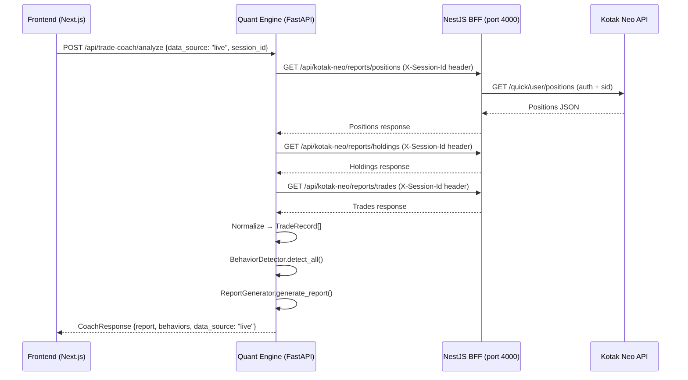
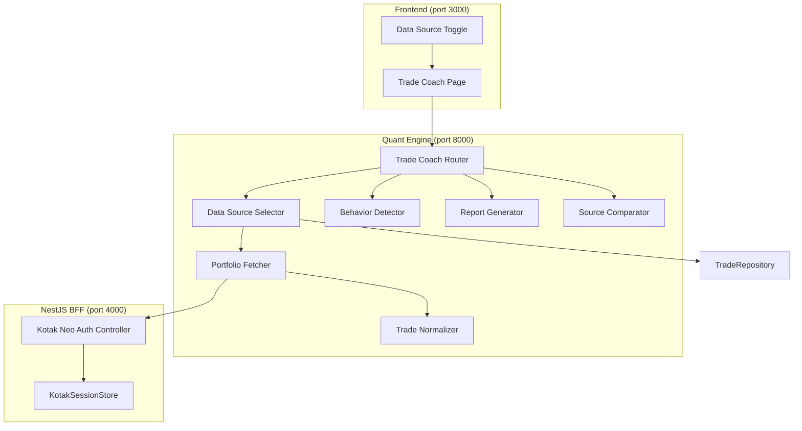

# Design Document: Portfolio Trade Coaching

## Overview

This feature extends the existing AI Trade Coach (`apps/quant/trade_coach/`) to analyze real brokerage data from the user's Kotak Neo account. The system introduces a **Portfolio Fetcher** that retrieves live positions, holdings, and trade history via the existing NestJS BFF proxy layer, a **Trade Normalizer** that converts Kotak Neo API responses into the internal `TradeRecord` format, and a **Data Source Selector** that lets users choose between paper, live, or combined analysis modes.

The design preserves the existing coaching analysis pipeline (behavior detection, report generation, source comparison) and extends it with live data capabilities. No changes to the core analysis engine are required — only the data ingestion layer is extended.

### Key Design Decisions

1. **Quant engine fetches from NestJS BFF** (not directly from Kotak Neo APIs) — this preserves the security model where broker tokens never leave the BFF.
2. **Normalization is a pure function** — transforms Kotak JSON responses into `TradeRecord` objects with no side effects, making it easily testable.
3. **No persistent caching of live data** — each analysis request fetches fresh data to avoid stale portfolio state.
4. **Graceful degradation** — if session expires mid-analysis, the system reports partial results rather than failing completely.

## Architecture



### Component Diagram



## Components and Interfaces

### 1. Portfolio Fetcher (`apps/quant/trade_coach/portfolio_fetcher.py`)

Responsible for making HTTP requests to the NestJS BFF and returning raw JSON responses.

```python
class PortfolioFetcher:
    """Fetches live portfolio data from the Kotak Neo BFF proxy."""

    def __init__(self, bff_base_url: str = "http://localhost:4000/api/kotak-neo"):
        self.bff_base_url = bff_base_url

    async def fetch_positions(self, session_id: str) -> dict:
        """GET /reports/positions with X-Session-Id header."""
        ...

    async def fetch_holdings(self, session_id: str) -> dict:
        """GET /reports/holdings with X-Session-Id header."""
        ...

    async def fetch_trades(self, session_id: str) -> dict:
        """GET /reports/trades with X-Session-Id header."""
        ...

    async def validate_session(self, session_id: str) -> bool:
        """GET /status with X-Session-Id to verify session is active."""
        ...
```

### 2. Trade Normalizer (`apps/quant/trade_coach/trade_normalizer.py`)

Pure function module that converts raw Kotak Neo JSON responses into `TradeRecord` objects.

```python
class TradeNormalizer:
    """Transforms Kotak Neo API responses into internal TradeRecord format."""

    def normalize_positions(self, raw_positions: list[dict]) -> list[TradeRecord]:
        """Convert Kotak Neo position records to TradeRecords."""
        ...

    def normalize_holdings(self, raw_holdings: list[dict]) -> list[TradeRecord]:
        """Convert Kotak Neo holding records to TradeRecords."""
        ...

    def normalize_trades(self, raw_trades: list[dict]) -> list[TradeRecord]:
        """Convert Kotak Neo executed trade records to TradeRecords."""
        ...
```

### 3. Data Source Selector (`apps/quant/trade_coach/data_source_selector.py`)

Orchestrates data retrieval based on the selected source mode.

```python
class DataSourceSelector:
    """Selects and merges trade data from paper and/or live sources."""

    def __init__(self, repository: TradeRepository, fetcher: PortfolioFetcher,
                 normalizer: TradeNormalizer):
        ...

    async def get_trades(self, user_id: str, source: str,
                         session_id: Optional[str] = None) -> DataSourceResult:
        """
        Retrieve trades based on source mode.

        Args:
            source: "paper" | "live" | "combined"
            session_id: Required when source is "live" or "combined"

        Returns:
            DataSourceResult with trades list and metadata.
        """
        ...

    def resolve_default_source(self, session_id: Optional[str],
                               has_paper_trades: bool) -> str:
        """Determine default source: combined if both available, else paper."""
        ...
```

### 4. Extended Router (`apps/quant/trade_coach/router.py`)

Updated endpoints accepting `data_source` and `session_id` parameters.

```python
@router.post("/analyze", response_model=CoachResponse)
async def analyze_trading(request: CoachRequest):
    """Extended to accept data_source and session_id fields."""
    ...

@router.get("/behaviors", response_model=BehaviorsResponse)
async def get_behaviors(
    user_id: str = Query(default="default"),
    data_source: str = Query(default="paper"),
    session_id: Optional[str] = Query(default=None),
):
    ...

@router.get("/compare", response_model=SourceComparisonResponse)
async def compare_sources(
    user_id: str = Query(default="default"),
    session_id: Optional[str] = Query(default=None),
):
    """Enhanced to include live portfolio metrics when session is valid."""
    ...
```

### 5. Frontend Data Source Toggle (`apps/web/app/trade-coach/page.tsx`)

UI component additions to the existing Trade Coach page.

```typescript
// New state and component additions
type DataSource = 'paper' | 'live' | 'combined';

// DataSourceToggle component with three options
// Disabled options when no active Kotak session
// Passes data_source + session_id to API calls
```

## Data Models

### Kotak Neo Raw Response Formats

Based on the MCP server implementation, the raw Kotak API responses use these field names:

**Positions** (from `/quick/user/positions`):
```json
{
  "trdSym": "RELIANCE-EQ",
  "sym": "RELIANCE",
  "qty": "10",
  "buyAmt": "25000.00",
  "sellAmt": "0.00",
  "prod": "MIS",
  "exSeg": "nse_cm"
}
```

**Holdings** (from `/portfolio/v1/holdings`):
```json
{
  "displaySymbol": "RELIANCE",
  "symbol": "RELIANCE-EQ",
  "quantity": "50",
  "averagePrice": "2450.75",
  "mktValue": "125000.00",
  "unrealisedGainLoss": "2462.50"
}
```

**Trades** (from `/quick/user/trades`):
```json
{
  "trdSym": "RELIANCE-EQ",
  "trnsTp": "B",
  "qty": "10",
  "prc": "2500.00",
  "flQty": "10",
  "ordSt": "complete",
  "nOrdNo": "230101000001",
  "flDtTm": "2024-01-15 10:30:45"
}
```

### Extended Internal Models

```python
# New fields in CoachRequest
class CoachRequest(BaseModel):
    user_id: str = Field(default="default")
    time_range_days: Optional[int] = None
    source_filter: Optional[str] = None
    data_source: str = Field(default="paper", description="paper|live|combined")
    session_id: Optional[str] = Field(default=None, description="Kotak session ID")

# New response wrapper for data source results
@dataclass
class DataSourceResult:
    trades: List[TradeRecord]
    source: str  # "paper", "live", "combined"
    live_fetch_errors: List[str] = field(default_factory=list)
    partial: bool = False  # True if session expired mid-fetch

# Extended CoachResponse metadata
class CoachResponse(BaseModel):
    success: bool
    report: Optional[CoachReportResponse] = None
    behaviors: List[BehaviorDetectionResponse] = []
    total_trades_analyzed: int = 0
    data_source: str = "paper"
    live_trade_count: Optional[int] = None
    paper_trade_count: Optional[int] = None
    slippage_summary: Optional[dict] = None
    generated_at: Optional[str] = None
```

### Normalization Mapping Rules

| Kotak Field | TradeRecord Field | Notes |
|---|---|---|
| `trdSym` / `displaySymbol` | `symbol` | Strip exchange suffix (-EQ) |
| `trnsTp` "B"/"S" | `direction` | B→LONG, S→SHORT |
| `qty` / `quantity` | `quantity` | Parse string → int |
| `prc` / `averagePrice` | `entry_price` | Parse string → float, preserve precision |
| `buyAmt` | computed `entry_price` | buyAmt / qty for positions |
| `mktValue` | computed `exit_price` | For holdings: current market value / qty |
| `unrealisedGainLoss` | `realized_pnl` | For holdings (unrealized treated as P&L) |
| `flDtTm` | `entry_date` | Parse "YYYY-MM-DD HH:MM:SS" |
| N/A | `user_id` | Set from request context |
| N/A | `id` | Generated UUID with "live-" prefix |


## Correctness Properties

*A property is a characteristic or behavior that should hold true across all valid executions of a system — essentially, a formal statement about what the system should do. Properties serve as the bridge between human-readable specifications and machine-verifiable correctness guarantees.*

### Property 1: Normalization completeness

*For any* valid Kotak Neo API record (position, holding, or executed trade), the Trade Normalizer SHALL produce a TradeRecord containing all required fields: a non-empty symbol, a valid direction, quantity > 0, a non-negative price, and trade source set to "live".

**Validates: Requirements 2.1, 2.2, 2.3**

### Property 2: Numeric precision preservation

*For any* valid Kotak Neo API record containing numeric fields (prices, quantities, P&L values), the normalized TradeRecord SHALL contain numeric values exactly equal to the parsed float/int values from the source — no rounding, truncation, or precision loss shall occur during normalization.

**Validates: Requirements 2.4**

### Property 3: Invalid record exclusion

*For any* Kotak Neo API response containing records with missing required fields, the Trade Normalizer SHALL exclude those records from the output list. The count of valid output records SHALL equal the count of input records minus the count of records with missing required fields.

**Validates: Requirements 2.5**

### Property 4: Normalization round-trip consistency

*For any* valid Kotak Neo API response, normalizing the records to TradeRecord objects, serializing those objects to dict, and normalizing the serialized form again SHALL produce TradeRecord objects equivalent to the first normalization result.

**Validates: Requirements 2.6**

### Property 5: Source filtering correctness

*For any* set of paper trades and live trades, and *for any* valid source mode ("paper", "live", or "combined"), the Data Source Selector SHALL return exactly the trades belonging to the selected source(s): only paper trades for "paper" mode, only live trades for "live" mode, and the union of both for "combined" mode. The response's `data_source` metadata field SHALL match the requested source mode.

**Validates: Requirements 3.2, 3.3, 3.4, 4.4**

### Property 6: Default source resolution

*For any* combination of session state (active or inactive) and paper trade availability (present or absent), the Data Source Selector SHALL resolve the default source to "combined" when both an active session exists AND paper trades are present, and to "paper" otherwise.

**Validates: Requirements 3.5, 3.6**

### Property 7: Slippage calculation correctness

*For any* live trade where both executed price and intended (order) price are available, the calculated slippage SHALL equal `(executed_price - intended_price)` for buy orders and `(intended_price - executed_price)` for sell orders. The slippage value SHALL be positive when execution is unfavorable and negative when favorable.

**Validates: Requirements 4.1**

### Property 8: API parameter validation

*For any* request to the Trade Coach analyze or behaviors endpoint, if `data_source` is "live" or "combined" and `session_id` is not provided (None or empty), the endpoint SHALL return HTTP 400. If `data_source` is "paper" or `session_id` is provided, validation SHALL pass.

**Validates: Requirements 7.1, 7.2, 7.3**

## Error Handling

### Session Errors

| Scenario | Behavior | Response |
|---|---|---|
| Session ID missing | Reject immediately | HTTP 400 with message "session_id required for live/combined mode" |
| Session ID invalid (BFF returns 401/403) | Abort analysis | `{success: false, error: "Kotak Neo session expired or invalid. Please log in again."}` |
| Session expires mid-fetch | Return partial results | `{success: true, partial: true, live_fetch_errors: ["Holdings fetch failed: 401"]}` |

### BFF/Network Errors

| Scenario | Behavior | Response |
|---|---|---|
| BFF unreachable (connection refused) | Retry once, then fail | `{success: false, error: "Cannot reach trading API. Please try again."}` |
| BFF returns 5xx | Propagate with context | `{success: false, error: "Trading API error (502). Please try again later."}` |
| BFF timeout (>10s) | Abort with timeout | `{success: false, error: "Trading API timeout. Please try again."}` |

### Data Errors

| Scenario | Behavior | Response |
|---|---|---|
| Empty positions/holdings/trades | Proceed with empty list | Analysis runs on available data (may result in 0 trades) |
| Malformed individual record | Skip record, log warning | Analysis proceeds with valid records only |
| All records malformed | Return empty analysis | `{success: true, total_trades_analyzed: 0, report: {recommendations: ["No valid trade data found"]}}` |
| Fewer than 5 live trades | Include recommendation | Add "More trading history needed for meaningful analysis" to recommendations |

### Frontend Error States

- **No session**: Live/Combined options disabled with tooltip "Log in to Kotak Neo to analyze live trades"
- **Session error during analysis**: Display login prompt dialog with "Your Kotak session has expired. Please log in again to continue."
- **Network error**: Display retry button with error message
- **Partial results**: Show available data with warning banner "Some live data could not be fetched"

## Testing Strategy

### Property-Based Tests (Hypothesis - Python)

The Trade Normalizer and Data Source Selector are pure-logic components well-suited for property-based testing. Each correctness property above maps to a Hypothesis test with minimum 100 iterations.

**Library**: [Hypothesis](https://hypothesis.readthedocs.io/) (already used in project — `.hypothesis/` directory present)

**Test file**: `apps/quant/tests/test_trade_normalizer_properties.py`

Tests:
- Property 1: Generate random valid Kotak position/holding/trade JSON objects → verify output field completeness
- Property 2: Generate random decimal strings with varying precision → verify exact float preservation
- Property 3: Generate records with randomly removed required fields → verify exclusion
- Property 4: Generate valid records → normalize → serialize → normalize → compare
- Property 5: Generate random paper/live trade lists + source mode → verify filtering
- Property 6: Generate random session_active/has_paper_trades booleans → verify default
- Property 7: Generate random price pairs (executed, intended) and direction → verify slippage formula
- Property 8: Generate random data_source + session_id combinations → verify 400/pass

**Configuration**: Each test runs with `@settings(max_examples=100)` minimum.

**Tag format**: Each test is decorated with a comment:
```python
# Feature: portfolio-trade-coaching, Property 1: Normalization completeness
```

### Unit Tests (pytest)

- Portfolio Fetcher: Mock httpx calls, verify correct URLs/headers/error handling
- Session validation: Mock BFF status endpoint, test active/expired scenarios
- Partial fill detection: Specific examples of partial fills
- Insufficient data threshold: Test with exactly 4 and 5 trades
- API endpoint parameter validation: Specific request/response pairs

### Integration Tests

- End-to-end flow: Quant engine → BFF (mocked Kotak responses) → normalize → analyze
- Frontend component tests: Render Trade Coach page, verify toggle behavior
- Session flow: Login → analyze with live → session expire → re-login prompt

### Test Environment

- **Quant engine tests**: `pytest` with `httpx` mocking for BFF calls
- **Frontend tests**: Vitest + React Testing Library for component behavior
- **No live broker calls in CI**: All Kotak Neo responses are mocked
