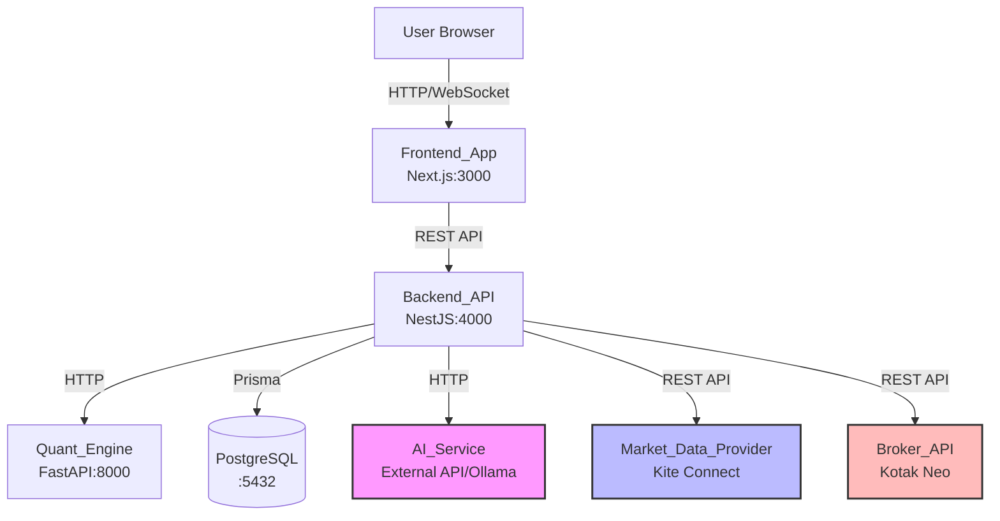

# Technical Design Document

## Overview

ProfitTerminal is a local-first AI trading operating system designed for Indian equity and options markets (NSE stocks, NIFTY/BANKNIFTY options). The system architecture enforces strict separation between AI reasoning and market execution through deterministic quant and risk engines, ensuring AI cannot fabricate data or bypass risk controls.

### Core Architecture Principle

The fundamental architectural constraint is that AI_Service has **no direct access** to Market_Data_Provider or Broker_API. All data flows through deterministic processing layers:

```
Market_Data_Provider (Kite Connect)
    ↓
Backend_API (NestJS) - Data Orchestration
    ↓
Quant_Engine (Python FastAPI) - Deterministic Analysis
    ↓
AI_Service (External API / Ollama) - Reasoning Layer
    ↓
Risk_Engine (NestJS Module) - Validation Layer
    ↓
User Confirmation (Frontend) - Human-in-the-Loop
    ↓
Broker_API (Kotak Neo) - Execution Layer
```

This design prevents AI hallucination from affecting trade execution and ensures all trades pass through quantitative validation and explicit user approval.

### Technology Stack

- **Frontend_App**: Next.js 14+ (App Router), TypeScript, Tailwind CSS, shadcn/ui, TradingView Lightweight Charts
- **Backend_API**: NestJS 10+, TypeScript, Prisma ORM, class-validator
- **Quant_Engine**: Python 3.11+, FastAPI, Pandas, NumPy, TA-Lib, SciPy
- **Database**: PostgreSQL 15+
- **State Management**: Zustand (Frontend), TanStack Query (data fetching)
- **Deployment**: Docker Compose (PostgreSQL only), all other services run natively

## Architecture

### System Architecture Diagram



### Data Flow Enforcement

**Critical Architectural Rules (enforced by Backend_API):**

1. **AI Cannot Access Market Data Directly**
   - AI_Service receives only processed quantitative results from Quant_Engine
   - Raw market data (OHLCV, order book) never exposed to AI
   - Backend_API validates all AI requests reject direct data access

2. **AI Cannot Execute Trades**
   - AI_Service generates recommendations, not orders
   - All recommendations pass through Risk_Engine validation
   - Live trades require explicit user confirmation via Frontend_App
   - Backend_API is the sole gateway to Broker_API

3. **Deterministic Processing First**
   - Market data → Quant_Engine (technical indicators, trendlines)
   - Quant results → AI_Service (reasoning, recommendations)
   - AI recommendations → Risk_Engine (validation)
   - Validated recommendations → User → Broker_API

### Service Communication Patterns

**Backend_API ↔ Quant_Engine:**

- Protocol: HTTP/REST
- Format: JSON
- Pattern: Request-Response (synchronous)
- Endpoints: `/analyze`, `/indicators`, `/trendlines`

**Backend_API ↔ AI_Service:**

- Protocol: HTTP/REST or local inference
- Format: JSON (structured prompts)
- Pattern: Request-Response (may be async for long inferences)
- Context: Quantitative results + user prompt + portfolio state

**Frontend_App ↔ Backend_API:**

- Protocol: HTTP/REST + WebSocket (real-time updates)
- Format: JSON
- Pattern: REST for commands, WebSocket for market data streams
- Authentication: JWT tokens

## Components and Interfaces

### Frontend_App (Next.js)

**Module Structure:**

```
src/
├── app/                      # Next.js App Router
│   ├── layout.tsx
│   ├── page.tsx             # Dashboard
│   ├── portfolio/           # Portfolio views
│   ├── analysis/            # Analysis interface
│   └── api/                 # Route handlers (optional)
├── components/
│   ├── ui/                  # shadcn/ui components
│   ├── charts/              # TradingView chart wrappers
│   ├── prompt-input.tsx     # Natural language input
│   ├── recommendation-card.tsx
│   ├── portfolio-table.tsx
│   └── trade-confirmation-dialog.tsx
├── lib/
│   ├── api-client.ts        # Backend API client
│   ├── websocket.ts         # WebSocket manager
│   └── utils.ts
├── stores/
│   ├── portfolio-store.ts   # Zustand stores
│   ├── ui-store.ts
│   └── auth-store.ts
└── types/
    └── api-types.ts         # TypeScript interfaces
```

**Key Components:**

1. **PromptInput**
   - Natural language text input
   - Sends user prompts to Backend_API
   - Displays parsing feedback (extracted symbols, timeframe)

2. **RecommendationCard**
   - Displays AI trade recommendations
   - Shows entry, target, stop-loss, confidence
   - Includes "Execute Paper Trade" and "Execute Live Trade" buttons

3. **TradeConfirmationDialog**
   - Modal for live trade confirmation
   - Displays trade details, risk metrics, and Risk_Engine validation
   - Requires explicit user click to execute

4. **ChartViewer**
   - Wraps TradingView Lightweight Charts
   - Displays candlestick data with technical indicators
   - Annotates support/resistance levels and trendlines

5. **PortfolioTable**
   - Real-time position tracking
   - Calculates and displays PnL
   - Color-coded profit/loss indicators

**State Management:**

- **Zustand stores** for client-side state (UI state, theme, preferences)
- **TanStack Query** for server state (data fetching, caching, refetching)
- Query keys organized by domain: `['market', symbol]`, `['portfolio']`, `['recommendations', id]`

**API Client Interface:**

```typescript
interface ApiClient {
  // Prompt and Analysis
  submitPrompt(prompt: string): Promise<AnalysisResponse>;
  getRecommendation(id: string): Promise<Recommendation>;

  // Portfolio
  getPortfolio(): Promise<Portfolio>;
  getPositions(): Promise<Position[]>;

  // Trading
  executePaperTrade(tradeRequest: TradeRequest): Promise<TradeResult>;
  executeLiveTrade(tradeRequest: TradeRequest): Promise<TradeResult>;

  // Market Data
  getMarketData(symbol: string, timeframe: string): Promise<MarketData>;
}
```

### Backend_API (NestJS)

**Module Structure:**

```
src/
├── main.ts
├── app.module.ts
├── config/
│   └── config.module.ts     # Environment configuration
├── database/
│   ├── prisma.module.ts
│   └── prisma.service.ts
├── market-data/
│   ├── market-data.module.ts
│   ├── market-data.service.ts
│   ├── market-data.controller.ts
│   └── providers/
│       └── kite-connect.provider.ts
├── quant/
│   ├── quant.module.ts
│   ├── quant.service.ts     # HTTP client to Quant_Engine
│   └── dto/
│       ├── indicators.dto.ts
│       └── analysis-result.dto.ts
├── ai/
│   ├── ai.module.ts
│   ├── ai.service.ts
│   ├── providers/
│   │   ├── openai.provider.ts
│   │   └── ollama.provider.ts
│   └── prompt-builder.service.ts
├── risk/
│   ├── risk.module.ts
│   ├── risk.service.ts      # Risk_Engine implementation
│   └── validators/
│       ├── position-size.validator.ts
│       ├── stop-loss.validator.ts
│       └── exposure.validator.ts
├── trading/
│   ├── trading.module.ts
│   ├── trading.service.ts
│   ├── trading.controller.ts
│   ├── paper-trading.service.ts
│   └── brokers/
│       └── kotak-neo.provider.ts
├── portfolio/
│   ├── portfolio.module.ts
│   ├── portfolio.service.ts
│   └── portfolio.controller.ts
├── prompt/
│   ├── prompt.module.ts
│   ├── prompt.service.ts    # Natural language parsing
│   └── prompt.controller.ts
└── common/
    ├── guards/
    ├── interceptors/
    └── filters/
```

**Core Services:**

1. **PromptService**
   - Parses natural language user prompts
   - Extracts: trading intent, symbols, timeframe, asset type
   - Returns structured ParsedPrompt object
   - Uses regex patterns and keyword matching (no AI here)

2. **MarketDataService**
   - Fetches data from Kite Connect API
   - Implements caching (60-second TTL)
   - Returns OHLCV data, options chain
   - Handles API rate limits and errors

3. **QuantService**
   - HTTP client to Quant_Engine
   - Sends market data for technical analysis
   - Receives structured quantitative results
   - Implements timeout and retry logic

4. **AiService**
   - Orchestrates AI reasoning flow
   - Builds structured prompts with quant results
   - Calls external AI API or Ollama
   - Parses AI responses into Recommendation objects
   - **Never receives raw market data**

5. **RiskService (Risk_Engine)**
   - Validates trade requests against rules
   - Checks: position size, stop-loss placement, portfolio exposure, max drawdown
   - Returns validation result with pass/fail + reason
   - Rules are configurable via database

6. **TradingService**
   - Executes paper trades (database only)
   - Executes live trades (via Broker_API)
   - Enforces user confirmation for live trades
   - Logs all trade attempts and outcomes

7. **PortfolioService**
   - Manages open positions
   - Calculates real-time PnL
   - Computes portfolio-level metrics
   - Tracks performance of AI recommendations

**Request Flow Example (User Prompt → Recommendation):**

```typescript
// 1. User submits: "Find the best swing trade in RELIANCE"
POST /api/prompt
{
  "prompt": "Find the best swing trade in RELIANCE"
}

// 2. PromptService parses
{
  "intent": "FIND_TRADE",
  "symbols": ["RELIANCE"],
  "timeframe": "SWING",
  "assetType": "STOCK"
}

// 3. MarketDataService fetches RELIANCE data
// 4. QuantService sends to Quant_Engine
// 5. Quant_Engine returns indicators
{
  "symbol": "RELIANCE",
  "indicators": {
    "rsi": 45.2,
    "macd": { "value": 12.3, "signal": 10.1 },
    "sma_50": 2450.0,
    "sma_200": 2380.0
  },
  "trendlines": [...],
  "support_resistance": [...]
}

// 6. AiService sends quantitative results to AI
// 7. AI returns recommendation
{
  "action": "BUY",
  "symbol": "RELIANCE",
  "entry": 2460,
  "target": 2520,
  "stopLoss": 2430,
  "confidence": 0.75,
  "reasoning": "..."
}

// 8. Backend returns to frontend
```

### Quant_Engine (Python FastAPI)

**Module Structure:**

```
quant_engine/
├── main.py                  # FastAPI app
├── routers/
│   ├── analyze.py           # Main analysis endpoint
│   ├── indicators.py        # Technical indicators
│   └── trendlines.py        # Trendline detection
├── services/
│   ├── indicator_service.py
│   ├── trendline_service.py
│   ├── support_resistance_service.py
│   └── options_service.py
├── calculators/
│   ├── rsi.py
│   ├── macd.py
│   ├── moving_averages.py
│   ├── bollinger_bands.py
│   └── greeks.py            # Options Greeks
├── models/
│   ├── market_data.py       # Pydantic models
│   ├── indicators.py
│   └── analysis_result.py
└── utils/
    ├── dataframe_utils.py
    └── validation.py
```

**Key Endpoints:**

```python
@app.post("/analyze")
async def analyze_market_data(request: MarketDataRequest) -> AnalysisResult:
    """
    Main endpoint: receives OHLCV data, returns full technical analysis
    """
    pass

@app.post("/indicators")
async def calculate_indicators(request: IndicatorRequest) -> IndicatorResult:
    """
    Calculate specific technical indicators
    """
    pass

@app.post("/trendlines")
async def detect_trendlines(request: TrendlineRequest) -> TrendlineResult:
    """
    Detect support/resistance and trendlines
    """
    pass

@app.post("/options/greeks")
async def calculate_greeks(request: OptionsRequest) -> GreeksResult:
    """
    Calculate options Greeks for given contracts
    """
    pass
```

**Technical Implementation:**

- Uses **Pandas** for time-series data manipulation
- Uses **NumPy** for numerical calculations
- Uses **TA-Lib** for standard technical indicators
- Uses **SciPy** for trendline fitting and statistical analysis
- All calculations are deterministic (no AI/ML models)

**Indicator Calculations:**

1. **RSI (Relative Strength Index)**
   - Standard 14-period RSI
   - Indicates overbought (>70) or oversold (<30)

2. **MACD (Moving Average Convergence Divergence)**
   - 12-period EMA, 26-period EMA, 9-period signal line
   - Returns MACD line, signal line, histogram

3. **Moving Averages**
   - SMA (Simple), EMA (Exponential)
   - Common periods: 20, 50, 200

4. **Bollinger Bands**
   - 20-period SMA ± 2 standard deviations
   - Upper band, middle band, lower band

5. **Support/Resistance Levels**
   - Clustering algorithm on local price extrema
   - Returns levels with strength scores

6. **Trendlines**
   - Linear regression on swing highs/lows
   - Returns slope, intercept, R² value

7. **Options Greeks** (for NIFTY/BANKNIFTY)
   - Delta, Gamma, Theta, Vega
   - Uses Black-Scholes model

## Data Models

### Prisma Schema

```prisma
// schema.prisma

generator client {
  provider = "prisma-client-js"
}

datasource db {
  provider = "postgresql"
  url      = env("DATABASE_URL")
}

// User configuration and settings
model User {
  id        String   @id @default(uuid())
  email     String   @unique
  name      String?
  createdAt DateTime @default(now())
  updatedAt DateTime @updatedAt

  config    UserConfig?
  trades    Trade[]
  strategies Strategy[]
  positions Position[]
}

model UserConfig {
  id                String   @id @default(uuid())
  userId            String   @unique
  user              User     @relation(fields: [userId], references: [id], onDelete: Cascade)

  // API credentials (encrypted)
  kiteApiKey        String?
  kiteApiSecret     String?
  kotakApiKey       String?
  kotakApiSecret    String?
  aiProvider        String   @default("openai") // openai, ollama
  aiApiKey          String?

  // Risk parameters
  maxPositionSize   Float    @default(100000)
  maxDrawdown       Float    @default(0.05)
  maxPortfolioExposure Float @default(0.30)
  defaultStopLoss   Float    @default(0.02)

  createdAt         DateTime @default(now())
  updatedAt         DateTime @updatedAt
}
```

```prisma
// Trading positions
model Position {
  id            String   @id @default(uuid())
  userId        String
  user          User     @relation(fields: [userId], references: [id], onDelete: Cascade)

  symbol        String
  assetType     AssetType
  tradeType     TradeType
  quantity      Int
  entryPrice    Float
  currentPrice  Float?
  stopLoss      Float?
  target        Float?

  isPaper       Boolean  @default(false)
  status        PositionStatus @default(OPEN)

  openedAt      DateTime @default(now())
  closedAt      DateTime?

  trades        Trade[]

  @@index([userId, status])
  @@index([symbol])
}

enum AssetType {
  STOCK
  OPTION_CALL
  OPTION_PUT
}

enum TradeType {
  SWING
  INTRADAY
  SCALPING
}

enum PositionStatus {
  OPEN
  CLOSED
  STOPPED
}
```

```prisma
// Individual trade executions
model Trade {
  id            String   @id @default(uuid())
  userId        String
  user          User     @relation(fields: [userId], references: [id], onDelete: Cascade)
  positionId    String?
  position      Position? @relation(fields: [positionId], references: [id], onDelete: SetNull)

  symbol        String
  action        TradeAction
  quantity      Int
  price         Float
  isPaper       Boolean  @default(false)

  // Broker execution details
  brokerOrderId String?
  status        TradeStatus @default(PENDING)
  slippage      Float?

  // AI recommendation tracking
  recommendationId String?
  recommendation   Recommendation? @relation(fields: [recommendationId], references: [id], onDelete: SetNull)

  createdAt     DateTime @default(now())
  executedAt    DateTime?

  @@index([userId, createdAt])
  @@index([symbol])
  @@index([recommendationId])
}

enum TradeAction {
  BUY
  SELL
}

enum TradeStatus {
  PENDING
  EXECUTED
  FAILED
  CANCELLED
}
```

```prisma
// AI recommendations
model Recommendation {
  id            String   @id @default(uuid())
  userId        String

  // Input context
  userPrompt    String
  symbol        String
  assetType     AssetType
  tradeType     TradeType

  // Quantitative analysis used
  quantData     Json     // Stores full quant analysis

  // AI recommendation
  action        TradeAction
  entryPrice    Float
  target        Float
  stopLoss      Float
  confidence    Float    // 0.0 to 1.0
  reasoning     String

  // Outcome tracking
  trades        Trade[]
  outcome       RecommendationOutcome?
  actualReturn  Float?

  createdAt     DateTime @default(now())

  @@index([userId, createdAt])
  @@index([symbol])
}

enum RecommendationOutcome {
  WIN
  LOSS
  BREAK_EVEN
  NOT_EXECUTED
}
```

```prisma
// Trading strategies
model Strategy {
  id            String   @id @default(uuid())
  userId        String
  user          User     @relation(fields: [userId], references: [id], onDelete: Cascade)

  name          String
  description   String?

  // Strategy definition
  entryConditions  Json  // Structured conditions
  exitConditions   Json
  riskParameters   Json

  // Performance tracking
  backtestResults  Json?
  livePerformance  Json?

  isActive      Boolean  @default(false)
  createdAt     DateTime @default(now())
  updatedAt     DateTime @updatedAt

  @@index([userId])
}

// Market data cache
model MarketDataCache {
  id            String   @id @default(uuid())
  symbol        String
  timeframe     String   // 1m, 5m, 15m, 1d, etc.

  data          Json     // OHLCV data

  cachedAt      DateTime @default(now())
  expiresAt     DateTime

  @@unique([symbol, timeframe])
  @@index([expiresAt])
}

// Audit log for data flow enforcement
model AuditLog {
  id            String   @id @default(uuid())
  service       String   // backend, quant, ai
  action        String
  payload       Json?
  success       Boolean
  error         String?

  createdAt     DateTime @default(now())

  @@index([service, createdAt])
}
```

### TypeScript Interface Definitions

**API Request/Response Types:**

```typescript
// Prompt parsing
interface ParsedPrompt {
  intent: 'FIND_TRADE' | 'ANALYZE_PORTFOLIO' | 'GENERATE_STRATEGY';
  symbols: string[];
  timeframe: 'SWING' | 'INTRADAY' | 'SCALPING';
  assetType: 'STOCK' | 'OPTION_CALL' | 'OPTION_PUT';
}

// Quantitative analysis result
interface QuantAnalysisResult {
  symbol: string;
  timeframe: string;
  indicators: {
    rsi: number;
    macd: { value: number; signal: number; histogram: number };
    sma_20: number;
    sma_50: number;
    sma_200: number;
    ema_20: number;
    bollingerBands: { upper: number; middle: number; lower: number };
  };
  supportResistance: { level: number; strength: number }[];
  trendlines: { slope: number; intercept: number; rSquared: number }[];
  optionsGreeks?: {
    delta: number;
    gamma: number;
    theta: number;
    vega: number;
  };
}

// AI recommendation
interface Recommendation {
  id: string;
  action: 'BUY' | 'SELL' | 'HOLD';
  symbol: string;
  entryPrice: number;
  target: number;
  stopLoss: number;
  confidence: number; // 0.0 to 1.0
  reasoning: string;
  quantData: QuantAnalysisResult;
}
```

```typescript
// Risk validation
interface RiskValidationResult {
  passed: boolean;
  violations: {
    rule: string;
    message: string;
    severity: 'ERROR' | 'WARNING';
  }[];
}

// Trade request
interface TradeRequest {
  recommendationId?: string;
  symbol: string;
  action: 'BUY' | 'SELL';
  quantity: number;
  price: number;
  stopLoss?: number;
  target?: number;
  isPaper: boolean;
}

// Trade result
interface TradeResult {
  tradeId: string;
  status: 'EXECUTED' | 'FAILED' | 'PENDING';
  executedPrice?: number;
  slippage?: number;
  brokerOrderId?: string;
  error?: string;
}

// Portfolio
interface Portfolio {
  totalValue: number;
  cashBalance: number;
  positions: Position[];
  totalPnL: number;
  dailyPnL: number;
  metrics: {
    totalExposure: number;
    winRate: number;
    avgWin: number;
    avgLoss: number;
  };
}

interface Position {
  id: string;
  symbol: string;
  quantity: number;
  entryPrice: number;
  currentPrice: number;
  unrealizedPnL: number;
  unrealizedPnLPercent: number;
  stopLoss?: number;
  target?: number;
  isPaper: boolean;
}
```

### Python Pydantic Models

```python
# quant_engine/models/market_data.py
from pydantic import BaseModel
from typing import List, Optional
from datetime import datetime

class OHLCVData(BaseModel):
    timestamp: datetime
    open: float
    high: float
    low: float
    close: float
    volume: int

class MarketDataRequest(BaseModel):
    symbol: str
    timeframe: str  # 1m, 5m, 15m, 1h, 1d
    data: List[OHLCVData]

class IndicatorResult(BaseModel):
    rsi: float
    macd: dict
    sma_20: float
    sma_50: float
    sma_200: float
    ema_20: float
    bollinger_bands: dict

class TrendlineResult(BaseModel):
    slope: float
    intercept: float
    r_squared: float
    start_point: tuple[float, float]
    end_point: tuple[float, float]

class SupportResistanceLevel(BaseModel):
    level: float
    strength: float
    touches: int

class AnalysisResult(BaseModel):
    symbol: str
    timeframe: str
    indicators: IndicatorResult
    support_resistance: List[SupportResistanceLevel]
    trendlines: List[TrendlineResult]
    options_greeks: Optional[dict] = None
```

## API Contracts

### Backend_API REST Endpoints

**Prompt and Analysis:**

```
POST /api/prompt
Content-Type: application/json

Request:
{
  "prompt": "Find the best swing trade in RELIANCE"
}

Response:
{
  "parsedPrompt": {
    "intent": "FIND_TRADE",
    "symbols": ["RELIANCE"],
    "timeframe": "SWING",
    "assetType": "STOCK"
  },
  "recommendation": {
    "id": "uuid",
    "action": "BUY",
    "symbol": "RELIANCE",
    "entryPrice": 2460,
    "target": 2520,
    "stopLoss": 2430,
    "confidence": 0.75,
    "reasoning": "Strong uptrend with RSI at 45...",
    "quantData": { ... }
  }
}
```

**Portfolio:**

```
GET /api/portfolio

Response:
{
  "totalValue": 500000,
  "cashBalance": 200000,
  "positions": [...],
  "totalPnL": 25000,
  "dailyPnL": 1200,
  "metrics": {
    "totalExposure": 0.60,
    "winRate": 0.68,
    "avgWin": 3500,
    "avgLoss": -1200
  }
}
```

**Trading:**

```
POST /api/trade/paper
Content-Type: application/json

Request:
{
  "recommendationId": "uuid",
  "symbol": "RELIANCE",
  "action": "BUY",
  "quantity": 10,
  "price": 2460,
  "stopLoss": 2430,
  "target": 2520
}

Response:
{
  "tradeId": "uuid",
  "status": "EXECUTED",
  "executedPrice": 2460,
  "slippage": 0
}
```

```
POST /api/trade/live
Content-Type: application/json
Authorization: Bearer <jwt>

Request:
{
  "recommendationId": "uuid",
  "symbol": "RELIANCE",
  "action": "BUY",
  "quantity": 10,
  "price": 2460,
  "stopLoss": 2430,
  "target": 2520,
  "userConfirmed": true
}

Response:
{
  "tradeId": "uuid",
  "status": "PENDING",
  "brokerOrderId": "NEO123456",
  "message": "Order submitted to broker"
}
```

**Risk Validation:**

```
POST /api/risk/validate
Content-Type: application/json

Request:
{
  "symbol": "RELIANCE",
  "action": "BUY",
  "quantity": 100,
  "price": 2460
}

Response:
{
  "passed": false,
  "violations": [
    {
      "rule": "MAX_POSITION_SIZE",
      "message": "Position size 246000 exceeds max 100000",
      "severity": "ERROR"
    }
  ]
}
```

### Quant_Engine REST Endpoints

```
POST /analyze
Content-Type: application/json

Request:
{
  "symbol": "RELIANCE",
  "timeframe": "1d",
  "data": [
    {
      "timestamp": "2024-01-01T00:00:00Z",
      "open": 2450,
      "high": 2470,
      "low": 2445,
      "close": 2465,
      "volume": 1000000
    },
    ...
  ]
}

Response:
{
  "symbol": "RELIANCE",
  "timeframe": "1d",
  "indicators": {
    "rsi": 45.2,
    "macd": {
      "value": 12.3,
      "signal": 10.1,
      "histogram": 2.2
    },
    "sma_20": 2455.0,
    "sma_50": 2450.0,
    "sma_200": 2380.0,
    "ema_20": 2458.0,
    "bollingerBands": {
      "upper": 2500.0,
      "middle": 2455.0,
      "lower": 2410.0
    }
  },
  "supportResistance": [
    { "level": 2400, "strength": 0.85, "touches": 5 },
    { "level": 2500, "strength": 0.72, "touches": 3 }
  ],
  "trendlines": [
    {
      "slope": 2.5,
      "intercept": 2350,
      "rSquared": 0.89,
      "startPoint": [0, 2350],
      "endPoint": [30, 2425]
    }
  ]
}
```

```
POST /options/greeks
Content-Type: application/json

Request:
{
  "underlying": "NIFTY",
  "spotPrice": 21500,
  "strikePrice": 21600,
  "optionType": "CALL",
  "expiryDate": "2024-12-26",
  "volatility": 0.15,
  "riskFreeRate": 0.07
}

Response:
{
  "delta": 0.52,
  "gamma": 0.003,
  "theta": -12.5,
  "vega": 45.2,
  "rho": 23.4
}
```

### WebSocket Events (Backend_API)

**Real-time market data updates:**

```
// Client subscribes to symbol
{
  "event": "subscribe",
  "symbol": "RELIANCE"
}

// Server pushes price updates
{
  "event": "priceUpdate",
  "symbol": "RELIANCE",
  "price": 2465.50,
  "change": 5.50,
  "changePercent": 0.22,
  "timestamp": "2024-01-15T10:30:00Z"
}

// Portfolio PnL updates
{
  "event": "portfolioUpdate",
  "totalPnL": 25200,
  "dailyPnL": 1400
}
```

## Swing Trading Module (Phase 6)

### Overview

The Swing Trading Module provides automated scanning and analysis of NSE stocks for multi-day position opportunities. It implements a deterministic scoring algorithm that evaluates 15+ technical factors, ranks stocks by quality, and integrates AI reasoning for final recommendations while maintaining strict safety controls.

### Architecture

The module follows the same architectural constraints as the rest of ProfitTerminal:

```
Stock Universe Configuration
    ↓
Backend_API (SwingService) - Orchestration
    ↓
Market_Data_Provider - OHLCV Data
    ↓
Quant_Engine (/quant/swing/*) - Technical Analysis + Scoring
    ↓
AI_Service - Reasoning (receives ONLY verified analysis)
    ↓
Risk_Engine - Validation
    ↓
User Confirmation - Paper Trade Only
```

**Critical Safety Features:**
- AI receives only verified technical analysis data (NO raw market data)
- "NO TRADE" logic rejects setups that don't meet minimum criteria
- Paper trading button only (NO automatic live trade execution)
- Explicit user action required to move to live trading

### Module Components

#### 1. SwingModule (Backend_API)

**NestJS Module with:**
- **SwingController**: HTTP endpoints for scan and analyze
- **SwingService**: Orchestrates universe scanning and analysis
- **SwingAnalysisService**: Coordinates all technical factor calculations
- **SwingScoringService**: Implements deterministic scoring algorithm
- **SectorAnalysisService**: Calculates sector strength
- **MarketRegimeService**: Determines overall market trend

**Database Schema Additions:**

```prisma
model StockUniverse {
  id        String   @id @default(uuid())
  symbol    String   @unique
  sector    String
  marketCap Float
  isActive  Boolean  @default(true)
  
  createdAt DateTime @default(now())
  updatedAt DateTime @updatedAt
  
  @@index([sector])
  @@index([isActive])
}

model ScoringWeights {
  id             String   @id @default(uuid())
  userId         String?  @unique
  
  trendWeight         Float @default(0.20)
  technicalWeight     Float @default(0.20)
  volumeWeight        Float @default(0.15)
  relativeStrengthWeight Float @default(0.15)
  breakoutWeight      Float @default(0.10)
  sectorWeight        Float @default(0.10)
  riskRewardWeight    Float @default(0.10)
  
  createdAt      DateTime @default(now())
  updatedAt      DateTime @updatedAt
}
```

#### 2. Swing Endpoints (Quant_Engine)

**POST /quant/swing/analyze**

Performs comprehensive technical analysis for swing trading.

Request:
```python
{
  "symbol": "RELIANCE",
  "data": [OHLCVData] # 200+ candles
}
```

Response:
```python
{
  "symbol": "RELIANCE",
  "priceAction": {
    "trend": "UPTREND",
    "higherHighs": true,
    "higherLows": true,
    "momentum": 12.5
  },
  "indicators": {
    "ema_20": 2460.0,
    "ema_50": 2450.0,
    "ema_200": 2380.0,
    "rsi": 58.5,
    "adx": 32.4,
    "atr": 45.2,
    "macd": {...},
    "vwap": 2455.0
  },
  "volume": {
    "volumeMA": 1200000,
    "relativeVolume": 1.35,
    "volumeTrend": "INCREASING"
  },
  "priceRange": {
    "week52High": 2600.0,
    "week52Low": 2200.0,
    "distanceFromHigh": -5.4,
    "distanceFromLow": 11.8
  },
  "breakout": {
    "status": "BREAKOUT",
    "type": "RESISTANCE",
    "volumeConfirmed": true,
    "strength": 0.85
  },
  "retest": {
    "detected": true,
    "confidence": 0.72,
    "level": 2430.0
  },
  "supportResistance": [
    {"level": 2400, "strength": 0.85},
    {"level": 2500, "strength": 0.72}
  ],
  "trendlines": [
    {"slope": 2.5, "intercept": 2350, "rSquared": 0.89}
  ],
  "sectorStrength": 68.5,
  "marketRegime": {
    "status": "BULL_MARKET",
    "strength": 0.78
  }
}
```

**POST /quant/swing/score**

Calculates deterministic score from technical analysis.

Request:
```python
{
  "analysis": {SwingTechnicalAnalysis},
  "weights": {
    "trendWeight": 0.20,
    "technicalWeight": 0.20,
    "volumeWeight": 0.15,
    "relativeStrengthWeight": 0.15,
    "breakoutWeight": 0.10,
    "sectorWeight": 0.10,
    "riskRewardWeight": 0.10
  }
}
```

Response:
```python
{
  "totalScore": 72.5,
  "components": {
    "trendScore": 80.0,
    "technicalScore": 75.0,
    "volumeScore": 85.0,
    "relativeStrengthScore": 68.0,
    "breakoutScore": 85.0,
    "sectorScore": 65.0,
    "riskRewardScore": 70.0
  },
  "signals": [
    "Strong uptrend with EMA alignment",
    "RSI in bullish zone (50-70)",
    "Volume confirmation on breakout",
    "Above average sector performance"
  ]
}
```

#### 3. Scoring Algorithm

**Component Calculations:**

1. **Trend Score (20%)**
   - EMA alignment: price > EMA20 > EMA50 > EMA200 = 100, decreases for violations
   - ADX strength: ADX > 30 = strong trend (100), ADX 20-30 = moderate (70), ADX < 20 = weak (30)
   - Price position: distance from EMAs
   - Formula: `(ema_alignment * 0.5 + adx_strength * 0.3 + price_position * 0.2)`

2. **Technical Score (20%)**
   - RSI: optimal 40-70 range = 100, outside penalized
   - MACD: histogram direction and strength
   - ATR: moderate volatility preferred
   - Formula: `(rsi_score * 0.4 + macd_score * 0.4 + atr_score * 0.2)`

3. **Volume Score (15%)**
   - Relative volume: > 1.5 = excellent (100), 1.0-1.5 = good (70), < 1.0 = weak (40)
   - Volume trend: increasing = bonus
   - Formula: `relative_volume_score * 0.7 + volume_trend_score * 0.3`

4. **Relative Strength Score (15%)**
   - Compare stock performance to sector index (0-100)
   - Compare stock performance to NIFTY (0-100)
   - Formula: `(sector_comparison * 0.6 + market_comparison * 0.4)`

5. **Breakout Score (10%)**
   - Breakout detected + volume confirmed = 100
   - Breakout without volume = 60
   - No breakout = 0
   - Retest bonus: +20 if retest detected

6. **Sector Score (10%)**
   - Direct mapping of sector strength (0-100)
   - Leading sectors get higher scores

7. **Risk/Reward Score (10%)**
   - Calculate based on stop loss distance and target distance
   - Risk/Reward ratio: > 3 = 100, 2-3 = 80, 1.5-2 = 60, < 1.5 = 30
   - Stop loss proximity: tighter stops preferred

**Final Calculation:**
```
totalScore = (trendScore * 0.20) + 
             (technicalScore * 0.20) + 
             (volumeScore * 0.15) + 
             (relativeStrengthScore * 0.15) + 
             (breakoutScore * 0.10) + 
             (sectorScore * 0.10) + 
             (riskRewardScore * 0.10)
```

**Deterministic Guarantee:** Same input ALWAYS produces same output (no randomness, no AI in scoring).

#### 4. API Endpoints (Backend_API)

**POST /swing/scan**

Scans configured stock universe and returns ranked candidates.

Request:
```json
{
  "minScore": 60,
  "sectorFilter": "BANKING",
  "maxResults": 20
}
```

Response:
```json
{
  "scannedCount": 150,
  "candidatesFound": 15,
  "candidates": [
    {
      "symbol": "RELIANCE",
      "score": 72.5,
      "trend": "UPTREND",
      "setupType": "BREAKOUT_RETEST",
      "entry": 2460.0,
      "stopLoss": 2430.0,
      "target": 2520.0,
      "riskReward": 2.0,
      "components": {...}
    }
  ]
}
```

**POST /swing/analyze/:symbol**

Performs deep analysis on specific symbol.

Request: (no body required, symbol in URL)

Response:
```json
{
  "symbol": "RELIANCE",
  "analysis": {SwingTechnicalAnalysis},
  "score": {SwingScoreResult},
  "recommendation": {
    "stock": "RELIANCE",
    "signal": "BUY",
    "setup": "Breakout retest on strong support",
    "entry": 2460.0,
    "stopLoss": 2430.0,
    "target": 2520.0,
    "riskReward": 2.0,
    "probability": 0.72,
    "trend": "Uptrend with EMA alignment",
    "volume": "Above average, increasing",
    "trendline": "Ascending support line intact",
    "support": "2430 (previous resistance)",
    "resistance": "2500 (52-week high zone)",
    "marketRegime": "Bull market with strength 0.78",
    "rationale": "Stock broke resistance at 2450, retested it as support with volume confirmation. Strong sector, favorable market regime.",
    "invalidation": "Break below 2420 on high volume"
  }
}
```

#### 5. Frontend Components

**SwingScanner Component**
- Input field for filtering
- "Scan Universe" button
- Progress indicator during scan
- Table displaying ranked candidates
- Columns: Symbol, Score, Setup, Entry, Target, Stop Loss, R:R
- Click row for detailed analysis

**SwingAnalysisPanel Component**
- Organized sections for all technical factors
- Visual indicators for trend, breakout, volume
- Support/resistance levels with chart annotations
- Trendline visualization
- Scoring breakdown with component weights

**SwingRecommendationCard Component**
- Structured display of all recommendation fields
- Color-coded signal (GREEN for BUY, RED for SELL, GRAY for NO TRADE)
- Entry/Stop/Target with visual price ladder
- Probability gauge and R:R ratio
- Rationale text and invalidation criteria
- **"BUY ON PAPER" button** (NO live trade button)

#### 6. Safety Controls

**"NO TRADE" Logic:**

Recommendation returns "NO TRADE" if:
- Score < minimum threshold (default: 60)
- Risk/Reward ratio < minimum (default: 2.0)
- Market regime is BEAR_MARKET with strength > 0.7
- Missing critical data (support/resistance, trendlines)

**Paper Trading Only:**

- Frontend displays "BUY ON PAPER" button
- Button calls existing POST /api/trade/paper endpoint
- NO live trade button shown by default
- User must navigate to trading module explicitly for live trades
- All paper trades logged in audit table

**Data Flow Enforcement:**

- AI receives only SwingTechnicalAnalysis + SwingScoreResult
- AI NEVER receives raw OHLCV data
- Audit log validates no Market_Data → AI_Service calls
- Backend enforces architectural constraints via dependency injection

### Implementation Notes

**Performance Optimization:**
- Parallel scanning of stock universe (use async/await)
- Cache market data with 60-second TTL
- Batch database operations
- Timeout protection: 60 seconds max per scan

**Error Handling:**
- Individual stock failures don't abort entire scan
- Return partial results with failure count
- Log all errors to audit table
- Graceful degradation if AI service unavailable

**Testing Requirements:**
- Property 20: Swing Scoring Determinism
- Unit tests for all component scoring functions
- Integration tests for scan and analyze endpoints
- E2E test for complete flow: scan → analyze → paper trade

## Correctness Properties

_A property is a characteristic or behavior that should hold true across all valid executions of a system—essentially, a formal statement about what the system should do. Properties serve as the bridge between human-readable specifications and machine-verifiable correctness guarantees._

ProfitTerminal has significant deterministic calculation logic (technical indicators, risk validation, PnL calculations, prompt parsing) that benefits from property-based testing. These properties verify universal invariants across the input space.

### Property 1: Cache TTL Enforcement

_For any_ cached market data with a given expiration timestamp, retrieving the data after the expiration time SHALL return a cache miss, and retrieving before expiration SHALL return the cached data.

**Validates: Requirements 2.6**

### Property 2: Technical Indicator Calculation Correctness

_For any_ valid OHLCV price series, the calculated RSI value SHALL be between 0 and 100, MACD values SHALL satisfy the relationship MACD = EMA12 - EMA26, and Bollinger Bands SHALL satisfy lower < middle < upper.

**Validates: Requirements 3.2, 3.3, 3.5**

### Property 3: Moving Average Invariants

_For any_ price series, the calculated moving average value SHALL always fall within the range [min(prices), max(prices)] for the period.

**Validates: Requirements 3.4**

### Property 4: Quantitative Analysis Serialization Round-Trip

_For any_ valid QuantAnalysisResult object, serializing to JSON and deserializing back SHALL produce an equivalent object with all numerical values preserved within floating-point precision.

**Validates: Requirements 3.8**

### Property 5: Prompt Parsing Consistency

_For any_ user prompt containing a valid NSE stock symbol, the parser SHALL extract that symbol regardless of its position in the prompt or surrounding text.

**Validates: Requirements 19.2**

### Property 6: Timeframe Extraction Consistency

_For any_ user prompt containing a timeframe keyword (swing, intraday, scalping), the parser SHALL correctly identify the timeframe regardless of case or surrounding words.

**Validates: Requirements 19.3**

### Property 7: Asset Type Extraction Consistency

_For any_ user prompt containing asset type keywords (stock, option, call, put), the parser SHALL correctly identify the asset type.

**Validates: Requirements 19.4**

### Property 8: Risk Engine Position Size Validation

_For any_ trade request, if the position size (price × quantity) exceeds the configured maxPositionSize, the Risk_Engine SHALL reject the trade with a MAX_POSITION_SIZE violation.

**Validates: Requirements 8.1**

### Property 9: Stop Loss Placement Validation

_For any_ trade request with a stop loss, if stopLoss ≥ entryPrice for BUY orders (or stopLoss ≤ entryPrice for SELL orders), the Risk_Engine SHALL reject the trade.

**Validates: Requirements 8.2**

### Property 10: Portfolio Exposure Validation

_For any_ portfolio state, the total exposure (sum of all position values / total portfolio value) SHALL not exceed maxPortfolioExposure, and any trade that would violate this SHALL be rejected.

**Validates: Requirements 8.3**

### Property 11: Risk Validation Failure Produces Reason

_For any_ trade request that fails risk validation, the response SHALL contain at least one violation with a non-empty message explaining the failure.

**Validates: Requirements 8.5**

### Property 12: Paper Trade Persistence Round-Trip

_For any_ valid paper trade request, storing the trade in the database and retrieving it SHALL produce a trade object with identical symbol, action, quantity, price, and isPaper=true.

**Validates: Requirements 9.1**

### Property 13: Paper Trade Slippage Bounds

_For any_ paper trade execution, the simulated slippage SHALL be non-negative and SHALL not exceed 1% of the requested price.

**Validates: Requirements 9.2**

### Property 14: PnL Calculation Accuracy

_For any_ position with entryPrice and currentPrice, the unrealizedPnL SHALL equal (currentPrice - entryPrice) × quantity for LONG positions and (entryPrice - currentPrice) × quantity for SHORT positions.

**Validates: Requirements 9.3, 11.2**

### Property 15: Position Update Idempotency

_For any_ position, updating it multiple times with the same currentPrice SHALL result in the same PnL value each time.

**Validates: Requirements 9.4**

### Property 16: Live Trade Execution Persistence

_For any_ live trade execution result from the broker, storing the execution details and retrieving them SHALL preserve the brokerOrderId, executedPrice, and status.

**Validates: Requirements 10.6**

### Property 17: Position Retrieval Completeness

_For any_ set of positions stored in the database with status=OPEN, retrieving all open positions SHALL return exactly those positions with no duplicates or omissions.

**Validates: Requirements 11.1**

### Property 18: Portfolio Metrics Consistency

_For any_ portfolio, the sum of individual position PnLs SHALL equal the totalPnL, and totalValue SHALL equal cashBalance plus sum of all position values.

**Validates: Requirements 11.3**

### Property 19: Scoring Determinism (Phase 4)

_For any_ valid market data and indicator set, calculating the deterministic score multiple times SHALL produce identical results (same input always produces same output).

**Validates: Requirements 4.1**

### Property 20: Swing Scoring Determinism (Phase 6)

_For any_ valid swing trading technical analysis result, calculating the swing score with the same weights SHALL produce identical results across multiple invocations (deterministic scoring with no randomness).

**Validates: Requirements 21.3**

## Error Handling

### Error Classification

ProfitTerminal implements a layered error handling strategy with specific patterns for each service tier:

**1. External Service Failures (Market Data, Broker APIs)**

- **Pattern**: Retry with exponential backoff (max 3 attempts)
- **Fallback**: Return cached data if available (for market data)
- **User Feedback**: Display error status with timestamp of last successful fetch
- **Logging**: Log all API failures to AuditLog table

```typescript
// Example: MarketDataService error handling
async fetchMarketData(symbol: string): Promise<MarketData> {
  try {
    return await this.retryWithBackoff(() =>
      this.kiteConnectProvider.getQuotes(symbol)
    )
  } catch (error) {
    this.logger.error(`Market data fetch failed for ${symbol}`, error)

    // Try cache
    const cached = await this.getCachedData(symbol)
    if (cached && !this.isCacheExpired(cached)) {
      return cached
    }

    throw new MarketDataUnavailableException(symbol)
  }
}
```

**2. Quant Engine Failures**

- **Pattern**: No retry (calculations should be deterministic)
- **Fallback**: Return error to user without AI recommendation
- **User Feedback**: "Technical analysis unavailable. Please try again."
- **Logging**: Log calculation errors with input data for debugging

**3. AI Service Failures**

- **Pattern**: Retry once after 2-second delay
- **Fallback**: Return quantitative analysis without AI reasoning
- **User Feedback**: Display quant results with "AI analysis unavailable"
- **Logging**: Log AI failures (but not prompts/responses for privacy)

```typescript
// Example: AiService error handling
async getRecommendation(quantData: QuantAnalysisResult, prompt: string): Promise<Recommendation> {
  try {
    return await this.callAiProvider(quantData, prompt)
  } catch (error) {
    this.logger.warn('AI service failed, retrying once', error.message)

    await this.delay(2000)

    try {
      return await this.callAiProvider(quantData, prompt)
    } catch (retryError) {
      this.logger.error('AI service retry failed', retryError.message)
      throw new AiServiceUnavailableException()
    }
  }
}
```

**4. Risk Engine Failures**

- **Pattern**: No retry (risk validation errors are fatal)
- **Fallback**: Block the trade, return violation reasons
- **User Feedback**: Display specific violation messages
- **Logging**: Log all risk violations for audit trail

**5. Database Failures**

- **Pattern**: Retry transient failures (connection issues)
- **Fallback**: Queue write operations in memory for 60 seconds
- **User Feedback**: "Saving data... (retrying)"
- **Logging**: Critical alerts for persistent database issues

### Architectural Safeguard Violations

Attempts to violate architectural constraints are treated as critical errors:

```typescript
// Example: AI attempts to access market data directly
@Injectable()
export class AiService {
  constructor(
    private readonly quantService: QuantService
    // MarketDataService is NOT injected here
  ) {}

  // This method does not exist - AI only receives quant results
  // async getMarketData(symbol: string) { ... }
}

// Backend enforces the flow
@Injectable()
export class PromptService {
  async processPrompt(prompt: string) {
    const parsed = this.parsePrompt(prompt);
    const marketData = await this.marketDataService.fetch(parsed.symbol);
    const quantResult = await this.quantService.analyze(marketData);

    // AI only receives quantResult, never marketData
    const recommendation = await this.aiService.getRecommendation(quantResult, prompt);

    return { parsed, recommendation };
  }
}
```

**Violation Detection:**

- AuditLog table records all service-to-service calls
- Monitoring alerts on unexpected call patterns (e.g., AI → Market Data)
- Unit tests verify dependency injection constraints

### Error Response Format

All API errors follow a consistent structure:

```typescript
interface ErrorResponse {
  error: {
    code: string; // ERROR_CODE_CONSTANT
    message: string; // User-friendly message
    details?: any; // Additional context (not sensitive data)
    timestamp: string;
    requestId: string; // For tracing
  };
}

// Example error codes
enum ErrorCode {
  MARKET_DATA_UNAVAILABLE = 'MARKET_DATA_UNAVAILABLE',
  QUANT_ENGINE_FAILED = 'QUANT_ENGINE_FAILED',
  AI_SERVICE_UNAVAILABLE = 'AI_SERVICE_UNAVAILABLE',
  RISK_VALIDATION_FAILED = 'RISK_VALIDATION_FAILED',
  BROKER_API_ERROR = 'BROKER_API_ERROR',
  INVALID_PROMPT = 'INVALID_PROMPT',
  INSUFFICIENT_FUNDS = 'INSUFFICIENT_FUNDS',
  POSITION_NOT_FOUND = 'POSITION_NOT_FOUND',
  UNAUTHORIZED = 'UNAUTHORIZED',
}
```

### Circuit Breaker Pattern

For external services (Market Data, Broker APIs), implement circuit breaker to prevent cascading failures:

- **Closed State**: Normal operation, requests pass through
- **Open State**: After 5 consecutive failures, stop calling service for 30 seconds
- **Half-Open State**: After cooldown, try one request to test recovery

```typescript
@Injectable()
export class KiteConnectProvider {
  private circuitBreaker = new CircuitBreaker({
    threshold: 5,
    cooldown: 30000,
    onOpen: () => this.logger.warn('Circuit breaker opened for Kite Connect'),
  });

  async getQuotes(symbol: string) {
    return this.circuitBreaker.execute(() => this.kiteClient.getQuotes(symbol));
  }
}
```

## Testing Strategy

### Multi-Layered Testing Approach

ProfitTerminal requires a comprehensive testing strategy covering unit tests, property-based tests, integration tests, and end-to-end tests. The deterministic calculation logic (technical indicators, risk validation, PnL) benefits significantly from property-based testing to verify invariants across the input space.

### 1. Property-Based Tests

**Framework**: fast-check (TypeScript), Hypothesis (Python)

**Configuration**:

- Minimum 100 iterations per property test
- Each test tagged with: `Feature: profit-terminal, Property {number}: {property_text}`
- Generators for: OHLCV data, trade requests, portfolio states, user prompts

**Coverage Areas**:

**Quant Engine (Python + Hypothesis)**:

```python
# test_indicators.py
from hypothesis import given, strategies as st
import hypothesis.strategies as st
from calculators.rsi import calculate_rsi

@given(st.lists(st.floats(min_value=1, max_value=10000), min_size=14, max_size=100))
def test_rsi_bounds(prices):
    """Feature: profit-terminal, Property 2: RSI value between 0 and 100"""
    rsi = calculate_rsi(prices)
    assert 0 <= rsi <= 100

@given(st.lists(st.floats(min_value=1, max_value=10000), min_size=20))
def test_moving_average_within_bounds(prices):
    """Feature: profit-terminal, Property 3: MA within [min, max] of prices"""
    ma = calculate_sma(prices, period=20)
    assert min(prices) <= ma <= max(prices)
```

**Risk Engine (TypeScript + fast-check)**:

```typescript
// risk.service.spec.ts
import fc from 'fast-check';

describe('RiskService', () => {
  it('Feature: profit-terminal, Property 8: Position size validation', () => {
    fc.assert(
      fc.property(
        fc.record({
          symbol: fc.string(),
          quantity: fc.integer({ min: 1, max: 1000 }),
          price: fc.float({ min: 1, max: 100000 }),
        }),
        (tradeRequest) => {
          const config = { maxPositionSize: 100000 };
          const result = riskService.validate(tradeRequest, config);

          const positionSize = tradeRequest.quantity * tradeRequest.price;
          if (positionSize > config.maxPositionSize) {
            expect(result.passed).toBe(false);
            expect(result.violations).toContainEqual(
              expect.objectContaining({ rule: 'MAX_POSITION_SIZE' })
            );
          }
        }
      ),
      { numRuns: 100 }
    );
  });

  it('Feature: profit-terminal, Property 9: Stop loss placement validation', () => {
    fc.assert(
      fc.property(
        fc.record({
          action: fc.constantFrom('BUY', 'SELL'),
          entryPrice: fc.float({ min: 100, max: 10000 }),
          stopLoss: fc.float({ min: 50, max: 15000 }),
        }),
        (trade) => {
          const result = riskService.validateStopLoss(trade);

          if (trade.action === 'BUY' && trade.stopLoss >= trade.entryPrice) {
            expect(result.passed).toBe(false);
          }
          if (trade.action === 'SELL' && trade.stopLoss <= trade.entryPrice) {
            expect(result.passed).toBe(false);
          }
        }
      ),
      { numRuns: 100 }
    );
  });
});
```

**PnL Calculations (TypeScript + fast-check)**:

```typescript
// portfolio.service.spec.ts
it('Feature: profit-terminal, Property 14: PnL calculation accuracy', () => {
  fc.assert(
    fc.property(
      fc.record({
        entryPrice: fc.float({ min: 1, max: 10000 }),
        currentPrice: fc.float({ min: 1, max: 10000 }),
        quantity: fc.integer({ min: 1, max: 1000 }),
        action: fc.constantFrom('BUY', 'SELL'),
      }),
      (position) => {
        const pnl = portfolioService.calculatePnL(position);

        const expectedPnL =
          position.action === 'BUY'
            ? (position.currentPrice - position.entryPrice) * position.quantity
            : (position.entryPrice - position.currentPrice) * position.quantity;

        expect(pnl).toBeCloseTo(expectedPnL, 2);
      }
    ),
    { numRuns: 100 }
  );
});

it('Feature: profit-terminal, Property 18: Portfolio metrics consistency', () => {
  fc.assert(
    fc.property(
      fc.array(
        fc.record({
          entryPrice: fc.float({ min: 1, max: 10000 }),
          currentPrice: fc.float({ min: 1, max: 10000 }),
          quantity: fc.integer({ min: 1, max: 100 }),
        }),
        { minLength: 1, maxLength: 20 }
      ),
      fc.float({ min: 0, max: 1000000 }),
      (positions, cashBalance) => {
        const portfolio = portfolioService.buildPortfolio(positions, cashBalance);

        const sumOfPositionPnLs = positions.reduce(
          (sum, pos) => sum + portfolioService.calculatePnL(pos),
          0
        );

        expect(portfolio.totalPnL).toBeCloseTo(sumOfPositionPnLs, 2);

        const sumOfPositionValues = positions.reduce(
          (sum, pos) => sum + pos.currentPrice * pos.quantity,
          0
        );

        expect(portfolio.totalValue).toBeCloseTo(cashBalance + sumOfPositionValues, 2);
      }
    ),
    { numRuns: 100 }
  );
});
```

**Prompt Parsing (TypeScript + fast-check)**:

```typescript
// prompt.service.spec.ts
const symbolGenerator = fc.constantFrom(
  'RELIANCE',
  'TCS',
  'INFY',
  'HDFC',
  'ICICIBANK',
  'NIFTY',
  'BANKNIFTY'
);

it('Feature: profit-terminal, Property 5: Symbol extraction consistency', () => {
  fc.assert(
    fc.property(
      symbolGenerator,
      fc.array(fc.lorem({ maxCount: 5 })),
      fc.array(fc.lorem({ maxCount: 5 })),
      (symbol, prefixWords, suffixWords) => {
        const prompt = [...prefixWords, symbol, ...suffixWords].join(' ');
        const parsed = promptService.parse(prompt);

        expect(parsed.symbols).toContain(symbol);
      }
    ),
    { numRuns: 100 }
  );
});

it('Feature: profit-terminal, Property 6: Timeframe extraction consistency', () => {
  fc.assert(
    fc.property(
      fc.constantFrom('swing', 'intraday', 'scalping', 'SWING', 'Intraday'),
      fc.lorem({ maxCount: 10 }),
      (timeframeWord, context) => {
        const prompt = `${context} ${timeframeWord} trade`;
        const parsed = promptService.parse(prompt);

        const normalized = timeframeWord.toUpperCase();
        expect(parsed.timeframe).toBe(
          normalized === 'SWING' ? 'SWING' : normalized === 'INTRADAY' ? 'INTRADAY' : 'SCALPING'
        );
      }
    ),
    { numRuns: 100 }
  );
});
```

### 2. Unit Tests

**Framework**: Jest (TypeScript), pytest (Python)

**Coverage Areas**:

- Service method logic (mocked dependencies)
- DTO validation (class-validator, Pydantic)
- Utility functions
- Error handling edge cases

**Examples**:

```typescript
// market-data.service.spec.ts
describe('MarketDataService', () => {
  it('should return cached data when cache is valid', async () => {
    const cachedData = createMockMarketData('RELIANCE');
    jest.spyOn(service, 'getCachedData').mockResolvedValue(cachedData);
    jest.spyOn(service, 'isCacheExpired').mockReturnValue(false);

    const result = await service.fetchMarketData('RELIANCE');

    expect(result).toEqual(cachedData);
    expect(kiteConnectProvider.getQuotes).not.toHaveBeenCalled();
  });

  it('should throw MarketDataUnavailableException when API and cache fail', async () => {
    jest.spyOn(kiteConnectProvider, 'getQuotes').mockRejectedValue(new Error());
    jest.spyOn(service, 'getCachedData').mockResolvedValue(null);

    await expect(service.fetchMarketData('RELIANCE')).rejects.toThrow(
      MarketDataUnavailableException
    );
  });
});
```

```python
# test_trendline_service.py
def test_detect_trendlines_returns_valid_slope():
    prices = [100, 102, 101, 105, 107, 106, 110, 112]
    result = trendline_service.detect_trendlines(prices)

    assert len(result) > 0
    for trendline in result:
        assert isinstance(trendline.slope, float)
        assert 0 <= trendline.r_squared <= 1
```

### 3. Integration Tests

**Framework**: Jest + Supertest (Backend API), pytest (Quant Engine)

**Coverage Areas**:

- Backend API endpoints (with test database)
- Service-to-service communication (mocked external APIs)
- Database operations (Prisma with test DB)
- WebSocket connections

**Examples**:

```typescript
// prompt.controller.spec.ts (integration)
describe('POST /api/prompt', () => {
  it('should return recommendation for valid prompt', async () => {
    // Mock external services
    mockMarketDataProvider.getQuotes.mockResolvedValue(mockOHLCV);
    mockQuantEngine.analyze.mockResolvedValue(mockQuantResult);
    mockAiProvider.chat.mockResolvedValue(mockAiResponse);

    const response = await request(app.getHttpServer())
      .post('/api/prompt')
      .send({ prompt: 'Find swing trade in RELIANCE' })
      .expect(200);

    expect(response.body.recommendation).toMatchObject({
      symbol: 'RELIANCE',
      action: expect.stringMatching(/BUY|SELL|HOLD/),
      confidence: expect.any(Number),
    });
  });

  it('should enforce architectural constraint: no direct market data to AI', async () => {
    // Verify AI service only receives quant results
    await request(app.getHttpServer()).post('/api/prompt').send({ prompt: 'Analyze NIFTY' });

    expect(mockAiProvider.chat).toHaveBeenCalledWith(
      expect.objectContaining({
        quantData: expect.any(Object),
      })
    );

    expect(mockAiProvider.chat).not.toHaveBeenCalledWith(
      expect.objectContaining({
        marketData: expect.anything(),
      })
    );
  });
});
```

### 4. End-to-End Tests

**Framework**: Playwright (Frontend + Backend)

**Coverage Areas**:

- Complete user workflows
- UI interactions with real backend (test database)
- Trade execution flows (paper and live with mocked broker)

**Examples**:

```typescript
// e2e/trading-flow.spec.ts
test('complete paper trading flow', async ({ page }) => {
  await page.goto('http://localhost:3000');

  // Submit prompt
  await page.fill('[data-testid="prompt-input"]', 'Find swing trade in TCS');
  await page.click('[data-testid="submit-prompt"]');

  // Wait for recommendation
  await page.waitForSelector('[data-testid="recommendation-card"]');

  // Verify recommendation displayed
  const symbol = await page.textContent('[data-testid="rec-symbol"]');
  expect(symbol).toBe('TCS');

  // Execute paper trade
  await page.click('[data-testid="execute-paper-trade"]');

  // Verify trade appears in portfolio
  await page.click('[data-testid="portfolio-tab"]');
  const positions = page.locator('[data-testid="position-row"]');
  await expect(positions).toHaveCount(1);

  const positionSymbol = await positions
    .first()
    .locator('[data-testid="position-symbol"]')
    .textContent();
  expect(positionSymbol).toBe('TCS');
});

test('live trading requires user confirmation', async ({ page }) => {
  await page.goto('http://localhost:3000');

  // Get recommendation
  await page.fill('[data-testid="prompt-input"]', 'Buy RELIANCE');
  await page.click('[data-testid="submit-prompt"]');
  await page.waitForSelector('[data-testid="recommendation-card"]');

  // Click live trade button
  await page.click('[data-testid="execute-live-trade"]');

  // Verify confirmation dialog appears
  await expect(page.locator('[data-testid="trade-confirmation-dialog"]')).toBeVisible();

  // Verify trade details shown
  const dialogSymbol = await page.textContent('[data-testid="confirm-symbol"]');
  expect(dialogSymbol).toBe('RELIANCE');

  // Cancel should not execute trade
  await page.click('[data-testid="cancel-trade"]');
  await expect(page.locator('[data-testid="trade-confirmation-dialog"]')).not.toBeVisible();
});
```

### 5. Architectural Constraint Tests

Special test suite to verify architectural safeguards:

```typescript
// architecture.spec.ts
describe('Architectural Constraints', () => {
  it('AI service should not have MarketDataService injected', () => {
    const aiServiceMetadata = Reflect.getMetadata(PARAMTYPES_METADATA, AiService);

    expect(aiServiceMetadata).not.toContain(MarketDataService);
  });

  it('AI service should not have direct broker access', () => {
    const aiServiceMetadata = Reflect.getMetadata(PARAMTYPES_METADATA, AiService);

    expect(aiServiceMetadata).not.toContain(KotakNeoProvider);
  });

  it('paper trades should never call broker API', async () => {
    const brokerSpy = jest.spyOn(kotakNeoProvider, 'placeOrder');

    await tradingService.executePaperTrade({
      symbol: 'RELIANCE',
      action: 'BUY',
      quantity: 10,
      price: 2460,
      isPaper: true,
    });

    expect(brokerSpy).not.toHaveBeenCalled();
  });

  it('all AI requests should be logged to audit table', async () => {
    await aiService.getRecommendation(mockQuantData, 'test prompt');

    const auditLog = await prisma.auditLog.findFirst({
      where: {
        service: 'ai',
        action: 'getRecommendation',
      },
    });

    expect(auditLog).toBeDefined();
  });
});
```

### 6. Test Data Generators

**Custom generators for property-based tests:**

```typescript
// test/generators/market-data.generator.ts
import fc from 'fast-check';

export const ohlcvGenerator = fc
  .record({
    timestamp: fc.date(),
    open: fc.float({ min: 1, max: 100000 }),
    high: fc.float({ min: 1, max: 100000 }),
    low: fc.float({ min: 1, max: 100000 }),
    close: fc.float({ min: 1, max: 100000 }),
    volume: fc.integer({ min: 1, max: 10000000 }),
  })
  .filter(
    (ohlcv) =>
      ohlcv.low <= ohlcv.open &&
      ohlcv.low <= ohlcv.close &&
      ohlcv.high >= ohlcv.open &&
      ohlcv.high >= ohlcv.close
  );

export const tradeRequestGenerator = fc.record({
  symbol: fc.constantFrom('RELIANCE', 'TCS', 'INFY', 'HDFC'),
  action: fc.constantFrom('BUY', 'SELL'),
  quantity: fc.integer({ min: 1, max: 1000 }),
  price: fc.float({ min: 1, max: 100000 }),
  stopLoss: fc.option(fc.float({ min: 1, max: 100000 })),
  target: fc.option(fc.float({ min: 1, max: 200000 })),
  isPaper: fc.boolean(),
});

export const portfolioGenerator = fc.record({
  cashBalance: fc.float({ min: 0, max: 10000000 }),
  positions: fc.array(
    fc.record({
      symbol: fc.constantFrom('RELIANCE', 'TCS', 'INFY'),
      quantity: fc.integer({ min: 1, max: 100 }),
      entryPrice: fc.float({ min: 100, max: 10000 }),
      currentPrice: fc.float({ min: 100, max: 10000 }),
    }),
    { minLength: 0, maxLength: 20 }
  ),
});
```

### Test Coverage Goals

**Minimum Coverage Requirements:**

- **Unit Tests**: 80% line coverage
- **Property-Based Tests**: All correctness properties (18 properties)
- **Integration Tests**: All API endpoints, critical workflows
- **E2E Tests**: 3+ complete user flows (prompt → recommendation → trade)

### Continuous Integration

**Pre-commit checks:**

- TypeScript type checking (`tsc --noEmit`)
- Linting (ESLint for TS, Black for Python)
- Formatting (Prettier for TS, Black for Python)
- Unit tests (fast tests only)

**CI Pipeline (on push):**

1. Install dependencies
2. Run TypeScript type checks
3. Run linting and formatting checks
4. Run unit tests (with coverage report)
5. Run property-based tests (100 iterations)
6. Run integration tests (with test database)
7. Run E2E tests (headless)
8. Generate coverage report

**Test Database:**

- Use separate PostgreSQL database for tests
- Reset schema before each test suite
- Use transactions that rollback after each test

```typescript
// test/setup.ts
beforeAll(async () => {
  await prisma.$executeRawUnsafe('CREATE DATABASE profit_terminal_test');
  await prisma.$connect();
});

beforeEach(async () => {
  await prisma.$transaction([
    prisma.trade.deleteMany(),
    prisma.position.deleteMany(),
    prisma.recommendation.deleteMany(),
  ]);
});

afterAll(async () => {
  await prisma.$disconnect();
});
```
