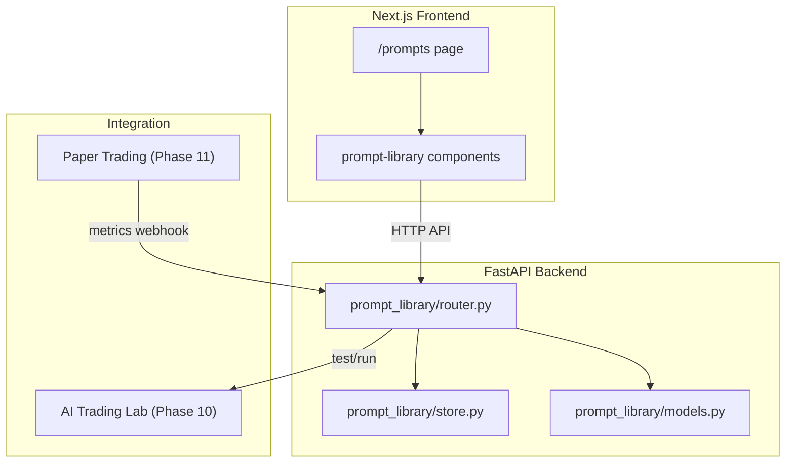
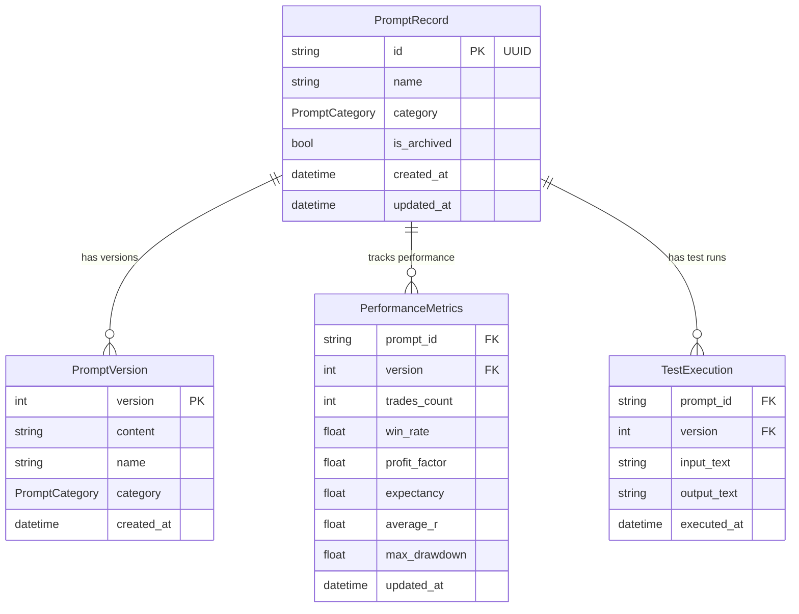

# Design Document: Prompt Library

## Overview

The Prompt Library provides a full lifecycle management system for AI trading prompts. It consists of a Python/FastAPI backend module (`apps/quant/prompt_library/`) with in-memory storage, and a Next.js frontend page (`apps/web/app/prompts/page.tsx`) with supporting components. The system enforces immutable versioning, category-based organization, and performance tracking per version.

The backend follows the same patterns as the existing `trading_lab` and `paper_trading` modules: a FastAPI router registered in `main.py`, Pydantic models for request/response, and a class-based in-memory store.

## Architecture



## Components and Interfaces

### Backend Components

#### 1. Models (`prompt_library/models.py`)

**Enums:**

```python
class PromptCategory(str, Enum):
    MASTER_AGENT = "MASTER_AGENT"
    MARKET_REGIME = "MARKET_REGIME"
    SWING_HUNTER = "SWING_HUNTER"
    INTRADAY = "INTRADAY"
    OPTIONS_SCALPING = "OPTIONS_SCALPING"
    TRADE_DETECTIVE = "TRADE_DETECTIVE"
    STRATEGY_RESEARCH = "STRATEGY_RESEARCH"
    STRATEGY_BUILDER = "STRATEGY_BUILDER"
    BACKTEST_ANALYST = "BACKTEST_ANALYST"
    PROBABILITY_CALIBRATION = "PROBABILITY_CALIBRATION"
    AGENT_SELF_EVALUATION = "AGENT_SELF_EVALUATION"
    RISK_REVIEW = "RISK_REVIEW"
    AGENT_SUPERVISOR = "AGENT_SUPERVISOR"
```

**Domain Dataclasses:**

```python
@dataclass
class PromptVersion:
    version: int
    content: str
    created_at: datetime
    name: str           # snapshot of prompt name at this version
    category: PromptCategory  # snapshot of category at this version

@dataclass
class PromptRecord:
    id: str             # UUID
    name: str           # current display name
    category: PromptCategory
    versions: List[PromptVersion]
    is_archived: bool
    created_at: datetime
    updated_at: datetime

@dataclass
class PerformanceMetrics:
    prompt_id: str
    version: int
    trades_count: int
    win_rate: float        # 0-100 percentage
    profit_factor: float
    expectancy: float
    average_r: float
    max_drawdown: float    # negative value
    updated_at: datetime

@dataclass
class TestExecution:
    prompt_id: str
    version: int
    input_text: str
    output_text: str
    executed_at: datetime
```

**Pydantic Request/Response Models:**

```python
class CreatePromptRequest(BaseModel):
    name: str = Field(..., min_length=1)
    category: PromptCategory
    content: str = Field(..., min_length=1)

class EditPromptRequest(BaseModel):
    content: str = Field(..., min_length=1)
    name: Optional[str] = Field(None, min_length=1)
    category: Optional[PromptCategory] = None

class TestPromptRequest(BaseModel):
    input_text: str = Field(..., min_length=1)

class UpdateMetricsRequest(BaseModel):
    trades_count: int = Field(..., ge=0)
    win_rate: float = Field(..., ge=0.0, le=100.0)
    profit_factor: float = Field(..., ge=0.0)
    expectancy: float
    average_r: float
    max_drawdown: float = Field(..., le=0.0)

class PromptVersionResponse(BaseModel):
    version: int
    content: str
    created_at: datetime
    name: str
    category: PromptCategory

class PromptResponse(BaseModel):
    id: str
    name: str
    category: PromptCategory
    latest_version: int
    latest_content: str
    is_archived: bool
    created_at: datetime
    updated_at: datetime

class PromptDetailResponse(BaseModel):
    id: str
    name: str
    category: PromptCategory
    is_archived: bool
    created_at: datetime
    updated_at: datetime
    versions: List[PromptVersionResponse]
    performance: Optional[Dict[int, PerformanceMetricsResponse]] = None

class PerformanceMetricsResponse(BaseModel):
    prompt_id: str
    version: int
    trades_count: int
    win_rate: float
    profit_factor: float
    expectancy: float
    average_r: float
    max_drawdown: float
    updated_at: datetime

class CompareVersionsRequest(BaseModel):
    version_ids: List[Dict[str, Any]]  # [{prompt_id, version}, ...]

class CompareVersionsResponse(BaseModel):
    versions: List[PromptVersionResponse]
    metrics: List[Optional[PerformanceMetricsResponse]]
    content_diffs: List[str]  # unified diff strings between consecutive versions
```

#### 2. Store (`prompt_library/store.py`)

In-memory storage following the `InteractionStore` pattern:

```python
class PromptStore:
    def __init__(self):
        self._prompts: Dict[str, PromptRecord] = {}
        self._metrics: Dict[str, Dict[int, PerformanceMetrics]] = {}  # prompt_id -> {version -> metrics}
        self._test_executions: List[TestExecution] = []

    def create_prompt(self, name: str, category: PromptCategory, content: str) -> PromptRecord
    def edit_prompt(self, prompt_id: str, content: str, name: Optional[str], category: Optional[PromptCategory]) -> PromptRecord
    def duplicate_prompt(self, prompt_id: str) -> PromptRecord
    def archive_prompt(self, prompt_id: str) -> PromptRecord
    def unarchive_prompt(self, prompt_id: str) -> PromptRecord
    def get_prompt(self, prompt_id: str) -> Optional[PromptRecord]
    def get_version(self, prompt_id: str, version: int) -> Optional[PromptVersion]
    def list_prompts(self, category: Optional[PromptCategory], include_archived: bool) -> List[PromptRecord]
    def store_metrics(self, prompt_id: str, version: int, metrics: PerformanceMetrics) -> None
    def get_metrics(self, prompt_id: str, version: int) -> Optional[PerformanceMetrics]
    def record_test(self, execution: TestExecution) -> None
```

#### 3. Router (`prompt_library/router.py`)

FastAPI router with prefix `/api/prompts`:

| Method | Path | Description |
|--------|------|-------------|
| GET | `/api/prompts` | List prompts (query params: category, archived) |
| POST | `/api/prompts` | Create a new prompt |
| GET | `/api/prompts/{id}` | Get prompt with full version history |
| PUT | `/api/prompts/{id}` | Edit prompt (creates new version) |
| POST | `/api/prompts/{id}/duplicate` | Duplicate a prompt |
| POST | `/api/prompts/{id}/archive` | Archive a prompt |
| POST | `/api/prompts/{id}/unarchive` | Unarchive a prompt |
| GET | `/api/prompts/{id}/versions/{version}` | Get specific version |
| POST | `/api/prompts/{id}/versions/{version}/test` | Test/run a prompt version |
| GET | `/api/prompts/{id}/versions/{version}/metrics` | Get version metrics |
| PUT | `/api/prompts/{id}/versions/{version}/metrics` | Update version metrics |
| POST | `/api/prompts/compare` | Compare multiple versions |
| GET | `/api/prompts/categories` | List all categories |

### Frontend Components

#### Page: `apps/web/app/prompts/page.tsx`
- Main prompt library page
- Fetches prompt list from API
- Provides category filter tabs
- Renders `PromptList` component

#### Components (`apps/web/components/prompt-library/`):
- `PromptList.tsx` - Grid/list view of prompts
- `PromptCard.tsx` - Individual prompt card with actions
- `PromptEditor.tsx` - Create/edit modal with content editor
- `VersionHistory.tsx` - Version list with diff viewer
- `PerformancePanel.tsx` - Metrics display per version
- `CompareView.tsx` - Side-by-side version comparison
- `TestRunner.tsx` - Test prompt execution interface
- `CategoryFilter.tsx` - Category tab/filter component

## Data Models



## Correctness Properties

*A property is a characteristic or behavior that should hold true across all valid executions of a system — essentially, a formal statement about what the system should do. Properties serve as the bridge between human-readable specifications and machine-verifiable correctness guarantees.*

### Property 1: Prompt creation invariants

*For any* valid name, category, and content inputs, creating a prompt SHALL produce a record with a unique UUID identifier, version number 1, content matching the input, and a valid creation timestamp.

**Validates: Requirements 1.1, 1.4**

### Property 2: Invalid input rejection

*For any* prompt creation or edit request with an empty/whitespace-only name, empty/whitespace-only content, or a category string not in the valid category enum, the Prompt_Library SHALL reject the request and return a validation error.

**Validates: Requirements 1.2, 1.3**

### Property 3: Version immutability and increment

*For any* prompt with N versions, editing it SHALL produce version N+1, and retrieving any version 1..N SHALL return the exact content that was stored at creation time for that version, unchanged.

**Validates: Requirements 2.1, 2.2, 5.1, 5.4**

### Property 4: Duplication correctness

*For any* existing prompt with K versions, duplicating it SHALL produce a new prompt with a different UUID, version 1, content equal to the source's version K content, and name equal to the source name appended with " (Copy)".

**Validates: Requirements 3.1, 3.2, 3.4**

### Property 5: Archive/unarchive listing partition

*For any* set of prompts where some are archived and some are active, the default listing SHALL return exactly the active prompts, the archived listing SHALL return exactly the archived prompts, and unarchiving a prompt SHALL move it back to the active set.

**Validates: Requirements 4.1, 4.2, 4.3, 4.5**

### Property 6: Category filter correctness

*For any* category C and a set of prompts spanning multiple categories, filtering by C SHALL return exactly the non-archived prompts whose category equals C and no others.

**Validates: Requirements 6.2**

### Property 7: Performance metrics round-trip

*For any* valid performance metrics submitted for an existing prompt version, retrieving those metrics SHALL return values equal to what was submitted.

**Validates: Requirements 8.1, 8.2**

### Property 8: Version comparison completeness

*For any* two or more existing prompt versions with recorded metrics, requesting a comparison SHALL return the metrics for each version and a content diff between them.

**Validates: Requirements 9.1, 9.3**

### Property 9: Serialization round-trip

*For any* valid PromptRecord, serializing it to JSON and then deserializing it back SHALL produce an equivalent PromptRecord.

**Validates: Requirements 12.3**

## Error Handling

| Scenario | HTTP Status | Error Response |
|----------|-------------|----------------|
| Prompt not found | 404 | `{"detail": "Prompt not found", "prompt_id": "..."}` |
| Version not found | 404 | `{"detail": "Version not found", "prompt_id": "...", "version": N}` |
| Validation error (empty fields) | 422 | Pydantic validation errors |
| Invalid category | 422 | `{"detail": "Invalid category", "valid_categories": [...]}` |
| AI pipeline error during test | 502 | `{"detail": "AI pipeline error", "error": "..."}` |
| Attempt to modify immutable version | 409 | `{"detail": "Versions are immutable and cannot be modified"}` |

## Testing Strategy

### Unit Tests (Example-based)
- Test category enum contains all 13 values
- Test prompt not-found error for non-existent IDs
- Test version timestamp is recorded
- Test test execution records are stored
- Frontend component rendering tests

### Property-Based Tests (Hypothesis)
- **Property 1**: Prompt creation invariants — generate random valid inputs, verify record structure
- **Property 2**: Invalid input rejection — generate invalid inputs (whitespace strings, bad categories), verify rejection
- **Property 3**: Version immutability — create prompt, apply random edits, verify all versions preserved
- **Property 4**: Duplication correctness — create random prompts, duplicate, verify copy semantics
- **Property 5**: Archive partition — create random sets of prompts, archive subset, verify listing
- **Property 6**: Category filter — create prompts across categories, filter, verify correctness
- **Property 7**: Metrics round-trip — generate random metrics, store and retrieve, verify equality
- **Property 8**: Comparison completeness — create versions with metrics, compare, verify all present
- **Property 9**: Serialization round-trip — generate random PromptRecords, serialize/deserialize, verify equality

### Integration Tests
- Test prompt execution through AI pipeline (mocked)
- Test metrics webhook from paper trading
- Test router registration in main.py
- Test frontend API calls against running backend

### Configuration
- Property tests use `hypothesis` library with minimum 100 examples per property
- Each property test is tagged: `Feature: prompt-library, Property N: <title>`
