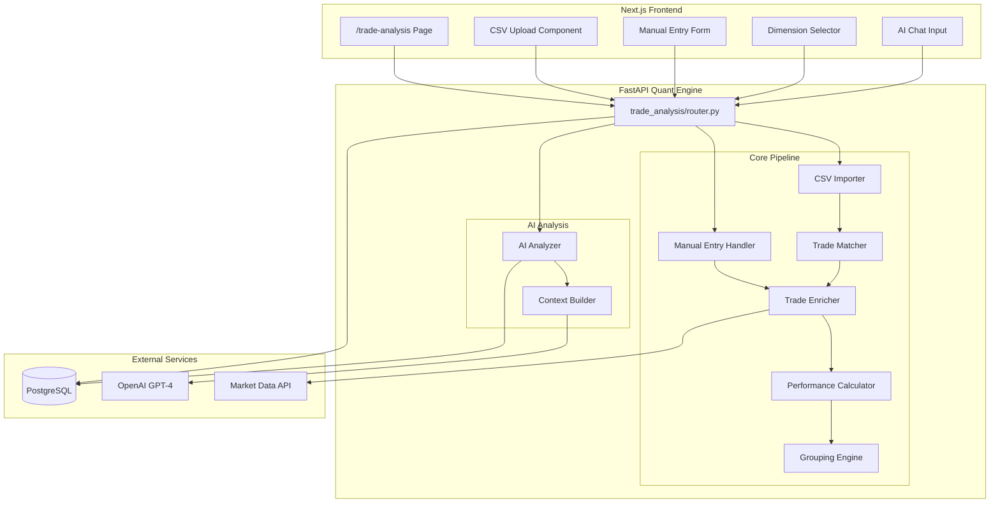
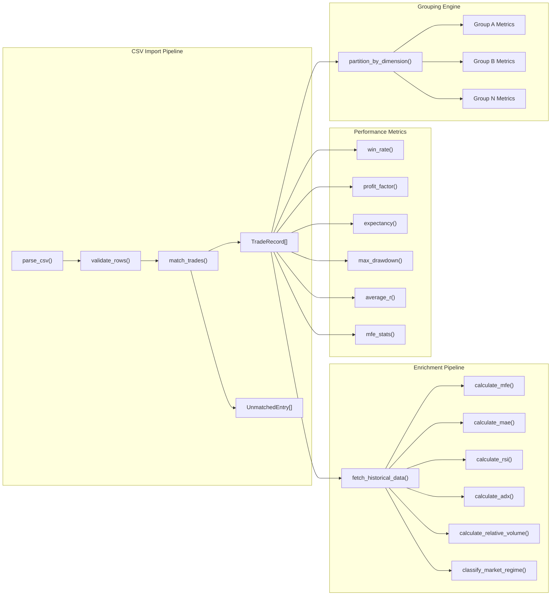
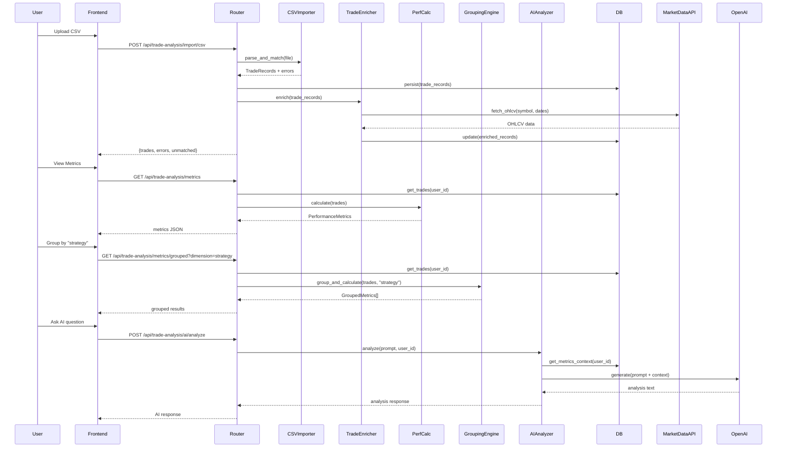

# Design Document: Trade Analysis Engine

## Overview

The Trade Analysis Engine provides traders with a comprehensive system for importing, enriching, and analyzing historical trade data. It lives as a new Python module at `apps/quant/trade_analysis/` with a frontend page at `apps/web/app/trade-analysis/page.tsx`.

The system follows a pipeline architecture: **Import → Match → Enrich → Calculate → Group → Analyze**. Trade data enters via CSV upload or manual entry, gets paired into complete trade records, enriched with technical indicators and market context from historical OHLCV data, then aggregated into performance metrics that can be sliced by multiple dimensions. An AI analyzer built on the existing Trading Lab pipeline provides conversational insights grounded in actual stored statistics.

Key design decisions:
- **Reuse existing infrastructure**: Leverages Phase 11's `PerformanceCalculator` pattern and Phase 10's AI pipeline (orchestrator + recommendation engine)
- **Separation of concerns**: Import/parsing is isolated from enrichment, which is isolated from metric calculation
- **Progressive enrichment**: Trades are stored immediately on import; enrichment with market data happens asynchronously when historical price data is available
- **JSON storage**: Uses PostgreSQL JSONB for trade records (consistent with paper trading module pattern)

## Architecture

### High-Level Architecture



### Low-Level Architecture



### Request Flow



## Components and Interfaces

### Module Structure

```
apps/quant/trade_analysis/
├── __init__.py
├── router.py              # FastAPI router with all endpoints
├── models.py              # Pydantic models and dataclasses
├── csv_importer.py        # CSV parsing and trade matching
├── trade_enricher.py      # Technical indicator enrichment
├── performance_calculator.py  # Metrics calculation (extends paper_trading pattern)
├── grouping_engine.py     # Dimension-based partitioning
├── ai_analyzer.py         # AI-driven trade analysis
├── repository.py          # Database operations
└── exceptions.py          # Custom exceptions
```

### Component Interfaces

#### CSVImporter

```python
class CSVImporter:
    """Parses CSV files and matches BUY/SELL pairs into TradeRecords."""

    def parse_csv(self, file_content: str) -> CSVParseResult:
        """
        Parse CSV content into raw trade actions.
        
        Supports date formats: ISO 8601, DD/MM/YYYY, MM/DD/YYYY.
        Returns parsed rows and per-row validation errors.
        """
        ...

    def match_trades(self, actions: List[TradeAction]) -> TradeMatchResult:
        """
        Match BUY/SELL actions for same symbol into complete TradeRecords.
        
        Unmatched entries (open trades) are flagged separately.
        Uses FIFO matching: earliest BUY matched with earliest SELL for same symbol.
        """
        ...
```

#### TradeEnricher

```python
class TradeEnricher:
    """Enriches TradeRecords with technical indicators and market context."""

    async def enrich(self, trade: TradeRecord) -> EnrichedTradeRecord:
        """
        Fetch historical OHLCV data and compute:
        - MFE (Maximum Favorable Excursion)
        - MAE (Maximum Adverse Excursion)
        - RSI at entry
        - ADX at entry
        - Relative volume at entry
        - Market regime (trending/ranging/volatile)
        - Trendline context
        - Risk/reward ratio (if stop loss defined)
        """
        ...

    def calculate_mfe(self, ohlcv: List[OHLCVData], entry_price: float, direction: str) -> float:
        """MFE = max favorable price movement during holding period."""
        ...

    def calculate_mae(self, ohlcv: List[OHLCVData], entry_price: float, direction: str) -> float:
        """MAE = max adverse price movement during holding period."""
        ...

    def classify_market_regime(self, adx: float, atr: float, avg_price: float) -> str:
        """
        Classify market regime:
        - ADX > 25 → 'trending'
        - ADX < 20 → 'ranging'
        - ATR/price > threshold → 'volatile'
        """
        ...
```

#### PerformanceCalculator

```python
class TradePerformanceCalculator:
    """
    Computes aggregate metrics from TradeRecords.
    Extends the pattern from paper_trading/performance_calculator.py.
    """

    def calculate_metrics(self, trades: List[TradeRecord]) -> PerformanceMetrics:
        """Compute all aggregate metrics."""
        ...

    def calculate_win_rate(self, trades: List[TradeRecord]) -> float:
        """Win Rate = (winning trades / total trades) × 100"""
        ...

    def calculate_profit_factor(self, trades: List[TradeRecord]) -> float:
        """Profit Factor = sum(profits) / |sum(losses)|. Returns inf if no losses."""
        ...

    def calculate_expectancy(self, trades: List[TradeRecord]) -> float:
        """Expectancy = total P&L / total trades"""
        ...

    def calculate_max_drawdown(self, trades: List[TradeRecord]) -> float:
        """Max Drawdown = largest peak-to-trough in cumulative P&L (ordered by exit date)"""
        ...

    def calculate_average_r(self, trades: List[TradeRecord]) -> float:
        """Average R = mean(realized_pnl / initial_risk) for trades with stop loss"""
        ...

    def calculate_mfe_mae_stats(self, trades: List[TradeRecord]) -> MFEMAEStats:
        """Compute mean, median, max of MFE and MAE values."""
        ...
```

#### GroupingEngine

```python
class GroupingEngine:
    """Partitions trades by dimension and computes per-group metrics."""

    VALID_DIMENSIONS = [
        "strategy", "setup", "market_regime", "sector",
        "time_of_day", "holding_period", "probability"
    ]

    TIME_BUCKETS = {
        "pre_market": (time(9, 0), time(9, 15)),
        "morning": (time(9, 15), time(11, 30)),
        "midday": (time(11, 30), time(13, 30)),
        "afternoon": (time(13, 30), time(15, 0)),
        "closing": (time(15, 0), time(15, 30)),
    }

    HOLDING_PERIOD_BUCKETS = {
        "intraday": (0, 0),
        "1-3 days": (1, 3),
        "4-7 days": (4, 7),
        "1-2 weeks": (8, 14),
        "2+ weeks": (15, None),
    }

    PROBABILITY_RANGES = {
        "0-25%": (0, 25),
        "25-50%": (25, 50),
        "50-75%": (50, 75),
        "75-100%": (75, 100),
    }

    def group_and_calculate(
        self, trades: List[TradeRecord], dimension: str
    ) -> List[GroupedMetrics]:
        """
        Partition trades by dimension and compute metrics per group.
        Empty groups are omitted from results.
        """
        ...

    def _get_dimension_value(self, trade: TradeRecord, dimension: str) -> Optional[str]:
        """Extract the grouping key for a trade based on dimension."""
        ...
```

#### AIAnalyzer

```python
class AIAnalyzer:
    """AI-driven trade analysis using OpenAI GPT-4."""

    def __init__(self, performance_calculator: TradePerformanceCalculator, 
                 grouping_engine: GroupingEngine, repository: TradeRepository):
        ...

    async def analyze(self, prompt: str, user_id: str) -> AIAnalysisResponse:
        """
        1. Fetch stored trade statistics from DB
        2. Compute aggregate + grouped metrics
        3. Build context with factual data
        4. Generate AI response grounded in actual statistics
        """
        ...

    def _build_analysis_context(self, metrics: PerformanceMetrics, 
                                 grouped: Dict[str, List[GroupedMetrics]]) -> str:
        """Build the context string with factual trade statistics for AI prompt."""
        ...
```

#### Router (API Endpoints)

```python
router = APIRouter(prefix="/api/trade-analysis", tags=["trade-analysis"])

@router.post("/import/csv")
async def import_csv(file: UploadFile) -> CSVImportResponse: ...

@router.post("/trades")
async def create_trade(trade: ManualTradeRequest) -> TradeRecordResponse: ...

@router.get("/metrics")
async def get_metrics(user_id: str = Depends(get_current_user)) -> MetricsResponse: ...

@router.get("/metrics/grouped")
async def get_grouped_metrics(
    dimension: str, user_id: str = Depends(get_current_user)
) -> GroupedMetricsResponse: ...

@router.post("/ai/analyze")
async def ai_analyze(request: AIAnalyzeRequest, 
                     user_id: str = Depends(get_current_user)) -> AIAnalysisResponse: ...
```

## Data Models

### Core Models

```python
from pydantic import BaseModel, Field
from dataclasses import dataclass
from datetime import datetime, date
from typing import Optional, List
from enum import Enum


class TradeDirection(str, Enum):
    LONG = "LONG"
    SHORT = "SHORT"


class MarketRegime(str, Enum):
    TRENDING = "trending"
    RANGING = "ranging"
    VOLATILE = "volatile"


class TimeBucket(str, Enum):
    PRE_MARKET = "pre_market"
    MORNING = "morning"
    MIDDAY = "midday"
    AFTERNOON = "afternoon"
    CLOSING = "closing"


class HoldingPeriodBucket(str, Enum):
    INTRADAY = "intraday"
    ONE_TO_THREE_DAYS = "1-3 days"
    FOUR_TO_SEVEN_DAYS = "4-7 days"
    ONE_TO_TWO_WEEKS = "1-2 weeks"
    TWO_PLUS_WEEKS = "2+ weeks"


@dataclass
class TradeRecord:
    """Complete trade record with entry/exit and computed fields."""
    id: str
    user_id: str
    symbol: str
    direction: TradeDirection
    entry_date: datetime
    exit_date: datetime
    entry_price: float
    exit_price: float
    quantity: int
    realized_pnl: float
    holding_period_days: int

    # Optional fields from import
    strategy: Optional[str] = None
    setup: Optional[str] = None
    sector: Optional[str] = None
    stop_loss: Optional[float] = None
    probability: Optional[float] = None

    # Enrichment fields (populated after enrichment)
    mfe: Optional[float] = None
    mae: Optional[float] = None
    rsi_at_entry: Optional[float] = None
    adx_at_entry: Optional[float] = None
    volume_ratio: Optional[float] = None
    market_regime: Optional[MarketRegime] = None
    trendline_context: Optional[str] = None
    risk_reward_ratio: Optional[float] = None

    created_at: datetime = None
    updated_at: datetime = None


@dataclass
class UnmatchedEntry:
    """An unmatched BUY or SELL that has no corresponding counterpart."""
    row_number: int
    symbol: str
    action: str  # "BUY" or "SELL"
    date: datetime
    price: float
    quantity: int
    reason: str  # e.g., "No matching SELL found"


@dataclass
class PerformanceMetrics:
    """Aggregate performance metrics."""
    total_trades: int = 0
    winning_trades: int = 0
    losing_trades: int = 0
    win_rate: float = 0.0          # percentage (0-100)
    profit_factor: float = 0.0     # ratio (can be inf)
    total_pnl: float = 0.0
    expectancy: float = 0.0        # average P&L per trade
    max_drawdown: float = 0.0      # negative value
    average_r: float = 0.0         # mean R-multiple
    mfe_mean: Optional[float] = None
    mfe_median: Optional[float] = None
    mfe_max: Optional[float] = None
    mae_mean: Optional[float] = None
    mae_median: Optional[float] = None
    mae_max: Optional[float] = None


@dataclass
class GroupedMetrics:
    """Performance metrics for a single group."""
    dimension_value: str
    trade_count: int
    win_rate: float
    profit_factor: float
    expectancy: float
    total_pnl: float
    average_r: float


@dataclass
class CSVParseResult:
    """Result of CSV parsing step."""
    trade_actions: List[dict]
    errors: List[CSVRowError]


@dataclass
class CSVRowError:
    """Error for a single CSV row."""
    row_number: int
    field_name: str
    message: str


@dataclass
class TradeMatchResult:
    """Result of trade matching step."""
    matched_trades: List[TradeRecord]
    unmatched_entries: List[UnmatchedEntry]
```

### API Request/Response Models

```python
class ManualTradeRequest(BaseModel):
    symbol: str = Field(..., min_length=1)
    entry_date: datetime
    entry_price: float = Field(..., gt=0)
    exit_date: datetime
    exit_price: float = Field(..., gt=0)
    quantity: int = Field(..., gt=0)
    direction: TradeDirection
    strategy: Optional[str] = None
    setup: Optional[str] = None
    sector: Optional[str] = None
    stop_loss: Optional[float] = Field(None, gt=0)


class CSVImportResponse(BaseModel):
    success: bool
    trades_imported: int
    trades: List[TradeRecordResponse]
    errors: List[CSVRowErrorResponse]
    unmatched: List[UnmatchedEntryResponse]


class MetricsResponse(BaseModel):
    success: bool
    metrics: PerformanceMetrics


class GroupedMetricsResponse(BaseModel):
    success: bool
    dimension: str
    groups: List[GroupedMetrics]


class AIAnalyzeRequest(BaseModel):
    prompt: str = Field(..., min_length=1, max_length=1000)


class AIAnalysisResponse(BaseModel):
    success: bool
    analysis: str
    metrics_used: PerformanceMetrics
    data_source: str = "stored_trade_statistics"


class ErrorResponse(BaseModel):
    detail: str
    errors: List[FieldError]


class FieldError(BaseModel):
    field: str
    message: str
```

### Database Schema (PostgreSQL JSONB)

```sql
CREATE TABLE trade_records (
    id UUID PRIMARY KEY DEFAULT gen_random_uuid(),
    user_id UUID NOT NULL REFERENCES users(id),
    data JSONB NOT NULL,  -- Full TradeRecord as JSON
    symbol VARCHAR(20) NOT NULL,
    direction VARCHAR(5) NOT NULL,
    entry_date TIMESTAMP NOT NULL,
    exit_date TIMESTAMP NOT NULL,
    realized_pnl DECIMAL(12, 2) NOT NULL,
    created_at TIMESTAMP DEFAULT NOW(),
    updated_at TIMESTAMP DEFAULT NOW()
);

CREATE INDEX idx_trade_records_user_id ON trade_records(user_id);
CREATE INDEX idx_trade_records_symbol ON trade_records(symbol);
CREATE INDEX idx_trade_records_exit_date ON trade_records(exit_date);
CREATE INDEX idx_trade_records_data_strategy ON trade_records((data->>'strategy'));
CREATE INDEX idx_trade_records_data_regime ON trade_records((data->>'market_regime'));
```

## Correctness Properties

*A property is a characteristic or behavior that should hold true across all valid executions of a system — essentially, a formal statement about what the system should do. Properties serve as the bridge between human-readable specifications and machine-verifiable correctness guarantees.*

### Property 1: CSV parsing preserves valid row data

*For any* valid CSV row containing a date (in ISO 8601, DD/MM/YYYY, or MM/DD/YYYY format), symbol, action, quantity, and price, parsing that row SHALL produce a trade action with the correct date value, symbol, action, quantity, and price fields preserved.

**Validates: Requirements 1.1, 1.5**

### Property 2: Invalid CSV rows produce descriptive errors

*For any* CSV row with one or more missing or malformed required fields, the CSV importer SHALL reject the row and return an error that contains the exact row number and the name of the first invalid field.

**Validates: Requirements 1.2**

### Property 3: Trade matching correctness

*For any* sequence of BUY and SELL actions for the same symbol, the trade matcher SHALL produce matched TradeRecords where each match has correct entry price (from BUY), exit price (from SELL), and P&L = (exit_price - entry_price) × quantity for LONG trades. All unmatched actions SHALL appear in the unmatched list and NOT in the matched trades list.

**Validates: Requirements 1.3, 1.4**

### Property 4: Manual trade entry preserves all fields

*For any* valid manual trade entry containing all required fields and any subset of optional fields (strategy, setup, sector, stop_loss), the created TradeRecord SHALL contain all provided field values unchanged. For any manual entry missing one or more required fields, the system SHALL return a validation error listing exactly the missing fields.

**Validates: Requirements 2.1, 2.2, 2.3**

### Property 5: Holding period calculation

*For any* TradeRecord with entry_date and exit_date, the holding_period_days SHALL equal the number of calendar days between entry_date and exit_date (i.e., (exit_date - entry_date).days).

**Validates: Requirements 4.1**

### Property 6: MFE and MAE excursion correctness

*For any* LONG trade with entry_price and a sequence of OHLCV candles during the holding period, MFE SHALL equal max(high_prices) - entry_price, and MAE SHALL equal entry_price - min(low_prices). For SHORT trades, MFE SHALL equal entry_price - min(low_prices), and MAE SHALL equal max(high_prices) - entry_price.

**Validates: Requirements 4.2, 4.3**

### Property 7: Market regime classification

*For any* ADX value and ATR/price ratio, the market regime classification SHALL follow: if ATR/price > 0.025 then 'volatile', else if ADX > 25 then 'trending', else if ADX < 20 then 'ranging', else 'trending'.

**Validates: Requirements 4.8**

### Property 8: Risk/reward ratio formula

*For any* LONG trade with entry_price, exit_price, and stop_loss where entry_price > stop_loss, risk_reward_ratio SHALL equal (exit_price - entry_price) / (entry_price - stop_loss).

**Validates: Requirements 4.9**

### Property 9: Performance metrics formulas

*For any* non-empty set of TradeRecords: win_rate SHALL equal (count of trades with pnl > 0 / total trades) × 100; profit_factor SHALL equal sum(positive pnls) / |sum(negative pnls)|; expectancy SHALL equal sum(all pnls) / total trades; average_r SHALL equal mean(pnl / (|entry_price - stop_loss| × quantity)) across trades with defined stop_loss.

**Validates: Requirements 5.1, 5.2, 5.3, 5.5**

### Property 10: Maximum drawdown calculation

*For any* sequence of TradeRecords ordered by exit_date, max_drawdown SHALL equal the largest peak-to-trough decline in the cumulative P&L series. Formally: max over all i < j of (cumsum[i] - cumsum[j]) where cumsum is the running sum of P&L values.

**Validates: Requirements 5.4**

### Property 11: MFE/MAE statistics

*For any* set of TradeRecords with MFE and MAE values populated, the reported mfe_mean SHALL equal the arithmetic mean of all MFE values, mfe_median SHALL equal the statistical median, and mfe_max SHALL equal the maximum. Same for MAE statistics.

**Validates: Requirements 5.6**

### Property 12: Grouping engine partitioning invariant

*For any* non-empty set of TradeRecords and any valid grouping dimension, the grouping engine SHALL produce groups where: (a) every trade appears in exactly one group, (b) all trades in a group share the same dimension value, (c) no group has zero trades, and (d) the sum of trade_counts across all groups equals the total number of trades with a non-null dimension value.

**Validates: Requirements 6.1, 6.2, 6.3, 6.4, 6.5, 6.6, 6.7, 6.8**

### Property 13: Relative volume calculation

*For any* trade with historical volume data of at least 20 periods, volume_ratio SHALL equal current_day_volume / mean(previous_20_days_volume).

**Validates: Requirements 4.6**

### Property 14: API validation error structure

*For any* API request with invalid or missing required fields, the response SHALL have status code 422 and contain a JSON body with a list of field-level errors where each error specifies the field name and an error message.

**Validates: Requirements 9.6**

## Error Handling

### Error Categories

| Error Type | HTTP Status | Handling |
|---|---|---|
| CSV parse error (malformed row) | 200 (partial success) | Return successfully parsed trades + error list |
| Missing required field (manual entry) | 422 | Return field-level validation errors |
| Invalid grouping dimension | 422 | Return error listing valid dimensions |
| Historical data unavailable | 200 (partial enrichment) | Store trade without enrichment, flag as un-enriched |
| Database connection failure | 500 | Return generic error, log details |
| OpenAI API failure | 500 | Return fallback message suggesting retry |
| No trades in database (AI analysis) | 200 | Return message suggesting trade import |
| Rate limit exceeded | 429 | Return retry-after header |

### Error Response Format

All 4xx and 5xx errors follow a consistent structure:

```json
{
  "detail": "Human-readable error summary",
  "errors": [
    {"field": "entry_price", "message": "Must be a positive number"},
    {"field": "exit_date", "message": "Required field is missing"}
  ]
}
```

### Graceful Degradation

- **Enrichment failure**: If market data API is unavailable, the trade is stored with `null` enrichment fields and can be enriched later via a retry mechanism.
- **Partial CSV import**: Valid rows are imported even if some rows fail validation. The response includes both successful imports and per-row errors.
- **AI unavailable**: If OpenAI API fails, return a message explaining the AI is temporarily unavailable with the raw metrics data so the user can still see their statistics.

## Testing Strategy

### Property-Based Testing (Hypothesis)

Property-based testing is well-suited to this feature because the core logic consists of pure functions with clear input/output behavior (CSV parsing, metric calculations, grouping, regime classification). The input space is large (arbitrary trade sequences, prices, dates) making property-based testing more effective than hand-picked examples.

**Library**: [Hypothesis](https://hypothesis.readthedocs.io/) (Python)

**Configuration**:
- Minimum 100 iterations per property test
- Each property test tagged with: `# Feature: trade-analysis, Property {N}: {title}`
- Custom strategies for generating TradeRecord instances, CSV rows, and OHLCV data

**Property tests cover**:
- CSV parsing round-trip and error reporting (Properties 1-3)
- Manual entry validation (Property 4)
- All metric formulas (Properties 5, 6, 8, 9, 10, 11, 13)
- Market regime classification (Property 7)
- Grouping partitioning invariants (Property 12)
- API error structure (Property 14)

### Unit Tests (pytest)

Unit tests focus on specific examples and edge cases:

- Profit factor returns infinity when all trades are profitable (Req 5.7)
- Kotak Neo unavailable returns "coming soon" message (Req 3.2)
- AI analyzer returns "no data" message when database is empty (Req 7.5)
- Time bucket boundary cases (e.g., trade at exactly 9:15)
- CSV with only unmatched entries returns empty trade list
- Date format disambiguation (e.g., 01/02/2024 — is it Jan 2 or Feb 1?)

### Integration Tests

Integration tests verify end-to-end behavior with real (or mocked) external services:

- CSV upload endpoint returns correct response structure
- Manual trade endpoint persists to database
- Metrics endpoint computes from stored trades for correct user
- AI analyzer queries database then calls OpenAI with correct context
- Enrichment pipeline fetches OHLCV and computes indicators
- Grouped metrics endpoint with each valid dimension value

### Frontend Tests

- Component rendering tests (React Testing Library)
- Form validation behavior
- API integration mocks
- Dimension selector interaction
