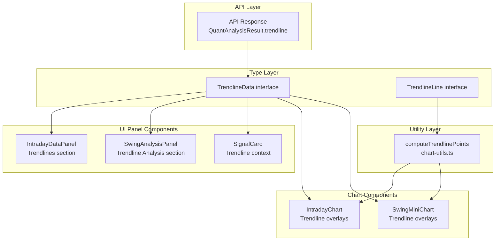

# Design Document: Trendline Visualization

## Overview

This feature adds trendline visualization to the trading platform's frontend. It encompasses two capabilities:

1. **Data Panel Display** — Showing trendline metadata (direction, status, breakout info, confidence) in existing UI data panels (IntradayDataPanel, SwingAnalysisPanel, SignalCard)
2. **Chart Overlays** — Rendering diagonal support/resistance trendlines on price charts (IntradayChart, SwingMiniChart) using lightweight-charts line series

The backend quant engine already computes trendline data via `TrendlineService` and the API returns it in the `trendline` field. This is purely frontend visualization work building on the existing component architecture.

### Key Design Decisions

- **Shared utility function**: A single `computeTrendlinePoints` function in `chart-utils.ts` handles the slope/intercept → LineData conversion for all chart components, ensuring consistency
- **Additive component changes**: Existing components gain optional trendline props; no breaking changes to current interfaces
- **lightweight-charts line series**: Trendlines are rendered as `LineSeries` with dashed style (`lineStyle: 2`), distinct from the horizontal price levels already in use

## Architecture



### Data Flow

1. API response includes `trendline` field in analysis results
2. Page components pass trendline data down to panel and chart components via props
3. Panel components render metadata (direction, status, confidence) as text/badges
4. Chart components use `computeTrendlinePoints()` utility to convert slope/intercept into `LineData[]` points
5. Chart components render trendlines as dashed `LineSeries` on the lightweight-charts instance

## Components and Interfaces

### Modified Components

| Component | File | Change |
|-----------|------|--------|
| IntradayDataPanel | `components/intraday-data-panel.tsx` | Add optional `trendline` prop; render "Trendlines" section after Support & Resistance |
| SwingAnalysisPanel | `components/swing-analysis-panel.tsx` | Add optional `trendline` prop; render "Trendline Analysis" section after Scoring Breakdown |
| SignalCard | `components/scalper/SignalCard.tsx` | Extend `SignalData` with trendline fields; display direction and breakout indicator |
| IntradayChart | `components/charts/IntradayChart.tsx` | Add optional `trendlines` prop; render diagonal line series for support/resistance |
| SwingMiniChart | `components/charts/SwingMiniChart.tsx` | Add optional `trendlines` prop; render diagonal line series for support/resistance |

### Modified Utilities

| Module | File | Change |
|--------|------|--------|
| chart-utils | `lib/charts/chart-utils.ts` | Add `computeTrendlinePoints()` function |
| api-client | `lib/api-client.ts` | Add `TrendlineData`, `TrendlineLine` interfaces; extend `SwingCandidate` |

### New Props Interfaces

```typescript
// Added to IntradayDataPanel props
interface IntradayDataPanelProps {
  data: { /* existing fields */ };
  trendline?: TrendlineData;
}

// Added to IntradayChart props  
interface IntradayChartProps {
  /* existing props */
  trendlines?: {
    support?: TrendlineLine;
    resistance?: TrendlineLine;
  };
}

// Added to SwingMiniChart props
interface SwingMiniChartProps {
  /* existing props */
  trendlines?: {
    support?: TrendlineLine;
    resistance?: TrendlineLine;
  };
}
```

### Utility Function Signature

```typescript
/**
 * Converts a trendline (slope/intercept) into two LineData points
 * for rendering on a lightweight-charts instance.
 *
 * @param trendline - Object with slope, intercept, start_point, end_point
 * @param ohlcvData - Array of OHLCV candles (timestamps used for mapping)
 * @returns Array of exactly 2 LineData points, or empty array if trendline is null
 */
export function computeTrendlinePoints(
  trendline: TrendlineLine | null | undefined,
  ohlcvData: OHLCVData[]
): LineData[];
```

## Data Models

### TrendlineData Interface

```typescript
export interface TrendlineData {
  support_line: TrendlineLine | null;
  resistance_line: TrendlineLine | null;
  swing_points: SwingPoint[];
  breakout_status: 'NONE' | 'BREAKOUT' | 'BREAKDOWN' | 'CONFIRMED';
  direction: 'UPTREND' | 'DOWNTREND' | 'SIDEWAYS';
  support_status: 'ACTIVE' | 'BROKEN' | 'RETESTING';
  resistance_status: 'ACTIVE' | 'BROKEN' | 'RETESTING';
  confidence: number; // 0.0 to 1.0
}
```

### TrendlineLine Interface

```typescript
export interface TrendlineLine {
  slope: number;
  intercept: number;
  r_squared: number;
  start_point: number; // index into OHLCV array
  end_point: number;   // index into OHLCV array
}
```

### SwingPoint Interface

```typescript
export interface SwingPoint {
  index: number;
  price: number;
  type: 'HIGH' | 'LOW';
}
```

### Chart Rendering Constants

```typescript
const SUPPORT_TL_COLOR = '#26a69a';    // green - matches existing theme
const RESISTANCE_TL_COLOR = '#ef5350'; // red - matches existing theme
const TRENDLINE_LINE_STYLE = 2;        // dashed (lightweight-charts LineStyle.Dashed)
const TRENDLINE_LINE_WIDTH = 2;
```

## Correctness Properties

*A property is a characteristic or behavior that should hold true across all valid executions of a system—essentially, a formal statement about what the system should do. Properties serve as the bridge between human-readable specifications and machine-verifiable correctness guarantees.*

### Property 1: Linear Price Computation

*For any* trendline with slope `s` and intercept `b`, and *for any* valid index `i` within an OHLCV array, the computed price at that index SHALL equal `s × i + b`, and the associated timestamp SHALL correspond to `ohlcvData[i].timestamp`.

**Validates: Requirements 4.4, 5.4, 6.2, 6.3**

### Property 2: Output Structure Invariant

*For any* non-null trendline with valid start_point and end_point, and *for any* non-empty OHLCV array, the `computeTrendlinePoints` function SHALL return exactly 2 `LineData` points, where each point has a numeric `time` field (UTCTimestamp) and a numeric `value` field.

**Validates: Requirements 6.1**

### Property 3: Index Clamping

*For any* trendline where start_point or end_point exceeds the OHLCV array bounds (negative or >= length), the `computeTrendlinePoints` function SHALL clamp the index to the valid range [0, length-1] and still produce a correct price using the clamped index in the formula slope × clamped_index + intercept.

**Validates: Requirements 6.4**

### Property 4: Null Trendline Returns Empty

*For any* null or undefined trendline input, regardless of the OHLCV array content, the `computeTrendlinePoints` function SHALL return an empty array.

**Validates: Requirements 6.5**

## Error Handling

| Scenario | Handling |
|----------|----------|
| `trendline` field is `null`/`undefined` in API response | Panel components show "No trendline data" or omit section; chart components skip overlay rendering |
| `support_line` or `resistance_line` is `null` | Only render the line that is present; skip the null one |
| `start_point` or `end_point` out of OHLCV bounds | `computeTrendlinePoints` clamps to valid range |
| Empty OHLCV data array | `computeTrendlinePoints` returns empty array; chart renders without overlays |
| `confidence` value outside [0,1] | Display as-is with formatting (component does not validate range) |
| Chart instance not ready (`isReady = false`) | useEffect guard prevents trendline rendering until chart is initialized |
| Re-render with new trendline data | Remove previous trendline series via `chart.removeSeries()` before adding new ones |

## Testing Strategy

### Unit Tests (Example-Based)

Unit tests cover the UI rendering behavior of panel and chart components:

- **IntradayDataPanel**: Verify "Trendlines" section appears with correct data, badge colors for breakout statuses, fallback text when data is missing
- **SwingAnalysisPanel**: Verify "Trendline Analysis" section appears/omits correctly, displays all fields
- **SignalCard**: Verify trendline direction and breakout indicator rendering, N/A fallbacks
- **IntradayChart**: Verify line series are added with correct colors/styles, removed on update, legend entries present
- **SwingMiniChart**: Verify line series are added with correct colors/styles, removed on update

### Property-Based Tests

Property-based tests validate the `computeTrendlinePoints` utility function using **fast-check** (compatible with vitest):

- **Property 1**: Generate random `{slope, intercept, start_point, end_point}` and random OHLCV arrays; verify output prices match the linear formula
- **Property 2**: Generate random valid inputs; verify output is always exactly 2 LineData points with correct structure
- **Property 3**: Generate trendlines with out-of-bounds indices; verify clamping and correct price computation
- **Property 4**: Pass null/undefined trendline; verify empty array

**Configuration:**
- Minimum 100 iterations per property test
- Test runner: vitest
- PBT library: fast-check
- Tag format: `Feature: trendline-visualization, Property {N}: {description}`

### Integration Tests

- Verify that the Intraday page passes trendline data from API response through to both IntradayDataPanel and IntradayChart
- Verify that the Swing Scanner page passes trendline data to SwingAnalysisPanel and SwingMiniChart
- Verify that the Options Scalper page passes trendline data to SignalCard
